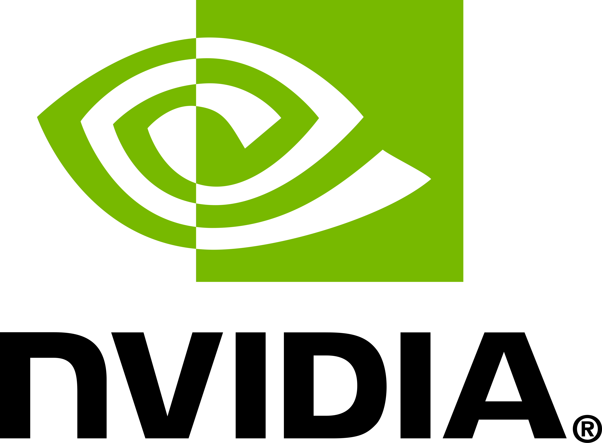
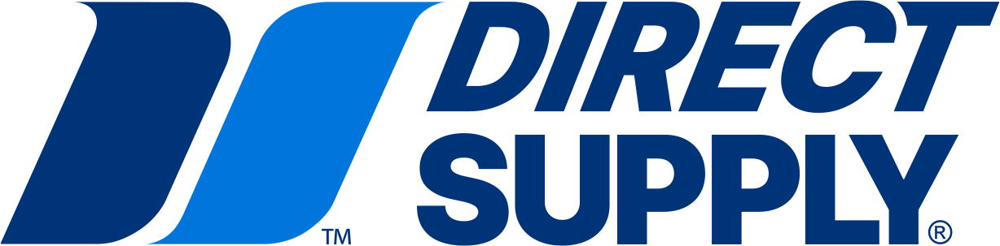

# ALL Applied AI Network — Content

<p align="center">
  
</p>

<p align="center">
  <strong>Open-source applied AI curriculum — from zero to shipping AI products.</strong>
</p>

<p align="center">
  <a href="https://github.com/ALL-Applied-AI-Network/aain-content/actions/workflows/pages.yml"></a>
  <a href="https://github.com/ALL-Applied-AI-Network/aain-content/actions/workflows/validate.yml"></a>
  <a href="https://creativecommons.org/licenses/by-nc-sa/4.0/"></a>
  <a href="LICENSE-CODE.md"></a>
</p>

<p align="center">
  <a href="#the-learning-tree">Learning Tree</a> ·
  <a href="#playbooks">Playbooks</a> ·
  <a href="#workshops">Workshops</a> ·
  <a href="STYLE_GUIDE.md">Style Guide</a> ·
  <a href="CONTRIBUTING.md">Contributing</a>
</p>

---

### Sponsors

<p align="center">
  <em>Sponsors fund the network so students learn for free.</em>
</p>

<table align="center">
  <tr>
    <td align="center"><strong>NVIDIA</strong></td>
    <td align="center"><strong>Direct Supply</strong></td>
    <td align="center"><strong>&nbsp;&nbsp;&nbsp;&nbsp;&nbsp;&nbsp;&nbsp;&nbsp;&nbsp;&nbsp;&nbsp;&nbsp;&nbsp;&nbsp;&nbsp;&nbsp;&nbsp;&nbsp;&nbsp;&nbsp;&nbsp;&nbsp;&nbsp;&nbsp;&nbsp;&nbsp;&nbsp;&nbsp;&nbsp;&nbsp;&nbsp;&nbsp;</strong></td>
    <td align="center"><strong>&nbsp;&nbsp;&nbsp;&nbsp;&nbsp;&nbsp;&nbsp;&nbsp;&nbsp;&nbsp;&nbsp;&nbsp;&nbsp;&nbsp;&nbsp;&nbsp;&nbsp;&nbsp;&nbsp;&nbsp;&nbsp;&nbsp;&nbsp;&nbsp;&nbsp;&nbsp;&nbsp;&nbsp;&nbsp;&nbsp;&nbsp;&nbsp;</strong></td>
  </tr>
  <tr>
    <td align="center"><a href="https://nvidia.com"></a></td>
    <td align="center"><a href="https://directsupply.com"></a></td>
    <td align="center"><a href="https://github.com/ALL-Applied-AI-Network"><em>Your logo here</em></a></td>
    <td align="center"><a href="https://github.com/ALL-Applied-AI-Network"><em>Your logo here</em></a></td>
  </tr>
</table>

<p align="center">
  <a href="https://github.com/ALL-Applied-AI-Network"><strong>Become a sponsor &rarr;</strong></a>
</p>

---

This is the shared content library for the **ALL Applied AI Network** — a chapter-based organization connecting universities, student hubs, and industry sponsors into one ecosystem.

Content is served via **GitHub Pages**. Hub websites fetch learning resources, playbooks, and workshops directly from this repo's published URL. When content is updated on `main`, every hub across the network gets the new version automatically.

The curriculum is designed for the **applied AI engineer**, not the academic researcher. It starts at absolute zero — someone who has never written a line of code — and builds a path to shipping real AI products. Theory and research are branches for students who want to go deep, not the starting point.

> **Looking to start a hub?** This repo is the content library. Head to [`aain-hub-template`](https://github.com/ALL-Applied-AI-Network/aain-hub-template) for the website template — fork it, edit your config, and you're live.

## The Learning Tree

The learning tree is an interactive, interconnected graph of learning resources — not a flat list of tutorials. Each node has prerequisites, unlocks new topics, and tracks student progress.

### Curriculum Overview

```
Layer 0                Layer 1                 Layer 2                  Layer 3
I want to learn AI     I'm coding with AI      I'm building AI apps     I ship AI products
───────────────────    ───────────────────     ───────────────────      ──────────────────
What is AI             Python through AI       AI APIs & SDKs           Web apps + AI
Setting up Cursor      Files & terminal        Prompt engineering       Databases & pipelines
Navigating an IDE      Git basics              RAG                      Deployment & Docker
First AI conversation  Working with data       Agents & tool use        Monitoring & eval
What is programming    Build: first script     Build: AI agent          Build: production app
                                ╲
                                 ╲
                    Layer 4                          Layer 5
                    I understand the engine           I go deep
                    ───────────────────              ──────────────────
                    Neural networks                  Computer vision
                    How models learn                 NLP & transformers
                    Embeddings & vectors             Reinforcement learning
                    Fine-tuning & adapters           Generative models
                    Classical ML                     MLOps & infrastructure
```

**Layers 0-3** are the main trunk: the applied AI engineer path.
**Layers 4-5** are branches for research-oriented students who want to understand how models work under the hood.
**Tooling** is a parallel track (AI IDEs, Git, Jupyter, cloud compute) that students enter anytime.

### How it works

Every learning resource has a `node.yaml` colocated with its markdown content:

```yaml
# learning/foundations/setting-up-cursor/node.yaml
id: "foundations/setting-up-cursor"
title: "Setting Up Cursor: Your AI-Powered Workspace"
difficulty: beginner
layer: 0
estimated_minutes: 30
tags: ["setup", "cursor", "ide", "getting-started"]

prerequisites: []
unlocks:
  - "foundations/first-conversation-with-ai"
  - "foundations/navigating-an-ide"

content_file: "setting-up-cursor.md"
```

On every push to `main`, GitHub Actions validates the entire graph (no orphans, no cycles, all references resolve) and generates `tree.json` — the full graph structure that hub websites fetch and render as an interactive skill tree.

### CI/CD

| Workflow | Trigger | What it does |
|---|---|---|
| **[Validate](/.github/workflows/validate.yml)** | Pull requests | Validates node schemas, graph integrity, content structure, and broken references. Posts results as PR comments. |
| **[Pages](/.github/workflows/pages.yml)** | Push to `main` | Generates `tree.json` + `manifest.json`, builds the site, and deploys to GitHub Pages. |

## Playbooks

Battle-tested operational guides for running a hub. Written from the experience of scaling MSOE's AI Club to 500+ active members.

| Playbook | What it covers |
|---|---|
| **[Getting Started](playbooks/getting-started/)** | University buy-in, finding sponsors, leadership structure, transition planning |
| **[Innovation Labs](playbooks/innovation-labs/)** | Sponsor onboarding, team formation, judging, prizes, post-event hiring pipeline |
| **[Speaker Series](playbooks/speaker-series/)** | Format guide, speaker outreach templates, promotion strategy |
| **[Hackathons](playbooks/hackathons/)** | Planning checklist, sponsor integration, logistics |
| **[Research Groups](playbooks/research-groups/)** | Topic selection, publication guide, cross-hub collaboration |

## Workshops

Hands-on, session-ready workshop content. Each includes a facilitator guide, student materials, and optional Jupyter notebooks.

**Applied AI workshops** — the core:
- Build a Chatbot · RAG from Scratch · Build an Agent · Deploy Your First AI App · Prompt Engineering Lab

**Deep dives** — adapted from MAIC's proven curriculum:
- Deep Learning from Scratch · CNNs · Image Segmentation · Intro to LLMs · Q-Learning · Attention Is All You Need · Embeddings

## Using This Content

### For hub websites (automatic)

Hub websites built from the [`aain-hub-template`](https://github.com/ALL-Applied-AI-Network/aain-hub-template) fetch content from this repo's GitHub Pages deployment automatically. No configuration needed.

```
https://all-ai-network.org/tree.json
https://all-ai-network.org/manifest.json
https://all-ai-network.org/learning/foundations/setting-up-cursor/setting-up-cursor.md
```

### For existing websites

If your chapter already has a website, fetch directly:

```typescript
const CONTENT_URL = 'https://all-ai-network.org';

const tree = await fetch(`${CONTENT_URL}/tree.json`).then(r => r.json());
const article = await fetch(`${CONTENT_URL}/learning/intermediate/applied-ai/rag-fundamentals/rag-fundamentals.md`).then(r => r.text());
```

## Repository Structure

```
learning/
├── foundations/            Layer 0-1: beginner -> coding with AI
├── intermediate/
│   ├── applied-ai/        Layer 2: AI APIs, prompting, RAG, agents (the core)
│   ├── production/        Layer 3: web apps, deployment, monitoring
│   └── data-skills/       Data handling and visualization
├── advanced/
│   ├── foundations-of-ml/  Layer 4: neural nets, training, embeddings, classical ML
│   ├── computer-vision/    Layer 5: specialization
│   ├── nlp/                Layer 5: specialization
│   ├── reinforcement-learning/
│   ├── generative-models/
│   └── mlops/
├── tooling/               Parallel track: AI IDEs, Git, Jupyter, cloud
└── series/                Track definitions (ordered paths through the graph)

playbooks/                 Operational guides for hub leaders
workshops/                 Session-ready hands-on content
scripts/                   Build tools (generate-tree, validate, manifest)
site/                      GitHub Pages site (learning tree viewer, toolkit, impact)

.github/workflows/
├── validate.yml           PR content validation + PR comment
└── pages.yml              Build & deploy to GitHub Pages
```

## Contributing

See [CONTRIBUTING.md](CONTRIBUTING.md) for guidelines and [STYLE_GUIDE.md](STYLE_GUIDE.md) for content formatting standards.

This project is built for AI-native development. Content and code are structured for AI coding tools (Cursor, Claude Code) to understand and contribute to confidently.

---

<p align="center">
  <sub>&copy; 2026 ALL Applied AI Network LLC. All rights reserved.</sub><br />
  <sub>ALL Applied AI Network&trade; and the ALL logo are trademarks of ALL Applied AI Network LLC.</sub>
</p>
