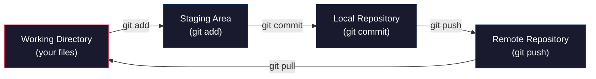
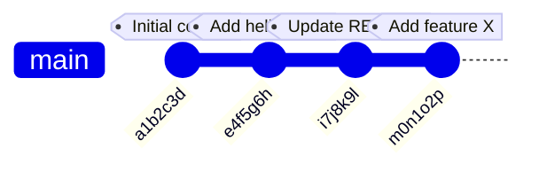

# Git Basics: Saving Snapshots of Your Work

Git is the version control system that nearly every professional software team uses. It tracks every change you make to your code, lets you undo mistakes, and makes it possible to collaborate with others without overwriting each other's work. This article teaches you the single-branch workflow that covers 90% of what you'll do as an individual developer.

:::callout[info]
You need to be comfortable with the terminal before starting this article. If commands like `cd`, `ls`, and `mkdir` aren't familiar yet, complete the "Files, Folders, and the Terminal" article first.
:::

## Why Version Control?

Imagine you're writing a script. It works. You add a new feature, and suddenly nothing works. You press Ctrl+Z a dozen times, but you can't get back to the working version. Sound familiar?

Version control solves this. With Git, you take **snapshots** of your project at specific moments. Each snapshot captures the exact state of every file. You can always go back to any previous snapshot.

:::definition[Version Control]
A system that records changes to files over time so you can recall specific versions later. Git is the most widely used version control system in the world.
:::

Beyond undo, version control gives you:

- **A history** of every change, who made it, and why
- **Confidence** to experiment — you can always revert
- **Collaboration** — multiple people can work on the same project
- **A portfolio** — your GitHub profile shows your work to employers

## Installing Git

:::tabs
---tab macOS
Git comes pre-installed on most Macs. Open your terminal and type:
```bash
git --version
```
If you see a version number, you're set. If not, install it with:
```bash
xcode-select --install
```
---tab Windows
Download Git from [git-scm.com](https://git-scm.com). Run the installer with the default settings. After installation, open a new terminal and verify:
```powershell
git --version
```
---tab Linux
```bash
sudo apt install git    # Ubuntu/Debian
sudo dnf install git    # Fedora
```
Then verify: `git --version`
:::

After installing, configure your identity. Git attaches your name and email to every commit:

```bash title="Configure your identity (one-time setup)"
git config --global user.name "Your Name"
git config --global user.email "your.email@example.com"
```

## The Mental Model

Think of Git as a camera for your project. Here's the workflow:

1. **Make changes** to your files (edit code, add files, delete things)
2. **Stage** the changes you want to include in the next snapshot
3. **Commit** — take the snapshot with a message describing what changed
4. **Push** — upload your commits to a remote repository (like GitHub)

:::diagram

:::

:::definition[Commit]
A snapshot of your project at a specific point in time. Each commit has a unique ID, a message describing what changed, and a reference to the previous commit. Commits form a timeline of your project's history.
:::

:::definition[Staging Area]
A holding zone between your working files and the repository. When you `git add` a file, you're saying "include this change in my next commit." This lets you commit some changes while keeping others as work-in-progress.
:::

:::definition[Remote]
A copy of your repository hosted on another server, typically GitHub. The default remote is called `origin`. When you `git push`, you upload commits from your local repository to the remote. When you `git pull`, you download commits from the remote to your local repository.
:::

:::definition[Push]
The act of uploading your local commits to a remote repository. `git push` sends your newest commits to GitHub (or wherever your remote is hosted), making them available to others and serving as a backup.
:::

The staging area exists so you can be selective. Maybe you fixed a bug AND started a new feature — you can commit the bug fix first, then the feature separately. Clean, organized history.

## Your First Repository

Let's build this hands-on. Open your terminal and create a new project:

```bash title="Create and initialize a repo"
mkdir git-practice
cd git-practice
git init
```

:::definition[Repository (Repo)]
A project tracked by Git. When you run `git init`, Git creates a hidden `.git` folder that stores all the version history. Your project folder + that `.git` folder = a repository.
:::

You'll see: `Initialized empty Git repository in .../git-practice/.git/`

Now create a file:

```bash
echo "# Git Practice" > README.md
```

Check what Git sees:

```bash
git status
```

Git tells you there's an **untracked file** — a file Git knows about but isn't tracking yet. Let's fix that.

## The Core Workflow: Add, Commit, Repeat

### Stage your changes

```bash
git add README.md
```

Run `git status` again. The file moved from "untracked" to "staged" (listed under "Changes to be committed"). It's in the staging area, ready for a snapshot.

:::callout[tip]
`git add .` stages everything in the current directory. It's convenient, but be intentional — make sure you're not staging files you don't want to commit (like API keys or temporary files). For now, `git add .` is fine.
:::

### Commit the snapshot

```bash
git commit -m "Add initial README"
```

The `-m` flag lets you write the commit message inline. Every commit needs a message — it's your note to your future self (and anyone else reading the history) about what this snapshot contains.

Run `git status` again. Clean — "nothing to commit, working tree clean." Your snapshot is saved.

### Make more changes

Open `README.md` in Cursor and add a line:

```markdown
# Git Practice

This is my first Git project. I'm learning version control.
```

Save the file. Now create a Python file:

```bash
echo 'print("Hello from Git!")' > hello.py
```

Check the status:

```bash
git status
```

Git shows two things: `README.md` is **modified** (it was tracked and you changed it) and `hello.py` is **untracked** (new file). Stage both and commit:

```bash
git add .
git commit -m "Add hello script and update README"
```

### View your history

```bash
git log
```

You see two commits, newest first. Each has a hash (the long string of characters), your name, the date, and the message. Press `q` to exit the log view.

For a condensed view:

```bash
git log --oneline
```

This shows just the short hash and message — much easier to scan.

Here is what a commit history looks like visually. Each commit points back to its parent, forming a timeline:

:::diagram

:::

Each commit is a snapshot of your entire project at that moment. You can always go back to any previous commit — nothing is ever lost (as long as it was committed).

## Writing Good Commit Messages

:::callout[tip]
A good commit message completes this sentence: "If applied, this commit will ___." For example: "Add user authentication," "Fix crash when list is empty," "Update README with setup instructions." Start with a verb. Keep it under 72 characters. Be specific.
:::

Bad commit messages:

- `"stuff"` — what stuff?
- `"fix"` — fix what?
- `"asdfg"` — no
- `"final version"` — it's never the final version

Good commit messages:

- `"Add movie filtering by genre"`
- `"Fix rating comparison to include exact matches"`
- `"Remove unused import statements"`

Your future self, reading `git log` at 2 AM trying to find when a bug was introduced, will thank you for clear messages.

## GitHub: Your Code in the Cloud

:::definition[GitHub]
A platform that hosts Git repositories online. It's where most open-source projects live, and it serves as a portfolio for developers. Your GitHub profile is often the first thing employers look at.
:::

Git is the tool. GitHub is the website that hosts your Git repositories online. They're different things, but they work together seamlessly.

### Create a GitHub account

If you don't have one already, go to [github.com](https://github.com) and sign up. Pick a professional username — this becomes your public developer identity.

### Create a repository on GitHub

1. Click the **+** button in the top right corner, then **New repository**
2. Name it `git-practice`
3. Leave it **Public** (it's a learning project, nothing sensitive)
4. **Do not** check "Add a README" — you already have one locally
5. Click **Create repository**

GitHub shows you setup instructions. Since you already have a local repo, you need the "push an existing repository" commands.

### Connect and push

```bash title="Connect local repo to GitHub and push"
git remote add origin https://github.com/YOUR-USERNAME/git-practice.git
git branch -M main
git push -u origin main
```

Let's break this down:

- `git remote add origin` — tells your local repo where the online version lives. "origin" is the conventional name for your primary remote.
- `git branch -M main` — renames your branch to `main` (the modern default).
- `git push -u origin main` — uploads your commits to GitHub. The `-u` flag sets this as the default, so next time you can just type `git push`.

Refresh your GitHub repository page. Your files and commits are there.

:::callout[warning]
If Git asks for your password when pushing, you may need to set up a Personal Access Token or SSH key. GitHub no longer accepts plain passwords. Follow GitHub's guide for [creating a personal access token](https://docs.github.com/en/authentication/keeping-your-account-and-data-secure/creating-a-personal-access-token), or ask Cursor AI: "How do I set up GitHub authentication for pushing from the terminal?"
:::

### The push workflow

From now on, after every commit:

```bash
git push
```

That's it. One command, and your code is backed up and visible on GitHub.

## Using Git in Cursor

Cursor has a built-in Source Control panel (click the branch icon in the left sidebar, or press Ctrl+Shift+G). It shows:

- **Changed files** — files you've modified since the last commit
- **A diff view** — click any file to see exactly what changed (green = added, red = removed)
- **A commit message box** — type your message and click the checkmark to commit

You can use either the visual panel or the terminal for Git operations. Most developers use both — the panel for reviewing changes, the terminal for committing and pushing. Use whatever feels natural.

:::details[What about branching?]
Branching is Git's most powerful feature — it lets you work on a new feature without affecting the main code. But for now, a single-branch workflow (just `main`) is all you need. You'll learn branching when you start collaborating with others or working on larger projects. One thing at a time.
:::

## Common Git Commands Reference

| Command | What it does |
|---|---|
| `git init` | Initialize a new Git repo |
| `git status` | Show what's changed since last commit |
| `git add .` | Stage all changes |
| `git add file.py` | Stage a specific file |
| `git commit -m "message"` | Take a snapshot with a message |
| `git log --oneline` | View commit history (compact) |
| `git push` | Upload commits to GitHub |
| `git diff` | Show unstaged changes line by line |

:::build-challenge
### Your First GitHub Repository

Build a real project with a proper Git history. Here's what to do:

1. Create a new folder called `my-first-repo`
2. Initialize it as a Git repository with `git init`
3. Create a `README.md` with a title and one-sentence description of the project (it can be anything — a to-do list, a favorite quotes file, a project plan)
4. Make your **first commit** with a clear message
5. Add a Python file that does something simple (print a greeting, calculate something, or reuse code from the Python Through AI article)
6. Make your **second commit**
7. Modify one of the existing files and add a new file
8. Make your **third commit**
9. Create a repository on GitHub (same name as your folder)
10. Connect your local repo to GitHub and push all three commits
11. Visit your repository on github.com and verify that all three commits are visible in the commit history

**Requirements:**
- Three commits, each with a meaningful, descriptive message
- At least two different files in the repo
- The repo should be visible on your GitHub profile

**Stretch goal:** Run `git log --oneline` and take a screenshot of your three commits. Add the screenshot to your project's README (ask AI how to embed images in Markdown).
:::
