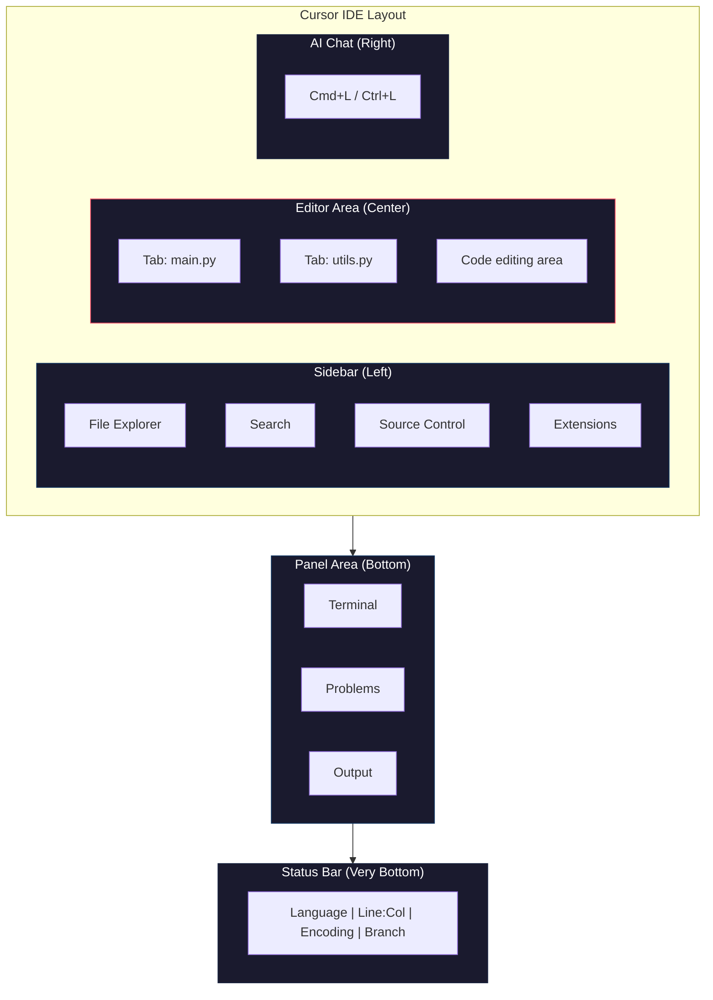

# Navigating an IDE: Finding Your Way Around Cursor

You've installed Cursor. Now it's time to learn where everything is and how to move around efficiently. This article walks you through the four main areas of the editor, teaches you the keyboard shortcuts that matter most, and gets you comfortable with the integrated terminal — one of the most important tools in your kit.

## The Four Zones

Every modern code editor is organized into the same basic layout. Once you learn it here, you'll feel at home in any IDE.

:::diagram

:::

Open Cursor and take a look. You'll see four distinct areas:

### 1. The Sidebar (Left)

The sidebar is your navigation panel. It runs along the left edge of the window and contains several icons stacked vertically. The most important one — the one you'll use constantly — is the **File Explorer**.

:::definition[File Explorer]
The panel that shows all the files and folders in your current project. It's like the Finder (macOS) or File Explorer (Windows) built right into your editor. You can create, rename, move, and delete files without ever leaving the IDE.
:::

Click the top icon in the sidebar (it looks like two overlapping pages) to open the File Explorer. Right now it might be empty or show a welcome screen. That's because you haven't opened a project folder yet — we'll do that shortly.

Other sidebar icons include:
- **Search** (magnifying glass) — find text across all files in your project
- **Source Control** (branch icon) — for Git version control, which you'll learn later
- **Extensions** (puzzle piece) — add-ons that extend what your editor can do

### 2. The Editor Area (Center)

This is the large central area where you write and read code. When you open a file, it appears here as a tab — just like tabs in a web browser. You can have multiple files open at once and switch between them by clicking tabs.

:::callout[tip]
You can split the editor to view two files side by side. Right-click any tab and select **Split Right** or **Split Down**. This is invaluable when you need to reference one file while editing another.
:::

### 3. The Panel Area (Bottom)

The bottom panel is collapsible — it might be hidden when you first open Cursor. This area contains several tabs, but the one that matters most right now is the **Terminal**.

:::definition[Terminal (also called Command Line or Console)]
A text-based interface where you type commands to interact with your computer. Instead of clicking buttons and icons, you type instructions. The terminal is how developers run code, install software, manage files, and control almost everything on their machine.
:::

You'll spend a lot of time in the terminal. It might feel unfamiliar if you've only ever used graphical interfaces, but it's simpler than it looks — and incredibly powerful once you get comfortable with it.

### 4. The Status Bar (Very Bottom)

The thin bar at the very bottom of the window shows useful information: what programming language your current file is in, line and column numbers, encoding, and other details. You don't need to worry about this much right now, but it's good to know it's there.

## Opening a Folder (Your "Project")

In Cursor (and any IDE), you don't just open individual files — you open a **folder**. That folder becomes your project, and the File Explorer shows everything inside it.

:::callout[info]
A "project" in this context is simply a folder on your computer that contains related files. There's no special project file to create. Any folder can be a project — you just open it in your editor.
:::

To open a folder:

:::tabs

### macOS

1. Go to **File > Open Folder** (or press `Cmd+O`)
2. Navigate to the folder you want to open (or create a new one)
3. Click **Open**

### Windows

1. Go to **File > Open Folder** (or press `Ctrl+K` then `Ctrl+O`)
2. Navigate to the folder you want to open (or create a new one)
3. Click **Select Folder**

### Linux

1. Go to **File > Open Folder** (or press `Ctrl+K` then `Ctrl+O`)
2. Navigate to the folder you want to open (or create a new one)
3. Click **OK**

:::

Once you open a folder, you'll see its contents in the File Explorer sidebar. This is your workspace.

## Creating Files and Folders

You can create files and folders directly in the File Explorer:

- **New File:** Hover over the folder name in the sidebar and click the **new file icon** (a page with a plus sign). Type the filename and press Enter.
- **New Folder:** Click the **new folder icon** (a folder with a plus sign) next to the new file icon. Type the folder name and press Enter.

You can also right-click anywhere in the File Explorer to see a context menu with options for creating, renaming, and deleting files and folders.

:::callout[warning]
File names matter. Avoid spaces in file names — use hyphens (`my-file.py`) or underscores (`my_file.py`) instead. Always include the correct file extension (`.py` for Python, `.txt` for plain text, `.md` for Markdown). The extension tells both you and the editor what kind of file it is.
:::

## The Integrated Terminal

This is one of the most important parts of your IDE. Let's open it and use it.

**Toggle the terminal open or closed:**

:::tabs

### macOS
Press `` Cmd+` `` (that's Command plus the backtick key, which is above the Tab key on most keyboards).

### Windows / Linux
Press `` Ctrl+` `` (that's Control plus the backtick key).

:::

When the terminal opens, you'll see a text prompt waiting for input. This is a real terminal — the same one you'd get if you opened Terminal (macOS), Command Prompt (Windows), or a terminal emulator (Linux). But it's built right into your editor, so you never have to leave.

### Your First Terminal Commands

Try typing these commands and pressing Enter after each one:

:::tabs

### macOS / Linux

```bash
pwd
```
This prints your current directory — the folder the terminal is "inside" right now. It should match the folder you opened in Cursor.

```bash
ls
```
This lists all files and folders in the current directory.

```bash
ls -la
```
This lists everything including hidden files, with details like file sizes and dates.

### Windows

```cmd
cd
```
This prints your current directory — the folder the terminal is "inside" right now.

```cmd
dir
```
This lists all files and folders in the current directory.

:::

:::callout[tip]
If you opened a folder in Cursor, the terminal automatically starts inside that folder. This is one of the big advantages of the integrated terminal — it's always in the right place.
:::

## Keyboard Shortcuts That Matter

You don't need to memorize dozens of shortcuts right now. Start with these — they'll cover 80% of what you do:

| Action | macOS | Windows / Linux |
|---|---|---|
| Save the current file | `Cmd+S` | `Ctrl+S` |
| Open a file by name | `Cmd+P` | `Ctrl+P` |
| Toggle the terminal | `` Cmd+` `` | `` Ctrl+` `` |
| Open the Command Palette | `Cmd+Shift+P` | `Ctrl+Shift+P` |
| Open AI chat | `Cmd+L` | `Ctrl+L` |
| Inline AI edit | `Cmd+K` | `Ctrl+K` |
| Close the current tab | `Cmd+W` | `Ctrl+W` |
| Undo | `Cmd+Z` | `Ctrl+Z` |
| Redo | `Cmd+Shift+Z` | `Ctrl+Y` |

:::definition[Command Palette]
A searchable menu that gives you access to every command in the editor. If you forget a shortcut or want to do something specific, open the Command Palette and type what you're looking for. It's the universal "I want to do something" tool.
:::

:::details[More shortcuts for later]
As you get more comfortable, these become useful:

| Action | macOS | Windows / Linux |
|---|---|---|
| Find text in current file | `Cmd+F` | `Ctrl+F` |
| Find text across all files | `Cmd+Shift+F` | `Ctrl+Shift+F` |
| Move a line up/down | `Option+Up/Down` | `Alt+Up/Down` |
| Duplicate a line | `Cmd+Shift+D` | `Ctrl+Shift+D` |
| Toggle line comment | `Cmd+/` | `Ctrl+/` |
| Open Settings | `Cmd+,` | `Ctrl+,` |

Don't try to memorize these now. Come back to this table when you need them.
:::

:::details[Advanced: Multi-cursor and power-user shortcuts]
These become invaluable once you are editing code daily. They feel like superpowers.

| Action | macOS | Windows / Linux |
|---|---|---|
| Add cursor at next match | `Cmd+D` | `Ctrl+D` |
| Add cursor above/below | `Cmd+Option+Up/Down` | `Ctrl+Alt+Up/Down` |
| Select all occurrences | `Cmd+Shift+L` | `Ctrl+Shift+L` |
| Go to line number | `Cmd+G` | `Ctrl+G` |
| Go to symbol/function | `Cmd+Shift+O` | `Ctrl+Shift+O` |
| Rename symbol everywhere | `F2` | `F2` |
| Toggle word wrap | `Option+Z` | `Alt+Z` |
| Zen mode (distraction-free) | `Cmd+K Z` | `Ctrl+K Z` |

**Multi-cursor editing** is worth learning early. Place your cursor on a variable name, press `Cmd+D` / `Ctrl+D` repeatedly to select each occurrence, and then type the new name. All occurrences change simultaneously.
:::

## Putting It All Together

Here's the mental model: your IDE is a workspace with everything you need in one window.

- **Sidebar** on the left to navigate your files
- **Editor** in the center to read and write code
- **Terminal** at the bottom to run commands
- **AI chat** on the right (or wherever you dock it) to get help from AI

You move between these areas constantly. Over time, your hands will reach for the keyboard shortcuts without thinking. For now, just knowing where things are is enough.

:::build-challenge

### Explore: Build Your First Project Folder

Create a real project structure and practice navigating it:

1. **Create a folder** on your computer called `my-first-project` (on your Desktop or in Documents — wherever you'll find it easily)
2. **Open that folder in Cursor** using File > Open Folder
3. **Create three files** inside it using the File Explorer sidebar:
   - `notes.txt`
   - `ideas.txt`
   - `tasks.txt`
4. **Type something** in each file (anything — a sentence or two is fine) and **save each one** with `Cmd+S` / `Ctrl+S`
5. **Open the terminal** (`` Cmd+` `` or `` Ctrl+` ``) and verify your files are there:

:::tabs

### macOS / Linux
```bash
ls
```
You should see your three files listed.

### Windows
```cmd
dir
```
You should see your three files listed.

:::

6. **Practice switching** between files using `Cmd+P` / `Ctrl+P` — start typing a filename and press Enter to open it

If you can see your three files in both the File Explorer and the terminal output, you've got it. You know how to create a project, manage files, and use the terminal. That's a real skill.
:::
