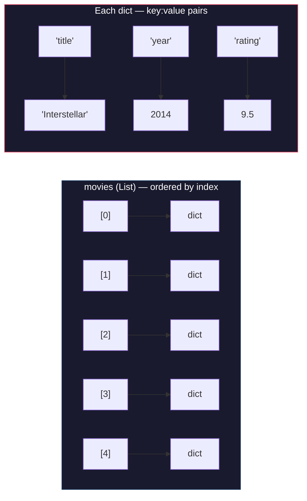

# Python Through AI: Learn by Reading, Not Memorizing

You're about to learn Python — the most widely used language in AI engineering. But you're not going to learn it the traditional way. Instead of memorizing syntax flashcards, you'll give AI a task, read the code it writes, understand the patterns, and then modify it yourself. This is how professional engineers work in 2026.

:::callout[info]
This article assumes you have Cursor installed and have had at least one conversation with an AI assistant. If not, go back and complete the Layer 0 prerequisites first.
:::

## The AI-First Learning Method

Traditional programming courses start with syntax. They teach you that `x = 5` creates a variable before you have any reason to care about variables. That approach works, but it's slow and disconnected from real problem-solving.

Here's the method you'll use instead:

1. **Start with a task** — a concrete thing you want to build
2. **Ask AI to write the code** — describe what you want in plain English
3. **Read and understand** — go through the code line by line
4. **Modify it** — change something, break something, fix something
5. **Repeat** — each cycle builds your understanding

You don't need to memorize `for item in my_list:` — you need to recognize it when you see it and understand what it does. The syntax will become second nature through repetition, not flashcards.

:::callout[tip]
Open Cursor right now. Create a new file called `learning.py`. You'll use this file to follow along with every example in this article. Type (or paste) the code yourself — don't just read it.
:::

## Variables and Data Types

Let's say you want to store information about a movie. Open Cursor's AI chat (Cmd+L or Ctrl+L) and type:

> "Write Python code that stores information about my favorite movie — its title, release year, rating out of 10, and whether I've seen it in theaters."

AI will give you something like this:

```python title="movie_info.py"
title = "Interstellar"
release_year = 2014
rating = 9.5
seen_in_theaters = True
```

Four lines. Four **variables**. Let's break down what's happening.

:::definition[Variable]
A variable is a name that points to a piece of data. Think of it as a labeled box — `title` is the label, `"Interstellar"` is what's inside. You can change what's in the box anytime.
:::

Each variable holds a different **data type**:

| Variable | Value | Type | What it means |
|---|---|---|---|
| `title` | `"Interstellar"` | **string** | Text, always in quotes |
| `release_year` | `2014` | **integer** | A whole number |
| `rating` | `9.5` | **float** | A decimal number |
| `seen_in_theaters` | `True` | **boolean** | True or False — that's it |

:::definition[Data Type]
A data type tells Python what kind of value a variable holds. Different types support different operations — you can add numbers together, but you can't divide a string by a boolean.
:::

:::details[How this actually works under the hood]
In Python, everything is an **object** in memory. When you write `title = "Interstellar"`, Python creates a string object somewhere in memory and makes `title` point to it. The variable is not a box — it is a label stuck to the object.

This means you can check a variable's type at any time with `type()`:
```python title="checking_types.py"
print(type(title))         # <class 'str'>
print(type(release_year))  # <class 'int'>
print(type(rating))        # <class 'float'>
print(type(seen_in_theaters))  # <class 'bool'>
```

Python is **dynamically typed** — you can reassign a variable to a different type at any time. `rating = "excellent"` would turn it from a float into a string. Most languages do not allow this. It is convenient but can also cause bugs if you lose track of what type a variable holds.
:::

**Now modify it.** Change the movie to one you actually like. Add a new variable called `genre` that stores the genre as a string. Run the file (click the play button or press Ctrl+Shift+` to open the terminal, then type `python learning.py`).

Nothing happens? That's correct — you stored data but didn't tell Python to display it. Add this line at the bottom:

```python
print(f"{title} ({release_year}) - {rating}/10")
```

Run it again. You should see something like: `Interstellar (2014) - 9.5/10`

:::details[What's that `f` before the string?]
The `f` makes it an **f-string** (formatted string). Anything inside `{}` gets replaced with the variable's value. It's Python's cleanest way to mix text and data. Without the `f`, it would literally print `{title}` instead of the movie name.
:::

## Lists and Dictionaries

One movie isn't enough. Ask AI:

> "Create a Python list of 5 movies, where each movie is a dictionary with title, year, and rating."

```python title="movie_collection.py"
movies = [
    {"title": "Interstellar", "year": 2014, "rating": 9.5},
    {"title": "The Matrix", "year": 1999, "rating": 9.0},
    {"title": "Inception", "year": 2010, "rating": 8.8},
    {"title": "Arrival", "year": 2016, "rating": 8.5},
    {"title": "Blade Runner 2049", "year": 2017, "rating": 8.7},
]
```

Two new data structures just appeared. Here is how to visualize them:

:::diagram

:::

:::definition[List]
A list is an ordered collection of items, written with square brackets `[]`. Items can be anything — numbers, strings, even other lists. You access items by their position (starting from 0).
:::

:::definition[Dictionary]
A dictionary (dict) stores **key-value pairs**, written with curly braces `{}`. Instead of accessing items by position, you use a named key. `movie["title"]` gives you the title.
:::

:::details[How this actually works under the hood]
A **list** in Python is backed by a dynamic array. When you access `movies[2]`, Python jumps directly to the third slot in memory — this is instant regardless of list size (called O(1) access). Adding items with `.append()` is also fast.

A **dictionary** uses a hash table. When you access `movie["title"]`, Python hashes the string `"title"` into a number, uses that number as an index into an internal array, and retrieves the value. This is why dictionary lookups are fast even with thousands of keys — they do not scan through every key sequentially.

You can also nest these structures arbitrarily: lists of dicts (like our movies), dicts of lists, dicts of dicts, and so on. The `movies` variable above is a list of dictionaries — one of the most common patterns in real-world Python code.
:::

Try this yourself — add a line to print the third movie's title:

```python title="accessing_data.py"
print(movies[2]["title"])  # "Inception"
```

Why `[2]` for the third movie? Lists are **zero-indexed** — the first item is at position 0, the second at 1, the third at 2. This trips up everyone at first. It'll become automatic.

**Modify it.** Replace the movies with your own favorites. Add a `"genre"` key to each dictionary. Then print the title and genre of the last movie in the list.

## If/Else: Making Decisions

Programs need to make decisions. Ask AI:

> "Write Python code that checks a movie's rating and prints whether it's 'Must watch', 'Worth seeing', or 'Skip it' based on the score."

```python title="movie_rating.py"
rating = 8.5

if rating >= 9.0:
    print("Must watch")
elif rating >= 7.0:
    print("Worth seeing")
else:
    print("Skip it")
```

:::definition[Conditional (if/else)]
A conditional lets your program choose different paths based on a condition. `if` checks a condition — if it's true, the indented code runs. `elif` (else if) checks another condition. `else` catches everything that didn't match.
:::

Notice the **indentation**. In Python, indentation isn't optional decoration — it's how Python knows which code belongs inside the `if` block. Everything indented under `if rating >= 9.0:` only runs when that condition is true.

**Modify it.** Change the thresholds. Add a fourth category — maybe `"Masterpiece"` for ratings above 9.5. Change the variable to test each path.

:::details[How this actually works under the hood]
Python evaluates conditions **top to bottom** and stops at the first match. If `rating` is 9.5, it matches `rating >= 9.0` and never checks the `elif`. This is called **short-circuit evaluation** — Python is efficient about not doing work it does not need to do.

The comparison operators (`>=`, `>`, `==`, `!=`, `<`, `<=`) all return `True` or `False`. You can combine them with `and`, `or`, and `not`:
```python title="combined_conditions.py"
if rating >= 8.0 and release_year > 2010:
    print("Recent and highly rated")
```

Python also supports a neat shorthand: `7.0 <= rating < 9.0` checks that rating is between 7 and 9 in a single expression.
:::

:::callout[tip]
When you're testing conditionals, deliberately set the variable to values that trigger each branch. If you have 4 branches, test at least 4 values. This habit — thinking about edge cases — separates good engineers from everyone else.
:::

## For Loops: Doing Things Repeatedly

You have a list of 5 movies. Printing them one by one would be tedious. Ask AI:

> "Write a for loop that goes through the movies list and prints each movie's title and rating in a nice format."

```python title="print_all_movies.py"
movies = [
    {"title": "Interstellar", "year": 2014, "rating": 9.5},
    {"title": "The Matrix", "year": 1999, "rating": 9.0},
    {"title": "Inception", "year": 2010, "rating": 8.8},
    {"title": "Arrival", "year": 2016, "rating": 8.5},
    {"title": "Blade Runner 2049", "year": 2017, "rating": 8.7},
]

for movie in movies:
    print(f"{movie['title']} - {movie['rating']}/10")
```

:::definition[For Loop]
A for loop repeats a block of code once for each item in a collection. `for movie in movies:` means "take each item from the `movies` list, call it `movie`, and run the indented code with it."
:::

The variable name `movie` is your choice — Python doesn't care. You could write `for x in movies:` and it would work the same way. But `movie` is descriptive, which makes the code easier to read. Good variable names are a gift to your future self.

**Now combine loops with conditionals.** Ask AI:

> "Modify the loop to only print movies with a rating above 8.5."

```python title="filter_high_rated.py"
for movie in movies:
    if movie["rating"] > 8.5:
        print(f"{movie['title']} - {movie['rating']}/10")
```

See how the `if` is indented inside the `for`? That's nesting — code inside code. The `print` is indented twice: once for the loop, once for the conditional. It only runs when both conditions are met: we're looking at a movie AND its rating is above 8.5.

**Modify it.** Print only movies released after 2010. Then try printing movies sorted by rating (ask AI how to sort a list of dictionaries).

## Functions: Reusable Blocks of Code

You've been writing code that runs top to bottom. Functions let you package code into reusable blocks. Ask AI:

> "Write a Python function that takes a list of movies and a minimum rating, and returns only the movies above that rating."

```python title="filter_movies.py"
def filter_movies(movies, min_rating):
    results = []
    for movie in movies:
        if movie["rating"] >= min_rating:
            results.append(movie)
    return results
```

:::definition[Function]
A function is a named block of code that takes inputs (parameters), does something, and optionally returns an output. You define it once with `def`, then call it as many times as you need.
:::

Let's trace through this:

1. `def filter_movies(movies, min_rating):` — defines a function named `filter_movies` that takes two **parameters**
2. `results = []` — creates an empty list to hold our filtered movies
3. The `for` loop checks each movie's rating against `min_rating`
4. `.append(movie)` adds matching movies to the `results` list
5. `return results` sends the filtered list back to whoever called the function

To use it:

```python title="using_filter.py"
top_movies = filter_movies(movies, 9.0)
for movie in top_movies:
    print(movie["title"])
```

The function doesn't print anything itself — it returns data. The calling code decides what to do with that data. This separation is important. It makes your function reusable in different contexts.

:::details[How this actually works under the hood]
When Python sees `def filter_movies(...)`, it does not run the code inside — it creates a function object and stores it under the name `filter_movies`. The code only runs when you **call** the function.

Each call creates a new **scope** — a private workspace for that function's variables. The `results` list inside `filter_movies` is completely separate from any `results` variable that might exist outside the function. When the function ends, its scope is destroyed (cleaned up by Python's garbage collector).

Functions are first-class objects in Python, which means you can pass them as arguments, return them from other functions, and store them in variables. You will see this pattern a lot in real code:
```python title="functions_as_arguments.py"
# Python's built-in sorted() takes a function as its "key" argument
sorted_movies = sorted(movies, key=lambda m: m["rating"], reverse=True)
```
The `lambda` keyword creates a tiny anonymous function inline. It is shorthand for defining a named function that does one thing.
:::

**Modify it.** Write a second function called `average_rating` that takes a list of movies and returns the average rating. Ask AI if you get stuck, but try writing it yourself first.

:::callout[info]
A pattern you'll notice: AI-generated code almost always uses functions. That's because functions are the building blocks of real programs. If your code doesn't have functions, it's probably a script — which is fine for learning, but real projects organize code into functions, classes, and modules.
:::

## Putting It All Together

You now know the core building blocks of Python:

| Concept | What it does | Example |
|---|---|---|
| **Variables** | Store data | `name = "Ada"` |
| **Data types** | Define what kind of data | `str`, `int`, `float`, `bool` |
| **Lists** | Ordered collections | `[1, 2, 3]` |
| **Dicts** | Key-value pairs | `{"name": "Ada"}` |
| **If/else** | Make decisions | `if x > 10:` |
| **For loops** | Repeat actions | `for item in items:` |
| **Functions** | Reusable code blocks | `def greet(name):` |

These seven concepts cover roughly 80% of what you'll write day-to-day. The remaining 20% — classes, error handling, imports, file I/O — you'll pick up as you need them. And AI will always be there to help you with syntax you don't remember.

:::callout[warning]
A common trap: copying AI code without reading it. If you can't explain what every line does, you don't understand it yet. Slow down. Ask AI to explain the parts you don't get. The goal is comprehension, not speed.
:::

## The Pattern That Matters

Here's what to take away from this article. When you encounter any new Python concept:

1. **Ask AI to write it** — describe what you want in plain English
2. **Read every line** — if a line confuses you, ask AI to explain it
3. **Predict what it does** — before running, guess the output
4. **Run it** — see if your prediction was right
5. **Break it on purpose** — change a value, remove a line, see what error you get
6. **Fix it** — understanding error messages is a superpower

This loop works for every programming concept you'll ever encounter. You've already used it six times in this article without thinking about it.

:::build-challenge
### Movie Recommender

Build a movie recommendation program in Cursor with AI assistance. Here's the spec:

1. Create a list of at least 5 movies you like. Each movie should be a dictionary with `title`, `year`, `genre`, and `rating`
2. Ask the user what genre they're in the mood for (use `input()` — ask AI how)
3. Ask the user for their minimum rating threshold
4. Filter the movies by genre and rating using if/else logic
5. Print the matching recommendations in a clean format
6. If no movies match, print a helpful message

**Rules:**
- Use variables, lists, dicts, if/else, a for loop, and at least one function
- Use Cursor AI to help you write the code, but make sure you understand every line
- This is pure Python logic — no actual AI recommendation engine (that comes later)

**Stretch goal:** Add a "surprise me" option that picks a random movie from the full list (ask AI about the `random` module).
:::
