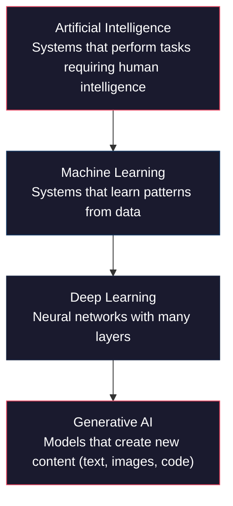
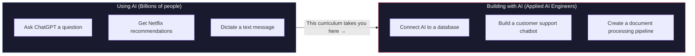

# What Is AI? The Real Story

Artificial intelligence is everywhere right now — in your phone, your search results, your social media feed, and increasingly in the tools people use to build software. This article cuts through the hype to explain what AI actually is, what it can do today, and why learning to build with it is one of the most valuable skills you can develop.

## Forget the Movie Robots

:::callout[info]
When most people hear "AI," they picture sentient robots or a superintelligence trying to take over the world. That makes for great movies, but it has almost nothing to do with the AI that's changing industries right now.
:::

The AI you'll work with in this curriculum is practical. It's software that can learn patterns from data and use those patterns to make predictions, generate text, recognize images, or make decisions. It's a tool — a powerful one — but a tool nonetheless.

:::definition[Artificial Intelligence (AI)]
Software systems that can perform tasks that typically require human intelligence — like understanding language, recognizing images, making recommendations, or generating content. Modern AI learns these abilities from large amounts of data rather than being explicitly programmed with rules.
:::

Think of it this way: a traditional program follows exact instructions. "If the user types X, display Y." An AI system learns from examples. Show it thousands of emails labeled "spam" or "not spam," and it figures out the patterns on its own. No one writes a rule for every possible spam message — the AI discovers what spam looks like.

## The AI Landscape

AI is not one thing — it is a set of nested fields, each more specific than the last. Here is how they relate:

:::diagram

:::

:::definition[Machine Learning (ML)]
A subset of AI where systems learn from data instead of being explicitly programmed. Rather than writing rules by hand, you show the system thousands of examples and it discovers the patterns itself. Spam filters, recommendation engines, and image classifiers are all ML.
:::

:::definition[Deep Learning]
A subset of machine learning that uses **neural networks** with many layers to learn complex patterns. Deep learning powers image recognition, speech-to-text, and language translation. It requires large amounts of data and computing power, but it can learn patterns too complex for simpler ML methods.
:::

:::definition[Generative AI]
AI models that create new content — text, images, code, music, video. Large language models (LLMs) like Claude and GPT are generative AI. So are image generators like DALL-E and Midjourney. This is the layer of AI you will work with most in this curriculum.
:::

The curriculum focuses primarily on the generative AI layer — specifically large language models — because that is where the most accessible and impactful opportunities are for applied AI engineers right now.

## AI You Already Use

You interact with AI dozens of times a day without thinking about it. Here are some systems you've probably used today:

**Recommendations.** Netflix suggesting your next show, Spotify building your Discover Weekly playlist, Amazon recommending products — these all use AI models that learn your preferences from your behavior.

**Search.** When you type a question into Google, AI helps interpret what you mean, ranks the results, and sometimes generates a direct answer at the top of the page.

**Voice assistants.** Siri, Alexa, and Google Assistant use AI to convert your speech to text, understand your intent, and generate a response.

**ChatGPT and Claude.** These are large language models (LLMs) — AI systems trained on massive amounts of text that can have conversations, write code, analyze documents, and reason through problems. If you've used ChatGPT, you've already interacted with one of the most sophisticated AI systems ever built.

**GitHub Copilot and Cursor.** AI-powered coding tools that can write, explain, and debug code alongside you. These are the tools you'll learn to use in this curriculum.

:::details[More AI in the wild]
- **Self-driving cars** use computer vision AI to interpret camera feeds and make driving decisions in real time
- **Medical imaging** systems use AI to detect tumors, fractures, and diseases in X-rays and MRIs — sometimes more accurately than human radiologists
- **Fraud detection** at banks uses AI to flag suspicious transactions the moment they happen
- **Translation** services like Google Translate and DeepL use neural networks to translate between 100+ languages
- **Content moderation** on social platforms uses AI to detect harmful content before humans ever see it
:::

## "Using AI" vs. "Building with AI"

There's a critical distinction that shapes this entire curriculum.

:::diagram

:::

**Using AI** means interacting with AI products that someone else built. Asking ChatGPT a question. Getting a recommendation on Netflix. Dictating a text message. Billions of people use AI every day.

**Building with AI** means creating applications, tools, and systems that leverage AI capabilities. Connecting an AI model to a database. Building a chatbot for a company's customer support. Creating a system that automatically processes documents. This is what applied AI engineers do.

:::callout[tip]
You don't need a PhD to build with AI. The tools and APIs available today make it possible to build powerful AI applications with practical programming skills and a solid understanding of how these systems work. That's exactly what this curriculum teaches.
:::

This curriculum is designed to take you from someone who has never written a line of code to someone who can build and ship real AI-powered applications. Not in theory — in practice.

## The Applied AI Engineer

:::definition[Applied AI Engineer]
A person who builds applications and systems that use AI models and services. Rather than training models from scratch, applied AI engineers connect existing AI capabilities (like language models, vision models, and embedding models) to real-world problems through APIs, SDKs, and frameworks.
:::

The applied AI engineer is one of the fastest-growing roles in tech. Here's why: companies don't need thousands of people training models from scratch. They need people who can take powerful AI models that already exist and build useful things with them.

Think of it like electricity. Very few people need to understand how to build a power plant. But millions of people need to know how to wire a building, design electrical systems, or build products that use electricity. Applied AI engineers are the electricians, architects, and product builders of the AI era.

What does an applied AI engineer actually do?

- **Connect AI models to applications.** Take a language model like Claude and build it into a customer support system, a document analyzer, or a coding assistant.
- **Design prompts and workflows.** Figure out how to get the best results from AI models by crafting the right instructions and building multi-step processes.
- **Build data pipelines.** Get the right information to the AI at the right time — from databases, documents, APIs, and user input.
- **Ship products.** Deploy AI-powered applications that real people use, monitor their performance, and improve them over time.

## What You'll Learn Here

This curriculum follows a clear path:

**Layer 0 (where you are now):** You'll set up your tools, learn what programming is, and start talking to AI to write code. No prior experience required.

**Layer 1:** You'll learn Python through AI — not by memorizing syntax, but by building things with an AI assistant helping you write and understand code.

**Layer 2:** You'll dive into the core applied AI skills — using AI APIs, prompt engineering, building RAG (retrieval-augmented generation) systems, and creating AI agents.

**Layer 3:** You'll build production-quality AI applications — web apps, databases, deployment, monitoring. Real software that real people can use.

**Layers 4-5 (optional branches):** For students who want to go deeper into how AI models actually work — neural networks, training, computer vision, NLP, and more.

:::callout[info]
You don't need to follow a rigid path. The learning tree is a graph, not a straight line. You can explore topics that interest you, skip ahead if you have experience, and come back to fill in gaps. Every node shows you what it requires and what it unlocks.
:::

## Why Now Is the Best Time to Start

The tools available to you today didn't exist two years ago. AI coding assistants like Cursor mean you can start building real things on day one, with an AI pair programmer by your side. Language model APIs mean you can add sophisticated AI capabilities to any application with a few lines of code.

The gap between "I've never coded" and "I built an AI-powered app" has never been smaller. This curriculum is designed to close that gap as efficiently as possible.

You start today.

:::build-challenge

### Explore: Your First AI Conversation

Head to [claude.ai](https://claude.ai) and create a free account if you don't have one. Then have a real conversation with Claude. Try each of these:

1. **Ask it to write a poem** about something you care about. Then ask it to rewrite the poem in a completely different style.
2. **Give it a math problem** — something harder than basic arithmetic. Ask it to explain its reasoning step by step.
3. **Ask it to explain something complex** in simple terms. Pick a topic you've always been curious about but never fully understood.
4. **Try to find its limits.** Ask it something it can't do well. Ask it about very recent events, or ask it to do something creative and see where it struggles.

Pay attention to how you phrase your questions. Notice that when you're more specific, you get better answers. That instinct — learning how to communicate clearly with AI — is the foundation of everything you'll learn in this curriculum.

**What to reflect on:** Did the AI surprise you? Where did it fall short? How did changing your wording change the response?
:::
