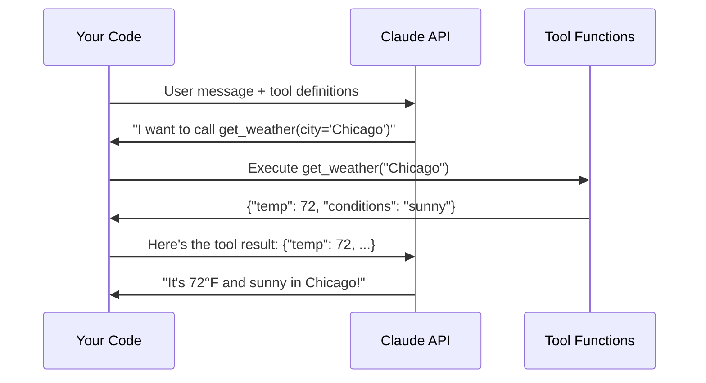
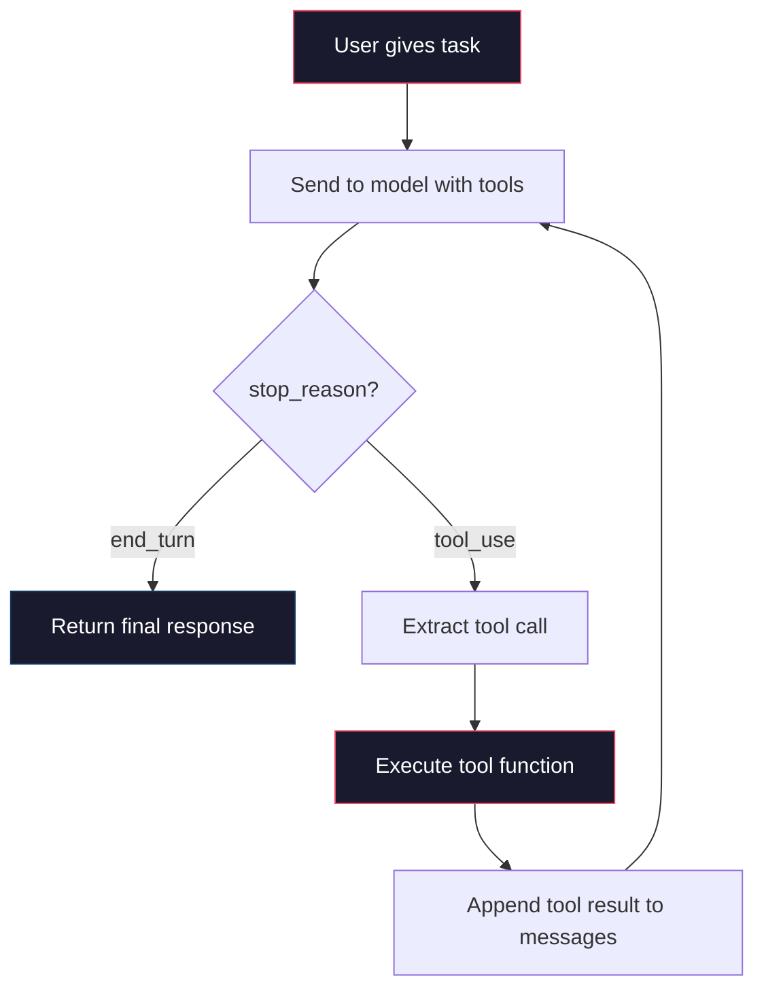

# Agents and Tool Use

Everything you have built so far — chatbots, RAG pipelines — follows the same pattern: the user asks a question, the model generates text. That is useful, but it is fundamentally limited. The model can only *say* things. It cannot *do* things.

Agents change that. An agent is an AI system that can take actions: search the web, read files, query databases, call APIs, run code. The model decides *what* to do, and your code *executes* it. This is the pattern behind every serious AI application being built today — from coding assistants to autonomous research tools.

This article teaches you the tool use pattern from the ground up, then builds progressively toward a working multi-tool agent.

## What Is an Agent?

:::definition[AI Agent]
An AI system that uses a language model to **decide what actions to take**, then executes those actions through code. Unlike a chatbot that only generates text, an agent can interact with external systems — APIs, databases, file systems, the web — in a loop until a task is complete.
:::

The simplest way to think about it: a chatbot *talks*. An agent *acts*.

Here is the key distinction:

| | Chatbot | Agent |
|---|---|---|
| **Input** | User message | User task |
| **Output** | Text response | Completed task (with text explanation) |
| **Interaction** | Single turn or multi-turn conversation | Loop: think, act, observe, repeat |
| **External systems** | None (or RAG retrieval) | Tools: APIs, databases, file systems, code execution |
| **Autonomy** | Responds to each message | Decides what to do next on its own |

:::callout[info]
The term "agent" is used loosely in the AI industry. Some people call a chatbot with RAG an "agent." In this curriculum, we use a specific definition: an agent is a system where the model *chooses which actions to take* from a set of available tools, and those actions are executed in a loop until the task is done.
:::

## The Tool Use Pattern

Tool use (also called "function calling") is the mechanism that makes agents possible. Here is how it works:

:::diagram

:::

The flow has four steps:

1. **You define tools** as JSON schemas describing what each tool does and what parameters it accepts.
2. **The model decides** when to call a tool and with what arguments — you do not hardcode this.
3. **Your code executes** the actual function and gets a result.
4. **You send the result back** to the model, which uses it to continue responding.

The critical insight: the model never executes code. It *requests* a tool call with specific arguments, and your application is responsible for actually running it. This keeps you in control.

## Defining Tools

Tools are defined as JSON schemas that you pass to the API alongside the user's message. Each tool has a name, a description, and an input schema describing its parameters.

Here is a simple calculator tool:

```python
calculator_tool = {
    "name": "calculator",
    "description": "Evaluate a mathematical expression. Use this for any arithmetic, "
                   "algebra, or math calculations. Supports +, -, *, /, **, sqrt, etc.",
    "input_schema": {
        "type": "object",
        "properties": {
            "expression": {
                "type": "string",
                "description": "The mathematical expression to evaluate, e.g. '(25 * 4) + 17'"
            }
        },
        "required": ["expression"]
    }
}
```

And a weather lookup tool:

```python
weather_tool = {
    "name": "get_weather",
    "description": "Get the current weather for a specific city. Returns temperature, "
                   "conditions, and humidity.",
    "input_schema": {
        "type": "object",
        "properties": {
            "city": {
                "type": "string",
                "description": "The city name, e.g. 'Chicago' or 'London'"
            },
            "units": {
                "type": "string",
                "enum": ["fahrenheit", "celsius"],
                "description": "Temperature units. Defaults to fahrenheit."
            }
        },
        "required": ["city"]
    }
}
```

:::callout[tip]
Tool descriptions matter enormously. The model uses the description to decide *when* to call the tool. A vague description like "does math" will lead to the model calling it at wrong times or not calling it when it should. Be specific about what the tool does and when to use it. Include examples in the description when it helps.
:::

### Implementing the Tool Functions

The tool definitions tell the model what is available. You also need the actual Python functions that do the work:

```python
import json


def calculator(expression: str) -> str:
    """Safely evaluate a mathematical expression."""
    # Only allow safe math operations
    allowed_chars = set("0123456789+-*/.() ")
    if not all(c in allowed_chars for c in expression):
        return json.dumps({"error": f"Invalid characters in expression: {expression}"})

    try:
        result = eval(expression)  # Safe because we validated the input
        return json.dumps({"expression": expression, "result": result})
    except Exception as e:
        return json.dumps({"error": str(e)})


def get_weather(city: str, units: str = "fahrenheit") -> str:
    """Get weather for a city. In production, this would call a real weather API."""
    # Simulated weather data for demonstration
    weather_data = {
        "Chicago": {"temp_f": 72, "temp_c": 22, "conditions": "Sunny", "humidity": 45},
        "London": {"temp_f": 59, "temp_c": 15, "conditions": "Cloudy", "humidity": 78},
        "Tokyo": {"temp_f": 81, "temp_c": 27, "conditions": "Humid", "humidity": 85},
    }

    data = weather_data.get(city)
    if not data:
        return json.dumps({"error": f"Weather data not available for {city}"})

    temp = data["temp_c"] if units == "celsius" else data["temp_f"]
    unit_label = "C" if units == "celsius" else "F"

    return json.dumps({
        "city": city,
        "temperature": f"{temp}°{unit_label}",
        "conditions": data["conditions"],
        "humidity": f"{data['humidity']}%"
    })
```

:::callout[warning]
Always return tool results as JSON strings. The model parses the result to incorporate it into its response. A well-structured JSON result gives the model clear data to work with. Returning raw text like "it's 72 degrees" works but is harder for the model to interpret reliably.
:::

## Making Your First Tool Use Call

Now let's wire it together. The API call looks almost identical to a normal chat call, except you include a `tools` parameter:

```python
import anthropic
from dotenv import load_dotenv

load_dotenv()

client = anthropic.Anthropic()

# Map tool names to functions
tool_functions = {
    "calculator": calculator,
    "get_weather": get_weather,
}

tools = [calculator_tool, weather_tool]


def call_with_tools(user_message: str) -> str:
    """Send a message to Claude with tools available."""
    response = client.messages.create(
        model="claude-sonnet-4-20250514",
        max_tokens=1024,
        tools=tools,
        messages=[{"role": "user", "content": user_message}]
    )

    # Check if the model wants to use a tool
    if response.stop_reason == "tool_use":
        # Find the tool use block in the response
        tool_use_block = next(
            block for block in response.content if block.type == "tool_use"
        )

        tool_name = tool_use_block.name
        tool_input = tool_use_block.input

        print(f"[Tool call: {tool_name}({tool_input})]")

        # Execute the tool
        func = tool_functions[tool_name]
        result = func(**tool_input)

        print(f"[Tool result: {result}]")

        # Send the result back to Claude
        final_response = client.messages.create(
            model="claude-sonnet-4-20250514",
            max_tokens=1024,
            tools=tools,
            messages=[
                {"role": "user", "content": user_message},
                {"role": "assistant", "content": response.content},
                {
                    "role": "user",
                    "content": [
                        {
                            "type": "tool_result",
                            "tool_use_id": tool_use_block.id,
                            "content": result,
                        }
                    ],
                },
            ],
        )

        return final_response.content[0].text

    # No tool use — just return the text response
    return response.content[0].text
```

Try it:

```python
# This will trigger the calculator tool
print(call_with_tools("What is 1847 * 29 + 456?"))

# This will trigger the weather tool
print(call_with_tools("What's the weather like in Tokyo?"))

# This will NOT trigger any tool — just a normal response
print(call_with_tools("What is the capital of France?"))
```

The model decides on its own whether to use a tool. Ask it a math question and it calls the calculator. Ask about weather and it calls the weather API. Ask a general knowledge question and it just responds directly. You never write `if "math" in question: use_calculator()`. The model figures it out.

## The Agentic Loop

The single tool call pattern above handles one tool call at a time. But real agents need to call *multiple tools in sequence* — think, act, observe, think again, act again — until the task is done. This is the agentic loop.

:::diagram

:::

The loop is simple: keep calling the API until the model says it is done (stop_reason is `end_turn` instead of `tool_use`).

```python
def agentic_loop(user_message: str, system: str = None, max_iterations: int = 10) -> str:
    """Run an agentic loop that handles multiple sequential tool calls."""
    messages = [{"role": "user", "content": user_message}]

    for iteration in range(max_iterations):
        # Call the API
        response = client.messages.create(
            model="claude-sonnet-4-20250514",
            max_tokens=4096,
            system=system or "You are a helpful assistant with access to tools.",
            tools=tools,
            messages=messages,
        )

        # Append the assistant's response to the conversation
        messages.append({"role": "assistant", "content": response.content})

        # If the model is done, return the final text
        if response.stop_reason == "end_turn":
            # Extract the text from the response
            text_blocks = [
                block.text for block in response.content if hasattr(block, "text")
            ]
            return "\n".join(text_blocks)

        # Otherwise, process all tool calls in this response
        tool_results = []
        for block in response.content:
            if block.type == "tool_use":
                print(f"  [{iteration + 1}] Tool: {block.name}({block.input})")

                # Execute the tool
                func = tool_functions.get(block.name)
                if func:
                    result = func(**block.input)
                else:
                    result = json.dumps({"error": f"Unknown tool: {block.name}"})

                tool_results.append({
                    "type": "tool_result",
                    "tool_use_id": block.id,
                    "content": result,
                })

        # Send all tool results back
        messages.append({"role": "user", "content": tool_results})

    return "Max iterations reached. The agent could not complete the task."
```

Now the agent can chain tools. Ask it "What's 72 degrees Fahrenheit in Celsius, and is that warmer than London right now?" and it will:

1. Call `calculator` to convert 72F to Celsius
2. Call `get_weather` for London
3. Compare the results and give you a final answer

```python
result = agentic_loop(
    "What's 72 degrees Fahrenheit in Celsius? "
    "And how does that compare to the current temperature in London?"
)
print(result)
```

## Building a Multi-Tool Agent

Let's build a more useful agent with a richer set of tools. This agent can do math, check the weather, and look up the current date/time:

```python
"""
multi_tool_agent.py — An agent with multiple tools and proper conversation management.
"""

import anthropic
import json
from datetime import datetime
from dotenv import load_dotenv

load_dotenv()

client = anthropic.Anthropic()


# --- Tool Definitions ---

TOOLS = [
    {
        "name": "calculator",
        "description": "Evaluate a mathematical expression. Supports basic arithmetic "
                       "(+, -, *, /), exponents (**), and parentheses.",
        "input_schema": {
            "type": "object",
            "properties": {
                "expression": {
                    "type": "string",
                    "description": "Math expression to evaluate, e.g. '(25 * 4) + 17'"
                }
            },
            "required": ["expression"]
        }
    },
    {
        "name": "get_current_datetime",
        "description": "Get the current date and time. Use this when the user asks about "
                       "today's date, the current time, or needs temporal context.",
        "input_schema": {
            "type": "object",
            "properties": {},
            "required": []
        }
    },
    {
        "name": "get_weather",
        "description": "Get the current weather for a city. Returns temperature (F), "
                       "conditions, and humidity.",
        "input_schema": {
            "type": "object",
            "properties": {
                "city": {
                    "type": "string",
                    "description": "City name, e.g. 'Chicago'"
                }
            },
            "required": ["city"]
        }
    },
    {
        "name": "search_knowledge_base",
        "description": "Search an internal knowledge base for information. Use this when "
                       "the user asks factual questions that might be in the knowledge base.",
        "input_schema": {
            "type": "object",
            "properties": {
                "query": {
                    "type": "string",
                    "description": "The search query"
                }
            },
            "required": ["query"]
        }
    },
]


# --- Tool Implementations ---

def calculator(expression: str) -> str:
    allowed_chars = set("0123456789+-*/.() ")
    if not all(c in allowed_chars for c in expression):
        return json.dumps({"error": "Invalid characters in expression"})
    try:
        result = eval(expression)
        return json.dumps({"result": result})
    except Exception as e:
        return json.dumps({"error": str(e)})


def get_current_datetime() -> str:
    now = datetime.now()
    return json.dumps({
        "date": now.strftime("%Y-%m-%d"),
        "time": now.strftime("%H:%M:%S"),
        "day_of_week": now.strftime("%A"),
        "timezone": "local",
    })


def get_weather(city: str) -> str:
    # In production, call a real API like OpenWeatherMap
    weather_data = {
        "Chicago": {"temp": 72, "conditions": "Sunny", "humidity": 45},
        "London": {"temp": 59, "conditions": "Overcast", "humidity": 78},
        "Tokyo": {"temp": 81, "conditions": "Humid", "humidity": 85},
        "New York": {"temp": 68, "conditions": "Partly Cloudy", "humidity": 55},
        "San Francisco": {"temp": 63, "conditions": "Foggy", "humidity": 82},
    }
    data = weather_data.get(city)
    if not data:
        return json.dumps({"error": f"No weather data for '{city}'. Available: {list(weather_data.keys())}"})
    return json.dumps({"city": city, **data})


def search_knowledge_base(query: str) -> str:
    # In production, this would search a real vector database or API
    kb = {
        "office hours": "Office hours are Monday-Friday 9am-5pm CST.",
        "return policy": "Returns accepted within 30 days with receipt.",
        "shipping": "Free shipping on orders over $50. Standard delivery 5-7 days.",
    }
    results = []
    for key, value in kb.items():
        if any(word in key for word in query.lower().split()):
            results.append(value)
    if results:
        return json.dumps({"results": results})
    return json.dumps({"results": [], "message": "No relevant information found."})


TOOL_FUNCTIONS = {
    "calculator": calculator,
    "get_current_datetime": get_current_datetime,
    "get_weather": get_weather,
    "search_knowledge_base": search_knowledge_base,
}


# --- The Agent ---

class Agent:
    def __init__(self, system_prompt: str, tools: list, tool_functions: dict):
        self.client = anthropic.Anthropic()
        self.system_prompt = system_prompt
        self.tools = tools
        self.tool_functions = tool_functions
        self.messages = []
        self.total_tokens = {"input": 0, "output": 0}

    def run(self, user_message: str, max_iterations: int = 10) -> str:
        """Process a user message through the agentic loop."""
        self.messages.append({"role": "user", "content": user_message})

        for i in range(max_iterations):
            response = self.client.messages.create(
                model="claude-sonnet-4-20250514",
                max_tokens=4096,
                system=self.system_prompt,
                tools=self.tools,
                messages=self.messages,
            )

            # Track token usage
            self.total_tokens["input"] += response.usage.input_tokens
            self.total_tokens["output"] += response.usage.output_tokens

            # Add assistant response to history
            self.messages.append({"role": "assistant", "content": response.content})

            # If the model is done, extract and return text
            if response.stop_reason == "end_turn":
                text_parts = [b.text for b in response.content if hasattr(b, "text")]
                return "\n".join(text_parts)

            # Process tool calls
            tool_results = []
            for block in response.content:
                if block.type == "tool_use":
                    func = self.tool_functions.get(block.name)
                    if func:
                        try:
                            result = func(**block.input)
                        except Exception as e:
                            result = json.dumps({"error": str(e)})
                    else:
                        result = json.dumps({"error": f"Unknown tool: {block.name}"})

                    print(f"  [Step {i+1}] {block.name}({block.input}) -> {result[:100]}")
                    tool_results.append({
                        "type": "tool_result",
                        "tool_use_id": block.id,
                        "content": result,
                    })

            self.messages.append({"role": "user", "content": tool_results})

        return "Agent reached maximum iterations without completing the task."

    def reset(self):
        """Clear conversation history."""
        self.messages = []

    def get_stats(self) -> dict:
        """Return usage statistics."""
        return {
            "total_input_tokens": self.total_tokens["input"],
            "total_output_tokens": self.total_tokens["output"],
            "conversation_turns": len(self.messages),
        }


# --- Run it ---

if __name__ == "__main__":
    agent = Agent(
        system_prompt=(
            "You are a helpful assistant with access to tools. Use them when needed. "
            "When you use multiple tools, explain your reasoning between steps."
        ),
        tools=TOOLS,
        tool_functions=TOOL_FUNCTIONS,
    )

    # Test with a multi-step task
    result = agent.run(
        "What day is it today, and what's the weather like in Chicago? "
        "If the temperature is above 70, calculate what it is in Celsius."
    )
    print(result)
    print(f"\nStats: {agent.get_stats()}")
```

Run it and watch the agent chain multiple tools together automatically:

```bash
python multi_tool_agent.py
```

You will see output like:

```
  [Step 1] get_current_datetime({}) -> {"date": "2026-03-30", ...}
  [Step 1] get_weather({"city": "Chicago"}) -> {"city": "Chicago", "temp": 72, ...}
  [Step 2] calculator({"expression": "(72 - 32) * 5 / 9"}) -> {"result": 22.22...}
It's Monday, March 30th, 2026. The weather in Chicago is 72°F and sunny...
```

Notice how the model called two tools in parallel in Step 1 (date and weather), then used the weather result to decide it needed the calculator in Step 2. The model orchestrated the entire workflow.

## When to Use Agents vs. Simpler Approaches

Not everything needs an agent. Agents add complexity, cost, and latency. Use the simplest approach that solves your problem.

:::tabs

```tab[Use Direct Prompting When...]
- The task can be completed in a single LLM call
- No external data or actions are needed
- Examples: summarization, translation, classification, code generation

**Cost:** 1 API call
**Latency:** 1-3 seconds
```

```tab[Use RAG When...]
- The model needs access to your specific data
- The task is primarily about answering questions from documents
- You need source attribution/citations
- Examples: documentation Q&A, knowledge base search, customer support

**Cost:** 1 API call + embedding lookup
**Latency:** 2-5 seconds
```

```tab[Use Agents When...]
- The task requires multiple steps that depend on each other
- The model needs to interact with external systems (APIs, databases, code)
- Different tasks require different tools — the model must *decide* what to do
- Examples: research tasks, data analysis, workflow automation, coding assistants

**Cost:** 3-15+ API calls per task
**Latency:** 10-60+ seconds
```

:::

:::callout[warning]
A common mistake is reaching for agents when RAG or even a simple prompt would work. If your user asks "What is our return policy?" and you have a knowledge base, that is RAG — not an agent. An agent is appropriate when the user says "Find our return policy, compare it to our competitor's, and draft a new policy that matches the industry best practice" — because that requires searching, reading, analyzing, and writing in sequence.
:::

## Common Pitfalls

Building agents is where many developers run into trouble. Here are the most common mistakes and how to avoid them.

### 1. Infinite Loops

If the model keeps calling tools without converging on an answer, you burn through API credits and never return a response.

**Prevention:** Always set a `max_iterations` limit. 10-20 is reasonable for most tasks. If the agent hits the limit, return what you have with an explanation.

```python
# Already built into our Agent class above
max_iterations: int = 10
```

### 2. Hallucinated Tool Calls

The model sometimes invents tool names that do not exist or passes invalid arguments.

**Prevention:** Always validate tool names against your registry and wrap tool execution in try/except:

```python
func = self.tool_functions.get(block.name)
if func:
    try:
        result = func(**block.input)
    except TypeError as e:
        # Invalid arguments
        result = json.dumps({"error": f"Invalid arguments for {block.name}: {e}"})
    except Exception as e:
        result = json.dumps({"error": str(e)})
else:
    result = json.dumps({"error": f"Unknown tool: {block.name}"})
```

### 3. Cost Explosion

Each iteration of the agentic loop sends the *entire* conversation history. A 10-step agent task where each step generates 500 tokens means the last API call includes ~5,000 tokens of history. Costs scale quadratically with conversation length.

**Prevention:**
- Track token usage (built into our Agent class)
- Set cost budgets and abort if exceeded
- Use cheaper models for simple tool-selection steps
- Summarize intermediate results instead of keeping full tool outputs

```python
# Add a cost guard to the agent
MAX_COST_DOLLARS = 0.50

estimated_cost = (
    self.total_tokens["input"] * 0.003 / 1000 +
    self.total_tokens["output"] * 0.015 / 1000
)
if estimated_cost > MAX_COST_DOLLARS:
    return f"Cost limit reached (${estimated_cost:.2f}). Stopping."
```

### 4. Poor Tool Descriptions

If your tool descriptions are vague, the model will misuse tools or fail to use them when it should.

**Bad:**
```python
{"name": "search", "description": "Searches for stuff"}
```

**Good:**
```python
{"name": "search_documents", "description": "Search the company knowledge base for information about products, policies, and procedures. Returns the top 5 most relevant document excerpts. Use this when the user asks a question that might be answered by internal documentation."}
```

### 5. Not Handling Tool Errors Gracefully

When a tool fails (API timeout, invalid input, no results), the model needs to know so it can try a different approach.

**Prevention:** Always return structured error messages in tool results. Never let exceptions propagate silently.

:::details[Advanced: Parallel Tool Calls]
Claude can request multiple tool calls in a single response. In our agentic loop above, we already handle this — we iterate over all `tool_use` blocks in the response content and send all results back together.

This is powerful for performance. If the model needs weather for three cities, it can request all three in one turn instead of three sequential turns.

The key implementation detail: you must return a `tool_result` for *every* `tool_use` block in the response. If you miss one, the API will reject your next request.

```python
# This is already handled in our Agent.run() method:
tool_results = []
for block in response.content:
    if block.type == "tool_use":
        # ... execute each tool ...
        tool_results.append({
            "type": "tool_result",
            "tool_use_id": block.id,  # Must match the tool_use block's ID
            "content": result,
        })
# Send ALL results back in one message
messages.append({"role": "user", "content": tool_results})
```
:::

## The Tool Use Message Flow

Understanding the exact message structure is important for debugging. Here is what the messages array looks like during an agentic loop:

```python
messages = [
    # Turn 1: User asks a question
    {"role": "user", "content": "What's the weather in Chicago?"},

    # Turn 2: Model requests a tool call
    {"role": "assistant", "content": [
        {"type": "text", "text": "Let me check the weather for you."},
        {"type": "tool_use", "id": "toolu_abc123", "name": "get_weather",
         "input": {"city": "Chicago"}}
    ]},

    # Turn 3: You send the tool result
    {"role": "user", "content": [
        {"type": "tool_result", "tool_use_id": "toolu_abc123",
         "content": '{"city": "Chicago", "temp": 72, "conditions": "Sunny"}'}
    ]},

    # Turn 4: Model gives the final answer
    {"role": "assistant", "content": [
        {"type": "text", "text": "It's currently 72°F and sunny in Chicago!"}
    ]},
]
```

:::callout[info]
Notice that the assistant response in Turn 2 contains *both* a text block and a tool_use block. The model often "thinks out loud" before making a tool call. Also notice that tool results are sent as `role: "user"` messages — this is required by the API.
:::

## Where to Go From Here

You now understand the complete tool use pattern and have built a working multi-tool agent. The next articles build on this foundation:

- **Build an Agent** (next) — A capstone project: build a full-featured personal assistant agent with file I/O, code execution, web search, and a UI
- **Evaluation and Observability** — How to systematically test your agents and monitor them in production

:::build-challenge
### Build Challenge: Research Agent

Build a research agent that can search the web, read webpages, and compile a summary report on any topic you give it.

**Tools to implement:**

1. **`web_search(query)`** — Search the web using an API (use [SerpAPI](https://serpapi.com/) free tier, or mock it with a dictionary of pre-defined results for testing)
2. **`read_webpage(url)`** — Fetch and extract text content from a URL (use the `requests` and `beautifulsoup4` libraries)
3. **`write_report(title, content)`** — Save a markdown report to a file

**Requirements:**
- The agent should accept a research topic as input
- It should search for relevant information (at least 3 searches)
- It should read the most promising results
- It should compile findings into a structured markdown report with sections, key findings, and source URLs
- Include error handling for failed web requests and rate limiting
- Track and display the total number of API calls and tokens used

**Example usage:**
```bash
python research_agent.py "What are the latest developments in nuclear fusion energy?"
```

**Expected output:**
- Console output showing each step the agent takes
- A saved markdown file like `report_nuclear_fusion.md` with a structured summary

**Stretch goals:**
- Add a `fact_check(claim)` tool that searches for evidence supporting or contradicting a specific claim
- Implement caching so repeated searches for the same query do not hit the API again
- Add a `--depth` flag: shallow (3 searches), medium (5 searches + reading), deep (10+ searches + reading + follow-up questions)
- Build a Gradio interface where users can enter a topic, watch the agent work in real time, and download the final report
:::
