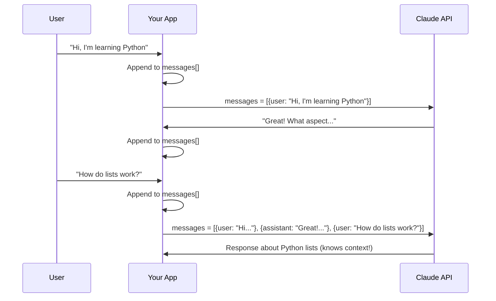
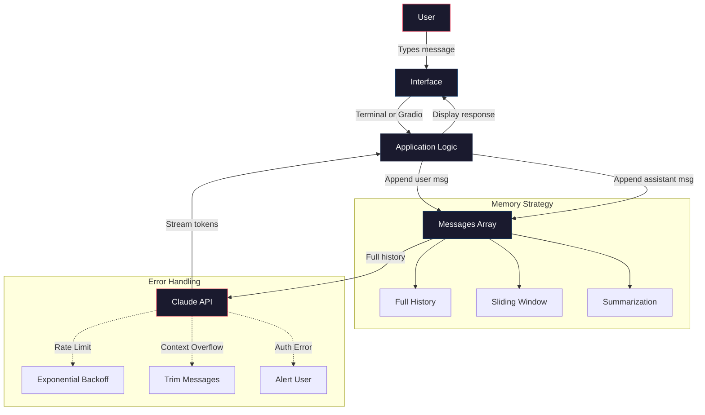

# Build a Chatbot

You have made single API calls and engineered good prompts. Now you build something that feels like a real product: a conversational AI application with memory, streaming output, error handling, and a web interface you can share with anyone. This is the article where everything comes together.

By the end, you will have a working chatbot deployed on a public URL.

## Conversation State: The Messages Array

Here is the most important concept in chatbot development: **the API has no memory**. Every single request is stateless. If you want the model to remember what was said three messages ago, you must send those three messages again.

The conversation "memory" is just a Python list that you manage:

```python
conversation = []
```

Every time the user says something, you append it. Every time the model responds, you append that too. Then you send the entire list with the next request.

:::diagram

:::

### The Basic Conversation Loop

```python
import anthropic
from dotenv import load_dotenv

load_dotenv()

client = anthropic.Anthropic()

system_prompt = "You are a helpful assistant. Be concise but thorough."
messages = []


def chat(user_input: str) -> str:
    """Send a message and get a response, maintaining conversation history."""
    messages.append({"role": "user", "content": user_input})

    response = client.messages.create(
        model="claude-sonnet-4-20250514",
        max_tokens=2048,
        system=system_prompt,
        messages=messages
    )

    assistant_text = response.content[0].text
    messages.append({"role": "assistant", "content": assistant_text})

    return assistant_text
```

This is the foundation. Every chatbot — from a simple terminal tool to ChatGPT itself — works on this same principle: accumulate messages, send them all, append the response.

## Building the Terminal Chatbot

Let's build a complete, polished terminal chatbot. Terminal chatbots are underrated — they are fast to build, easy to test, and genuinely useful.

```python
"""
chatbot.py — A terminal-based conversational AI chatbot.
"""

import anthropic
import sys
from dotenv import load_dotenv

load_dotenv()


def create_chatbot(system_prompt: str, model: str = "claude-sonnet-4-20250514"):
    """Create and run an interactive chatbot in the terminal."""
    client = anthropic.Anthropic()
    messages = []
    total_input_tokens = 0
    total_output_tokens = 0

    print("Chatbot ready. Type 'quit' to exit, 'clear' to reset conversation.\n")

    while True:
        try:
            user_input = input("You: ").strip()
        except (KeyboardInterrupt, EOFError):
            print("\nGoodbye!")
            break

        if not user_input:
            continue
        if user_input.lower() == "quit":
            print("Goodbye!")
            break
        if user_input.lower() == "clear":
            messages.clear()
            print("[Conversation cleared]\n")
            continue

        messages.append({"role": "user", "content": user_input})

        try:
            response = client.messages.create(
                model=model,
                max_tokens=2048,
                system=system_prompt,
                messages=messages
            )

            assistant_text = response.content[0].text
            messages.append({"role": "assistant", "content": assistant_text})

            total_input_tokens += response.usage.input_tokens
            total_output_tokens += response.usage.output_tokens

            print(f"\nAssistant: {assistant_text}\n")

        except anthropic.APIError as e:
            print(f"\n[Error: {e}]\n")
            messages.pop()  # Remove the failed user message

    print(f"\nSession stats: {total_input_tokens} input tokens, {total_output_tokens} output tokens")


if __name__ == "__main__":
    system = """You are a knowledgeable, friendly assistant. You give clear,
accurate answers. When you don't know something, you say so. Keep responses
focused — thorough but not unnecessarily long."""

    create_chatbot(system)
```

Run it and have a conversation:

```bash
python chatbot.py
```

Notice how each response is context-aware. The model remembers everything because *you* are sending the full history every time.

## Conversation Memory Strategies

As conversations grow longer, you hit a real engineering problem: **context windows have limits**. Claude Sonnet supports up to 200K tokens of context, but sending a 50,000-word conversation history with every request is slow and expensive.

Here are three strategies, from simple to sophisticated.

### Strategy 1: Full History (Simple, Limited)

Send everything. This is what the code above does.

**Pros:** Perfect recall of every detail.
**Cons:** Gets expensive and slow as conversations grow. Eventually hits the context window limit.

**Best for:** Short conversations (under 50 messages).

### Strategy 2: Sliding Window

Keep only the most recent N messages:

```python
MAX_MESSAGES = 20  # Keep last 20 messages (10 turns)

def chat_with_window(user_input: str) -> str:
    messages.append({"role": "user", "content": user_input})

    # Trim to sliding window
    recent_messages = messages[-MAX_MESSAGES:]

    response = client.messages.create(
        model="claude-sonnet-4-20250514",
        max_tokens=2048,
        system=system_prompt,
        messages=recent_messages
    )

    assistant_text = response.content[0].text
    messages.append({"role": "assistant", "content": assistant_text})

    return assistant_text
```

**Pros:** Bounded cost and latency.
**Cons:** The model "forgets" older context. It might ask your name again or lose track of something you discussed earlier.

**Best for:** Utility chatbots where distant history rarely matters.

### Strategy 3: Summarization

Periodically compress old messages into a summary:

```python
def summarize_history(messages_to_summarize: list[dict]) -> str:
    """Use the model to summarize old conversation history."""
    conversation_text = "\n".join(
        f"{m['role'].upper()}: {m['content']}" for m in messages_to_summarize
    )

    response = client.messages.create(
        model="claude-haiku-4-20250514",  # Use a fast, cheap model for summaries
        max_tokens=500,
        system="Summarize this conversation concisely. Capture key facts, decisions, and context that would be important for continuing the conversation.",
        messages=[{"role": "user", "content": conversation_text}]
    )
    return response.content[0].text


def chat_with_summarization(user_input: str) -> str:
    messages.append({"role": "user", "content": user_input})

    # If history is getting long, summarize older messages
    if len(messages) > 30:
        old_messages = messages[:20]
        summary = summarize_history(old_messages)

        # Replace old messages with the summary
        messages[:20] = [
            {"role": "user", "content": f"[Previous conversation summary: {summary}]"},
            {"role": "assistant", "content": "Understood, I have the context from our earlier conversation."}
        ]

    response = client.messages.create(
        model="claude-sonnet-4-20250514",
        max_tokens=2048,
        system=system_prompt,
        messages=messages
    )

    assistant_text = response.content[0].text
    messages.append({"role": "assistant", "content": assistant_text})

    return assistant_text
```

**Pros:** Retains key context while keeping token counts manageable.
**Cons:** Summary is lossy — details get dropped. Adds complexity and an extra API call.

**Best for:** Long-running conversations where earlier context matters (support bots, tutoring, project planning).

:::callout[tip]
In production, you will often combine strategies: full history for the last 10 messages, a summary of everything before that, and important "pinned" facts extracted from the conversation that always get included.
:::

## Streaming Responses

Without streaming, the user stares at a blank screen while the model generates the entire response. With streaming, tokens appear one by one — the same experience as ChatGPT. This is not just a UX polish; it makes the application feel dramatically more responsive.

:::definition[Streaming]
Receiving the model's response incrementally, token by token, rather than waiting for the complete response. The API sends a stream of small chunks that your code processes as they arrive.
:::

### Terminal Streaming

```python
def chat_streaming(user_input: str) -> str:
    """Send a message and stream the response token by token."""
    messages.append({"role": "user", "content": user_input})

    print("Assistant: ", end="", flush=True)
    full_response = ""

    with client.messages.stream(
        model="claude-sonnet-4-20250514",
        max_tokens=2048,
        system=system_prompt,
        messages=messages
    ) as stream:
        for text in stream.text_stream:
            print(text, end="", flush=True)
            full_response += text

    print("\n")  # Newline after response completes

    messages.append({"role": "assistant", "content": full_response})
    return full_response
```

The key differences from non-streaming:
- Use `client.messages.stream()` instead of `client.messages.create()`
- Iterate over `stream.text_stream` to get text chunks
- Print with `flush=True` to force immediate output
- Accumulate the full response for the messages history

### Complete Streaming Terminal Chatbot

Here is the full polished version with streaming:

```python
"""
chatbot_streaming.py — Terminal chatbot with streaming responses.
"""

import anthropic
from dotenv import load_dotenv

load_dotenv()

client = anthropic.Anthropic()


def run_chatbot(system_prompt: str):
    """Run an interactive chatbot with streaming responses."""
    messages = []

    print("Chatbot ready. Type 'quit' to exit, 'clear' to reset.\n")

    while True:
        try:
            user_input = input("You: ").strip()
        except (KeyboardInterrupt, EOFError):
            print("\nGoodbye!")
            return

        if not user_input:
            continue
        if user_input.lower() == "quit":
            return
        if user_input.lower() == "clear":
            messages.clear()
            print("[Conversation cleared]\n")
            continue

        messages.append({"role": "user", "content": user_input})

        try:
            print("Assistant: ", end="", flush=True)
            full_response = ""

            with client.messages.stream(
                model="claude-sonnet-4-20250514",
                max_tokens=2048,
                system=system_prompt,
                messages=messages
            ) as stream:
                for text in stream.text_stream:
                    print(text, end="", flush=True)
                    full_response += text

            print("\n")
            messages.append({"role": "assistant", "content": full_response})

        except anthropic.APIError as e:
            print(f"\n[Error: {e}]\n")
            messages.pop()


if __name__ == "__main__":
    system = """You are a helpful, concise assistant. Give clear answers.
When you don't know something, say so honestly."""

    run_chatbot(system)
```

## Adding a Web Interface with Gradio

Terminal chatbots are great for development, but sharing them with others means building a web interface. Gradio makes this absurdly easy — you can go from terminal bot to a shareable web app in about 20 lines of code.

:::definition[Gradio]
A Python library for building web interfaces for machine learning applications. You define your function, Gradio wraps it in a clean UI, and you get a local URL (and optionally a public shareable link). No HTML, CSS, or JavaScript required.
:::

Install Gradio:

```bash
pip install gradio
```

### Gradio Chatbot

```python
"""
chatbot_web.py — Web-based chatbot using Gradio.
"""

import anthropic
import gradio as gr
from dotenv import load_dotenv

load_dotenv()

client = anthropic.Anthropic()

SYSTEM_PROMPT = """You are a helpful assistant. Give clear, well-structured
answers. Use markdown formatting when it helps readability."""


def respond(message: str, history: list[dict]) -> str:
    """Generate a response given the user message and conversation history.

    Gradio's ChatInterface passes history as a list of
    {"role": "user"/"assistant", "content": "..."} dicts.
    """
    # Build messages array from Gradio's history format
    messages = []
    for entry in history:
        messages.append({"role": entry["role"], "content": entry["content"]})
    messages.append({"role": "user", "content": message})

    response = client.messages.create(
        model="claude-sonnet-4-20250514",
        max_tokens=2048,
        system=SYSTEM_PROMPT,
        messages=messages
    )

    return response.content[0].text


# Create the Gradio interface
demo = gr.ChatInterface(
    fn=respond,
    title="AI Chatbot",
    description="A conversational AI assistant powered by Claude.",
    type="messages",
    examples=["Explain quantum computing in simple terms",
              "Write a Python function to check if a number is prime",
              "What are the pros and cons of microservices?"],
)

if __name__ == "__main__":
    demo.launch()  # Add share=True for a public link
```

Run it:

```bash
python chatbot_web.py
```

This opens a browser with a full chat interface — message input, conversation history, example prompts, and a clean design. Add `share=True` to `demo.launch()` and Gradio gives you a public URL that anyone can access for 72 hours.

### Gradio with Streaming

For the best user experience, add streaming to the Gradio interface:

```python
def respond_streaming(message: str, history: list[dict]):
    """Generate a streaming response for Gradio."""
    messages = []
    for entry in history:
        messages.append({"role": entry["role"], "content": entry["content"]})
    messages.append({"role": "user", "content": message})

    partial_response = ""

    with client.messages.stream(
        model="claude-sonnet-4-20250514",
        max_tokens=2048,
        system=SYSTEM_PROMPT,
        messages=messages
    ) as stream:
        for text in stream.text_stream:
            partial_response += text
            yield partial_response  # Gradio displays the growing response


demo = gr.ChatInterface(
    fn=respond_streaming,
    title="AI Chatbot (Streaming)",
    description="Watch responses appear in real time.",
    type="messages",
)
```

The key change: the function uses `yield` instead of `return`. Gradio detects the generator and automatically handles streaming display.

## Error Handling

A chatbot that crashes on the first API error is not a chatbot — it is a demo. Real chatbots handle failures gracefully.

### Common Errors and How to Handle Them

```python
import anthropic
import time


def robust_chat(messages: list[dict], max_retries: int = 3) -> str:
    """Make an API call with comprehensive error handling."""

    for attempt in range(max_retries):
        try:
            response = client.messages.create(
                model="claude-sonnet-4-20250514",
                max_tokens=2048,
                system=SYSTEM_PROMPT,
                messages=messages
            )

            # Check if the response was truncated
            if response.stop_reason == "max_tokens":
                return response.content[0].text + "\n\n[Response truncated due to length limit]"

            return response.content[0].text

        except anthropic.AuthenticationError:
            return "[Error] Invalid API key. Check your ANTHROPIC_API_KEY."

        except anthropic.RateLimitError:
            if attempt < max_retries - 1:
                wait = 2 ** attempt
                time.sleep(wait)
                continue
            return "[Error] Rate limited. Please wait a moment and try again."

        except anthropic.BadRequestError as e:
            if "context length" in str(e).lower():
                # Conversation too long — trim and retry
                messages = messages[-10:]  # Keep last 10 messages
                continue
            return f"[Error] Bad request: {e}"

        except anthropic.APIError as e:
            if attempt < max_retries - 1:
                time.sleep(1)
                continue
            return f"[Error] API error: {e}"

    return "[Error] Failed after multiple retries."
```

:::callout[warning]
The context length error is particularly sneaky. Your chatbot works great for 20 messages, then crashes on message 21 because the total token count exceeded the model's limit. Always have a fallback strategy — trim old messages, summarize, or alert the user.
:::

## Adding Personality Through System Prompts

The system prompt is where you differentiate your chatbot from a generic assistant. Here are battle-tested system prompts for different use cases:

:::details[Study Buddy System Prompt]
```python
system = """You are a study buddy who helps students learn through active recall
and spaced repetition principles. Your approach:

1. When a student asks about a topic, DON'T just explain it. Instead:
   - Give a brief overview (2-3 sentences max)
   - Ask them a question to test their understanding
   - Based on their answer, either go deeper or clarify misconceptions

2. Use the Socratic method — guide them to the answer rather than giving it directly.

3. When they get something right, acknowledge it and increase difficulty.
   When they get something wrong, break it down and try a simpler question.

4. Keep a mental note of concepts they struggle with and revisit them later.

5. Be encouraging but honest. Don't say they're right when they're wrong.

6. If they ask you to "just tell me the answer," remind them that struggling
   with the material is how learning actually works, then give them a hint."""
```
:::

:::details[Code Reviewer System Prompt]
```python
system = """You are a senior software engineer doing code reviews. When code
is shared with you:

1. First, state what the code does (to confirm your understanding).
2. Then review for, in this order:
   - Bugs and correctness issues (CRITICAL)
   - Security concerns (CRITICAL)
   - Performance problems (WARNING)
   - Code style and readability (SUGGESTION)
   - Testing gaps (SUGGESTION)

3. For each finding, provide:
   - The specific line or section
   - What the problem is
   - Why it matters
   - The fix (show corrected code)

4. End with overall assessment: what the code does well and the most important
   thing to fix.

5. If the code is good, say so. Don't manufacture problems.
6. Be direct. No soft language like "you might consider" — state what should change."""
```
:::

:::details[Meeting Summarizer System Prompt]
```python
system = """You summarize meeting notes and transcripts. Your output format
is always:

## Meeting Summary
**Date:** [extracted or "Not specified"]
**Participants:** [extracted names]
**Duration:** [extracted or "Not specified"]

## Key Decisions
- [Numbered list of concrete decisions made]

## Action Items
- [ ] [Task] — **Owner:** [Name] — **Due:** [Date or "TBD"]

## Discussion Points
- [Brief summary of each major topic discussed]

## Open Questions
- [Anything unresolved that needs follow-up]

Rules:
- If something wasn't discussed, omit the section entirely
- Action items MUST have an owner. If none was mentioned, flag it as "Owner: UNASSIGNED"
- Be concise. Summaries should be 1/10th the length of the original transcript
- Never fabricate information not in the original notes"""
```
:::

## Architecture Overview

Here is the complete architecture of what you have built:

:::diagram

:::

:::build-challenge
### Build Challenge: Specialized Chatbot

Build a specialized chatbot for a real use case. Choose one of these or invent your own:

**Option A: Study Buddy**
- Quizzes you on a topic you provide
- Uses Socratic questioning (asks questions instead of just giving answers)
- Tracks which questions you got right/wrong within the session
- Adjusts difficulty based on your performance

**Option B: Code Reviewer**
- Paste in code and get a structured review
- Categorizes findings by severity (critical, warning, suggestion)
- Provides corrected code for each issue
- Remembers project context across multiple reviews in the same session

**Option C: Meeting Summarizer**
- Paste in meeting notes or a transcript
- Produces a structured summary with decisions, action items, and open questions
- Can answer follow-up questions about the meeting
- Generates follow-up email drafts based on the action items

**Requirements for all options:**
1. Terminal version that works with streaming
2. Gradio web interface with `share=True` so you can send the link to someone
3. Custom system prompt that makes the chatbot genuinely useful (not generic)
4. Error handling for API failures and context length
5. A memory strategy appropriate for the use case

**Stretch goals:**
- Add conversation export (save chat to a markdown or JSON file)
- Add a `/reset` command that clears history but keeps the system prompt
- Add token usage tracking that shows cumulative cost for the session
- Deploy the Gradio app to Hugging Face Spaces for a permanent public URL
:::
