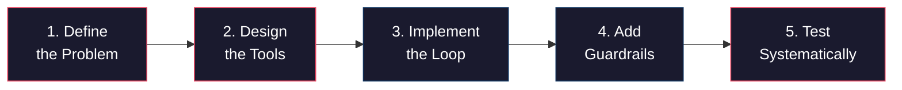

# Build an Agent

This is the capstone project for the applied AI core. You are going to build a real, useful AI agent from scratch — a personal assistant that can read and write files, execute Python code, search the web, and manage a todo list. Not a toy demo. A tool you will actually use.

By the end of this article, you will have a fully functional agent with proper error handling, cost tracking, conversation management, and a clean architecture you can extend for any domain.

## The Plan

Building an agent well requires thinking before coding. Here is the process we will follow:

:::diagram

:::

Most agent tutorials skip steps 1, 4, and 5. That is why most agent demos break the moment you try to use them for real work.

## Step 1: Define the Problem

Our agent is a personal assistant that can:

- **Read files** — Load text, code, or data files from disk
- **Write files** — Create or update files with generated content
- **Run Python code** — Execute code snippets and return the output
- **Search the web** — Look up current information
- **Manage a todo list** — Add, complete, list, and remove tasks

This set of tools is deliberately chosen: it is small enough to build in one session, but powerful enough to be genuinely useful. A coding assistant, a research tool, and a task manager in one.

:::callout[info]
The specific tools matter less than the *architecture*. Once you have a clean agent framework, adding a new tool takes 5 minutes — define the schema, write the function, register it. The hard part is getting the loop and error handling right.
:::

## Step 2: Design the Tools

Before writing any code, design each tool's interface. Think about what the model needs to send and what it gets back.

```python
"""
tools.py — Tool definitions and implementations for the personal assistant agent.
"""

import json
import subprocess
import sys
import os
from pathlib import Path
from datetime import datetime

# --- Configuration ---

WORKSPACE_DIR = Path("./agent_workspace")
WORKSPACE_DIR.mkdir(exist_ok=True)
TODO_FILE = WORKSPACE_DIR / "todos.json"


# ============================================================
# Tool Definitions (JSON schemas for the API)
# ============================================================

TOOL_DEFINITIONS = [
    {
        "name": "read_file",
        "description": (
            "Read the contents of a file from the workspace. Use this to examine "
            "code, data files, text documents, or any file the user references. "
            "Returns the full file content as a string."
        ),
        "input_schema": {
            "type": "object",
            "properties": {
                "file_path": {
                    "type": "string",
                    "description": (
                        "Path to the file, relative to the workspace directory. "
                        "Example: 'data/report.txt' or 'script.py'"
                    ),
                }
            },
            "required": ["file_path"],
        },
    },
    {
        "name": "write_file",
        "description": (
            "Write content to a file in the workspace. Creates the file if it "
            "doesn't exist, overwrites if it does. Use this to save code, reports, "
            "data, or any generated content. Creates parent directories automatically."
        ),
        "input_schema": {
            "type": "object",
            "properties": {
                "file_path": {
                    "type": "string",
                    "description": "Path for the file, relative to the workspace directory.",
                },
                "content": {
                    "type": "string",
                    "description": "The content to write to the file.",
                },
            },
            "required": ["file_path", "content"],
        },
    },
    {
        "name": "list_files",
        "description": (
            "List all files in the workspace directory (or a subdirectory). "
            "Use this to see what files are available before reading them."
        ),
        "input_schema": {
            "type": "object",
            "properties": {
                "directory": {
                    "type": "string",
                    "description": (
                        "Subdirectory to list, relative to workspace. "
                        "Leave empty for the root workspace directory."
                    ),
                    "default": "",
                }
            },
            "required": [],
        },
    },
    {
        "name": "run_python",
        "description": (
            "Execute a Python code snippet and return stdout/stderr. Use this for "
            "calculations, data processing, testing code, or any computation. "
            "The code runs in a separate process with a 30-second timeout."
        ),
        "input_schema": {
            "type": "object",
            "properties": {
                "code": {
                    "type": "string",
                    "description": "Python code to execute. Can be multi-line.",
                }
            },
            "required": ["code"],
        },
    },
    {
        "name": "web_search",
        "description": (
            "Search the web for current information. Returns titles, snippets, and "
            "URLs for the top results. Use this when the user needs up-to-date "
            "information that you don't have in your training data."
        ),
        "input_schema": {
            "type": "object",
            "properties": {
                "query": {
                    "type": "string",
                    "description": "The search query.",
                }
            },
            "required": ["query"],
        },
    },
    {
        "name": "todo_add",
        "description": "Add a new item to the todo list.",
        "input_schema": {
            "type": "object",
            "properties": {
                "task": {
                    "type": "string",
                    "description": "The task description.",
                }
            },
            "required": ["task"],
        },
    },
    {
        "name": "todo_list",
        "description": "List all items on the todo list with their status.",
        "input_schema": {
            "type": "object",
            "properties": {},
            "required": [],
        },
    },
    {
        "name": "todo_complete",
        "description": "Mark a todo item as complete by its index number (1-based).",
        "input_schema": {
            "type": "object",
            "properties": {
                "index": {
                    "type": "integer",
                    "description": "The 1-based index of the todo item to complete.",
                }
            },
            "required": ["index"],
        },
    },
    {
        "name": "todo_remove",
        "description": "Remove a todo item by its index number (1-based).",
        "input_schema": {
            "type": "object",
            "properties": {
                "index": {
                    "type": "integer",
                    "description": "The 1-based index of the todo item to remove.",
                }
            },
            "required": ["index"],
        },
    },
]
```

:::callout[tip]
Notice how each tool description explains not just *what* it does but *when to use it*. This is the most important factor in whether the model picks the right tool. Spend time on descriptions. They are prompt engineering applied to tool selection.
:::

## Tool Implementations

Now the actual functions. Every tool follows the same contract: accept the arguments defined in the schema, return a JSON string with the result or error.

```python
# ============================================================
# Tool Implementations
# ============================================================


def read_file(file_path: str) -> str:
    """Read a file from the workspace."""
    full_path = WORKSPACE_DIR / file_path

    # Security: prevent path traversal
    try:
        full_path = full_path.resolve()
        if not str(full_path).startswith(str(WORKSPACE_DIR.resolve())):
            return json.dumps({"error": "Access denied: path is outside workspace"})
    except Exception:
        return json.dumps({"error": "Invalid file path"})

    if not full_path.exists():
        return json.dumps({"error": f"File not found: {file_path}"})
    if not full_path.is_file():
        return json.dumps({"error": f"Not a file: {file_path}"})

    try:
        content = full_path.read_text(encoding="utf-8")
        return json.dumps({
            "file_path": file_path,
            "content": content,
            "size_bytes": full_path.stat().st_size,
            "lines": content.count("\n") + 1,
        })
    except Exception as e:
        return json.dumps({"error": f"Failed to read file: {e}"})


def write_file(file_path: str, content: str) -> str:
    """Write content to a file in the workspace."""
    full_path = WORKSPACE_DIR / file_path

    # Security: prevent path traversal
    try:
        full_path = full_path.resolve()
        if not str(full_path).startswith(str(WORKSPACE_DIR.resolve())):
            return json.dumps({"error": "Access denied: path is outside workspace"})
    except Exception:
        return json.dumps({"error": "Invalid file path"})

    try:
        full_path.parent.mkdir(parents=True, exist_ok=True)
        full_path.write_text(content, encoding="utf-8")
        return json.dumps({
            "status": "success",
            "file_path": file_path,
            "size_bytes": full_path.stat().st_size,
        })
    except Exception as e:
        return json.dumps({"error": f"Failed to write file: {e}"})


def list_files(directory: str = "") -> str:
    """List files in the workspace."""
    target = WORKSPACE_DIR / directory

    try:
        target = target.resolve()
        if not str(target).startswith(str(WORKSPACE_DIR.resolve())):
            return json.dumps({"error": "Access denied: path is outside workspace"})
    except Exception:
        return json.dumps({"error": "Invalid directory path"})

    if not target.exists():
        return json.dumps({"error": f"Directory not found: {directory}"})

    files = []
    for item in sorted(target.rglob("*")):
        if item.is_file():
            rel_path = item.relative_to(WORKSPACE_DIR)
            files.append({
                "path": str(rel_path),
                "size_bytes": item.stat().st_size,
                "modified": datetime.fromtimestamp(
                    item.stat().st_mtime
                ).strftime("%Y-%m-%d %H:%M"),
            })

    return json.dumps({"directory": directory or ".", "files": files, "count": len(files)})


def run_python(code: str) -> str:
    """Execute Python code in a subprocess with a timeout."""
    try:
        result = subprocess.run(
            [sys.executable, "-c", code],
            capture_output=True,
            text=True,
            timeout=30,
            cwd=str(WORKSPACE_DIR),
        )
        return json.dumps({
            "stdout": result.stdout,
            "stderr": result.stderr,
            "return_code": result.returncode,
        })
    except subprocess.TimeoutExpired:
        return json.dumps({"error": "Code execution timed out (30 second limit)"})
    except Exception as e:
        return json.dumps({"error": f"Failed to execute code: {e}"})


def web_search(query: str) -> str:
    """Search the web. Replace this with a real search API in production."""
    # This is a mock implementation for demonstration.
    # In production, use SerpAPI, Tavily, or Brave Search API.
    #
    # Example with Tavily (recommended — built for AI agents):
    #   pip install tavily-python
    #   from tavily import TavilyClient
    #   client = TavilyClient(api_key=os.getenv("TAVILY_API_KEY"))
    #   results = client.search(query, max_results=5)
    #   return json.dumps(results)

    return json.dumps({
        "query": query,
        "results": [
            {
                "title": f"Search result for: {query}",
                "snippet": "This is a mock search result. Replace web_search() with a "
                           "real search API (Tavily, SerpAPI, or Brave Search) for "
                           "production use.",
                "url": "https://example.com",
            }
        ],
        "note": "Mock results — connect a real search API for production use",
    })


# --- Todo functions ---

def _load_todos() -> list:
    """Load todos from disk."""
    if TODO_FILE.exists():
        return json.loads(TODO_FILE.read_text())
    return []


def _save_todos(todos: list):
    """Save todos to disk."""
    TODO_FILE.write_text(json.dumps(todos, indent=2))


def todo_add(task: str) -> str:
    """Add a new todo item."""
    todos = _load_todos()
    todos.append({"task": task, "done": False, "created": datetime.now().isoformat()})
    _save_todos(todos)
    return json.dumps({"status": "added", "task": task, "total_todos": len(todos)})


def todo_list() -> str:
    """List all todo items."""
    todos = _load_todos()
    if not todos:
        return json.dumps({"todos": [], "message": "No todos yet."})

    items = []
    for i, todo in enumerate(todos, 1):
        items.append({
            "index": i,
            "task": todo["task"],
            "status": "done" if todo["done"] else "pending",
            "created": todo["created"],
        })
    return json.dumps({"todos": items, "total": len(items),
                        "pending": sum(1 for t in todos if not t["done"])})


def todo_complete(index: int) -> str:
    """Mark a todo as complete."""
    todos = _load_todos()
    if index < 1 or index > len(todos):
        return json.dumps({"error": f"Invalid index {index}. Must be 1-{len(todos)}."})

    todos[index - 1]["done"] = True
    _save_todos(todos)
    return json.dumps({"status": "completed", "task": todos[index - 1]["task"]})


def todo_remove(index: int) -> str:
    """Remove a todo item."""
    todos = _load_todos()
    if index < 1 or index > len(todos):
        return json.dumps({"error": f"Invalid index {index}. Must be 1-{len(todos)}."})

    removed = todos.pop(index - 1)
    _save_todos(todos)
    return json.dumps({"status": "removed", "task": removed["task"]})


# Map tool names to functions
TOOL_FUNCTIONS = {
    "read_file": read_file,
    "write_file": write_file,
    "list_files": list_files,
    "run_python": run_python,
    "web_search": web_search,
    "todo_add": todo_add,
    "todo_list": todo_list,
    "todo_complete": todo_complete,
    "todo_remove": todo_remove,
}
```

:::callout[warning]
The `run_python` tool executes arbitrary code. This is powerful but dangerous. The 30-second timeout prevents infinite loops, and running in a subprocess prevents crashes from killing your agent. In production, you would sandbox this further — run code in a Docker container or a restricted environment. For learning and personal use, the subprocess approach is fine.
:::

## Step 3: Implement the Agentic Loop

Now the core agent class. This builds on the agentic loop from the previous article but adds conversation management, cost tracking, and proper error handling.

```python
"""
agent.py — The personal assistant agent.
"""

import anthropic
import json
from datetime import datetime
from tools import TOOL_DEFINITIONS, TOOL_FUNCTIONS


class PersonalAssistant:
    """An AI agent with tools for file I/O, code execution, web search, and todos."""

    def __init__(self, model: str = "claude-sonnet-4-20250514"):
        self.client = anthropic.Anthropic()
        self.model = model
        self.messages = []
        self.system_prompt = self._build_system_prompt()
        self.usage = {"input_tokens": 0, "output_tokens": 0, "api_calls": 0}

    def _build_system_prompt(self) -> str:
        return f"""You are a personal assistant agent with access to tools for file \
management, code execution, web search, and task management.

Current date: {datetime.now().strftime('%Y-%m-%d %H:%M')}
Workspace directory: ./agent_workspace/

Guidelines:
- Use tools when they help accomplish the task. Do not use tools unnecessarily.
- When writing code to a file, also offer to run it so the user can see the output.
- When a task has multiple steps, work through them one at a time, explaining your \
reasoning.
- If a tool call fails, explain the error and try an alternative approach.
- Be concise but thorough. Show your work when doing analysis.
- For file operations, always work within the workspace directory.
- When managing todos, show the updated list after any changes."""

    def _execute_tool(self, name: str, inputs: dict) -> str:
        """Execute a tool and return the result as a JSON string."""
        func = TOOL_FUNCTIONS.get(name)
        if not func:
            return json.dumps({"error": f"Unknown tool: {name}"})

        try:
            return func(**inputs)
        except TypeError as e:
            return json.dumps({"error": f"Invalid arguments for {name}: {e}"})
        except Exception as e:
            return json.dumps({"error": f"Tool {name} failed: {e}"})

    def chat(self, user_message: str, max_iterations: int = 15) -> str:
        """Send a message and run the agentic loop until completion."""
        self.messages.append({"role": "user", "content": user_message})

        for iteration in range(max_iterations):
            # Make the API call
            response = self.client.messages.create(
                model=self.model,
                max_tokens=4096,
                system=self.system_prompt,
                tools=TOOL_DEFINITIONS,
                messages=self.messages,
            )

            # Track usage
            self.usage["input_tokens"] += response.usage.input_tokens
            self.usage["output_tokens"] += response.usage.output_tokens
            self.usage["api_calls"] += 1

            # Add assistant response to conversation
            self.messages.append({"role": "assistant", "content": response.content})

            # If the model is done talking, return the text
            if response.stop_reason == "end_turn":
                return self._extract_text(response.content)

            # Process all tool calls
            tool_results = []
            for block in response.content:
                if block.type == "tool_use":
                    # Print what the agent is doing
                    self._log_tool_call(iteration + 1, block.name, block.input)

                    # Execute the tool
                    result = self._execute_tool(block.name, block.input)

                    # Print a summary of the result
                    self._log_tool_result(block.name, result)

                    tool_results.append({
                        "type": "tool_result",
                        "tool_use_id": block.id,
                        "content": result,
                    })

            # Send tool results back
            self.messages.append({"role": "user", "content": tool_results})

        return (
            "I reached the maximum number of steps for this task. "
            "Here is what I accomplished so far — you can ask me to continue."
        )

    def _extract_text(self, content: list) -> str:
        """Extract text blocks from a response."""
        parts = []
        for block in content:
            if hasattr(block, "text"):
                parts.append(block.text)
        return "\n".join(parts) if parts else "(No text response)"

    def _log_tool_call(self, step: int, name: str, inputs: dict):
        """Print a readable log of a tool call."""
        # Truncate long inputs for display
        display_inputs = {}
        for key, value in inputs.items():
            if isinstance(value, str) and len(value) > 100:
                display_inputs[key] = value[:100] + "..."
            else:
                display_inputs[key] = value

        print(f"  [{step}] {name}({json.dumps(display_inputs)})")

    def _log_tool_result(self, name: str, result: str):
        """Print a summary of a tool result."""
        try:
            parsed = json.loads(result)
            if "error" in parsed:
                print(f"       -> ERROR: {parsed['error']}")
            elif name == "read_file":
                print(f"       -> Read {parsed.get('lines', '?')} lines")
            elif name == "write_file":
                print(f"       -> Wrote {parsed.get('size_bytes', '?')} bytes")
            elif name == "run_python":
                stdout = parsed.get("stdout", "").strip()
                stderr = parsed.get("stderr", "").strip()
                if stderr:
                    print(f"       -> stderr: {stderr[:100]}")
                elif stdout:
                    print(f"       -> {stdout[:100]}")
                else:
                    print("       -> (no output)")
            else:
                print(f"       -> OK")
        except json.JSONDecodeError:
            print(f"       -> {result[:100]}")

    def reset(self):
        """Clear conversation history."""
        self.messages = []

    def get_stats(self) -> str:
        """Return formatted usage statistics."""
        cost_estimate = (
            self.usage["input_tokens"] * 0.003 / 1000
            + self.usage["output_tokens"] * 0.015 / 1000
        )
        return (
            f"API calls: {self.usage['api_calls']} | "
            f"Tokens: {self.usage['input_tokens']:,} in, "
            f"{self.usage['output_tokens']:,} out | "
            f"Est. cost: ${cost_estimate:.4f}"
        )
```

## Step 4: Add Error Handling and Guardrails

The agent class above already includes several guardrails. Let's highlight them and add a few more.

### Path Traversal Protection

Every file operation validates that the resolved path stays within the workspace:

```python
full_path = full_path.resolve()
if not str(full_path).startswith(str(WORKSPACE_DIR.resolve())):
    return json.dumps({"error": "Access denied: path is outside workspace"})
```

This prevents the model from reading `/etc/passwd` or writing to system files. Without this, a prompt injection attack could trick the model into accessing sensitive files.

### Code Execution Sandboxing

Python code runs in a subprocess with a 30-second timeout:

```python
result = subprocess.run(
    [sys.executable, "-c", code],
    capture_output=True,
    text=True,
    timeout=30,
    cwd=str(WORKSPACE_DIR),
)
```

### Iteration Limits

The agentic loop has a hard cap on iterations. This prevents infinite loops when the model gets stuck.

### Cost Tracking

Every API call's token usage is tracked. You can add a cost budget to abort before overspending:

```python
# Add to the chat() method after tracking usage:
MAX_COST = 1.00  # dollars
cost = (
    self.usage["input_tokens"] * 0.003 / 1000
    + self.usage["output_tokens"] * 0.015 / 1000
)
if cost > MAX_COST:
    return f"Cost limit reached (${cost:.2f}). Task incomplete."
```

:::callout[warning]
Guardrails are not optional. An agent that can execute code and write files is a powerful tool. Path traversal protection, execution timeouts, and cost limits are the minimum. In production, you would also add: rate limiting on tool calls, content filtering on generated code, and audit logging of every action taken.
:::

## Step 5: The Main Loop

Now wire everything together with a terminal interface:

```python
"""
main.py — Run the personal assistant agent.
"""

from dotenv import load_dotenv
from agent import PersonalAssistant

load_dotenv()


def main():
    agent = PersonalAssistant()

    print("Personal Assistant Agent")
    print("========================")
    print("I can read/write files, run Python code, search the web, and manage todos.")
    print("Type 'quit' to exit, 'reset' to clear history, 'stats' for usage info.\n")

    while True:
        try:
            user_input = input("You: ").strip()
        except (KeyboardInterrupt, EOFError):
            print("\nGoodbye!")
            break

        if not user_input:
            continue
        if user_input.lower() == "quit":
            print(f"\n{agent.get_stats()}")
            print("Goodbye!")
            break
        if user_input.lower() == "reset":
            agent.reset()
            print("[Conversation reset]\n")
            continue
        if user_input.lower() == "stats":
            print(f"[{agent.get_stats()}]\n")
            continue

        print()  # Blank line before agent output
        response = agent.chat(user_input)
        print(f"\nAssistant: {response}\n")


if __name__ == "__main__":
    main()
```

### Test It

```bash
pip install anthropic python-dotenv
python main.py
```

Try these tasks:

```
You: Write a Python script that generates the first 20 Fibonacci numbers and save it as fibonacci.py

You: Now run the fibonacci script

You: Add a todo: finish the applied AI curriculum

You: Read the fibonacci.py file and refactor it to use a generator

You: What files do I have in my workspace?
```

Watch the agent work through each task, calling tools as needed. The console shows every tool call and its result, so you can follow the agent's reasoning.

## Agent Architectures

The agent you just built is a **single-agent architecture** — one model, one set of tools, one loop. This is the right starting point for most applications. But as tasks get more complex, other architectures become useful.

:::tabs

```tab[Single Agent]
**What:** One model with a set of tools in a loop.

**When:** Most tasks. The model decides what to do at each step.

**Pros:** Simple, debuggable, predictable costs.

**Cons:** One model has to be good at everything — tool selection, reasoning, writing, coding.

**Example:** The personal assistant we just built.
```

```tab[Router Pattern]
**What:** A lightweight model classifies the task, then routes to a specialized handler.

**When:** You have distinct task categories that need different prompts, tools, or models.

**Pros:** Each handler can be optimized for its task. Cheaper routing model saves costs.

**Cons:** More code to maintain. Routing errors send tasks to the wrong handler.

**Example:** A support agent that routes to billing, technical, or general handlers.

```python
def route_task(user_message: str) -> str:
    """Use a fast model to classify, then hand off."""
    classification = client.messages.create(
        model="claude-haiku-4-20250514",  # Fast and cheap for routing
        max_tokens=50,
        system="Classify this as: coding, research, or general. Reply with one word.",
        messages=[{"role": "user", "content": user_message}],
    )
    category = classification.content[0].text.strip().lower()

    if category == "coding":
        return coding_agent.chat(user_message)
    elif category == "research":
        return research_agent.chat(user_message)
    else:
        return general_agent.chat(user_message)
```
```

```tab[Multi-Agent]
**What:** Multiple specialized agents that communicate with each other.

**When:** Complex workflows where different phases require fundamentally different capabilities.

**Pros:** Each agent focuses on what it does best. Can use different models for different agents.

**Cons:** Significantly more complex. Harder to debug. Communication between agents adds latency and cost.

**Example:** A code review system with a "reviewer" agent that finds issues, a "fixer" agent that writes patches, and a "tester" agent that runs tests.
```

:::

:::callout[info]
Start with a single agent. Only add complexity when you hit a real limitation. Most real applications work fine with one agent and good tools. Multi-agent systems are exciting in research papers but are usually overkill for practical applications.
:::

## Planning Patterns

Some tasks require the agent to make a plan before executing. Instead of immediately grabbing tools, the model first outlines a series of steps, then works through them.

```python
PLANNING_SYSTEM_PROMPT = """You are a personal assistant agent.

When given a complex task, FIRST create a plan:
1. Break the task into numbered steps
2. State what tool you will use for each step
3. Then execute the steps one by one

For simple tasks (single tool call), skip planning and act directly."""
```

Planning helps with multi-step tasks because it forces the model to think about the full workflow before starting. Without planning, agents sometimes take the first step that comes to mind and then get stuck when they realize they needed something from an earlier step.

## Memory Across Sessions

Our agent loses its conversation history when you restart it. For a personal assistant, you want it to remember across sessions. Here is a simple approach using file-based memory:

```python
import json
from pathlib import Path

MEMORY_FILE = Path("./agent_workspace/agent_memory.json")


def save_memory(messages: list):
    """Save conversation history to disk."""
    # Convert message objects to serializable format
    serializable = []
    for msg in messages:
        if isinstance(msg.get("content"), list):
            # Handle tool use/result blocks
            serializable.append({
                "role": msg["role"],
                "content": [
                    block if isinstance(block, dict) else {
                        "type": block.type,
                        **({"text": block.text} if hasattr(block, "text") else {}),
                    }
                    for block in msg["content"]
                ],
            })
        else:
            serializable.append(msg)
    MEMORY_FILE.write_text(json.dumps(serializable, indent=2, default=str))


def load_memory() -> list:
    """Load conversation history from disk."""
    if MEMORY_FILE.exists():
        return json.loads(MEMORY_FILE.read_text())
    return []
```

:::details[Advanced: Summarized Memory]
Saving the full conversation history works for short sessions but becomes expensive — every API call sends the entire history. A better approach for long-running agents is to periodically summarize the conversation:

```python
def summarize_conversation(messages: list) -> str:
    """Use the model to summarize conversation history."""
    response = client.messages.create(
        model="claude-haiku-4-20250514",  # Cheap model for summarization
        max_tokens=500,
        system="Summarize this conversation. Include key facts, decisions made, "
               "files created, and pending tasks. Be concise.",
        messages=[{
            "role": "user",
            "content": "Summarize this conversation:\n" + format_messages(messages),
        }],
    )
    return response.content[0].text
```

Then start new sessions with the summary as context in the system prompt rather than replaying every message.
:::

## Testing Your Agent Systematically

Do not just try 3 tasks and call it done. Build a test suite.

```python
"""
test_agent.py — Systematic tests for the personal assistant agent.
"""

from agent import PersonalAssistant


def test_file_operations():
    """Test that the agent can create and read files."""
    agent = PersonalAssistant()
    response = agent.chat("Write 'Hello, World!' to a file called test_output.txt")
    assert "success" in response.lower() or "wrote" in response.lower()

    agent.reset()
    response = agent.chat("Read the file test_output.txt and tell me what it says")
    assert "Hello, World!" in response


def test_code_execution():
    """Test that the agent can run Python code."""
    agent = PersonalAssistant()
    response = agent.chat("Run this Python code and tell me the result: print(sum(range(100)))")
    assert "4950" in response


def test_todo_management():
    """Test the full todo workflow."""
    agent = PersonalAssistant()
    agent.chat("Add a todo: Write unit tests")
    agent.chat("Add a todo: Deploy to production")
    response = agent.chat("Show my todo list")
    assert "Write unit tests" in response
    assert "Deploy to production" in response


def test_multi_step_task():
    """Test that the agent can handle tasks requiring multiple tools."""
    agent = PersonalAssistant()
    response = agent.chat(
        "Create a Python script that prints the current date, save it as "
        "date_script.py, then run it"
    )
    # Agent should write the file AND execute it
    assert "2026" in response or "date" in response.lower()


def test_error_handling():
    """Test that the agent handles errors gracefully."""
    agent = PersonalAssistant()
    response = agent.chat("Read a file called nonexistent_file_xyz.txt")
    assert "not found" in response.lower() or "error" in response.lower()


if __name__ == "__main__":
    tests = [
        test_file_operations,
        test_code_execution,
        test_todo_management,
        test_multi_step_task,
        test_error_handling,
    ]

    for test in tests:
        try:
            test()
            print(f"PASS: {test.__name__}")
        except AssertionError as e:
            print(f"FAIL: {test.__name__} — {e}")
        except Exception as e:
            print(f"ERROR: {test.__name__} — {e}")
```

:::callout[tip]
Agent tests are inherently non-deterministic — the model might phrase things differently each run. Test for the *presence of key information* rather than exact string matches. And run your test suite 3 times to make sure it passes consistently. If a test is flaky, your agent has a reliability problem.
:::

## Where to Go From Here

You now have a working agent architecture that you can extend to any domain. The next article covers the crucial missing piece: how do you *know* if your agent actually works well? Not just on 5 test cases, but systematically, at scale.

- **Evaluation and Observability** — Build test suites, automated scoring, and monitoring dashboards for your AI applications

:::build-challenge
### Build Challenge: Domain-Specific Agent

Extend the personal assistant agent with at least 2 custom tools for a domain you care about, and add a web interface.

**Choose a domain and add tools:**

- **Coding assistant:** Add `git_status()`, `git_diff()`, `run_tests()`, `lint_code()` tools
- **Research assistant:** Add `arxiv_search()`, `summarize_paper()`, `save_citation()` tools
- **Data analysis:** Add `load_csv()`, `describe_data()`, `plot_chart()`, `run_sql()` tools
- **Writing assistant:** Add `outline_essay()`, `check_grammar()`, `word_count()`, `export_pdf()` tools

**Requirements:**
1. Add at least 2 new tools with proper JSON schemas and implementations
2. Update the system prompt to reflect the agent's new capabilities
3. Build a Gradio interface with:
   - A chat window for interacting with the agent
   - A sidebar showing the current todo list
   - A file browser showing the workspace contents
   - A cost/usage display
4. Test the agent with 5+ real tasks that use the new tools

**Gradio starter:**
```bash
pip install gradio
```

```python
import gradio as gr
from agent import PersonalAssistant

agent = PersonalAssistant()

def respond(message, history):
    response = agent.chat(message)
    return response

demo = gr.ChatInterface(
    respond,
    title="AI Personal Assistant",
    description="I can read/write files, run code, search the web, and manage todos.",
)
demo.launch()
```

**Stretch goals:**
- Add streaming output so you can see the agent's thinking in real time
- Implement the router pattern: detect if a task is coding/research/general and use different system prompts
- Add an "undo" command that reverts the last file write
- Persist conversation memory across sessions
:::
