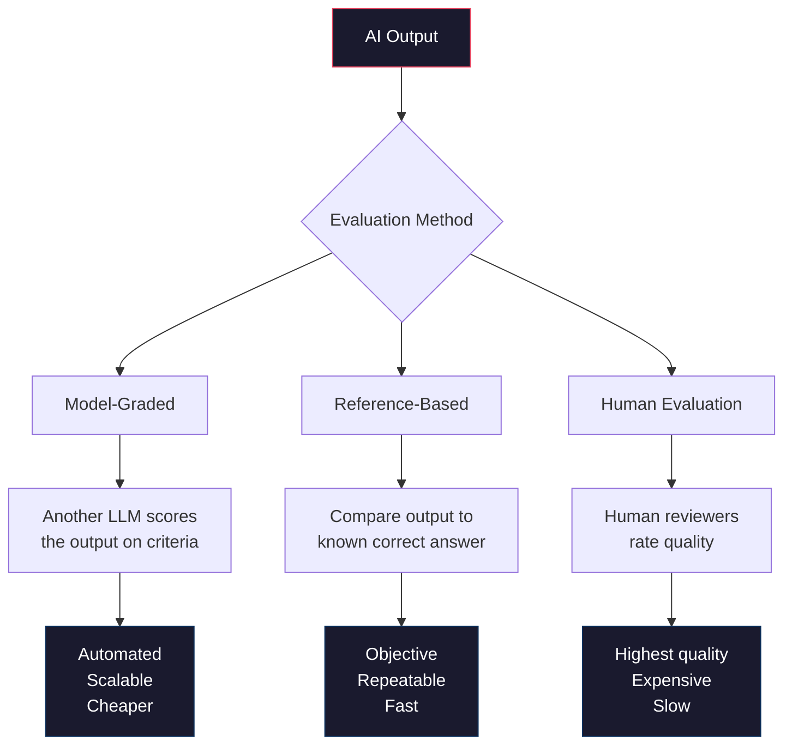

# Evaluation and Observability

You have built a chatbot, a RAG pipeline, and an agent. They work on the examples you tested. But do they actually work *well*? How often does your RAG system return the wrong document? How often does your agent pick the wrong tool? What happens when users ask questions you never anticipated?

This is the article most AI tutorials skip, and it is the reason most AI applications fail in production. The difference between a demo and a product is systematic evaluation.

## Why Vibes-Based Testing Fails

Here is how most developers test their AI applications: they try 5-10 examples, see that the output looks good, and ship it. This is vibes-based testing, and it fails for three reasons.

**1. You test the easy cases.** The examples you think of are the ones your system was designed for. Real users ask things you never imagined.

**2. You cannot spot subtle errors.** A RAG system that returns a slightly outdated document gives a response that *looks* correct. You do not notice unless you know the answer already. A chatbot that is 90% accurate on your test cases might be 50% accurate on edge cases.

**3. Regression is silent.** You change a prompt, update a chunk size, or swap a model. Everything still seems to work. But that one critical use case that worked last week now fails. You will not find out until a user reports it.

:::callout[warning]
If you ship an AI application without a systematic eval suite, you are flying blind. Every change you make — prompt tweaks, model upgrades, parameter tuning — could break existing functionality. Without evals, you will not know until users tell you.
:::

## Evaluation Types

There are three fundamental approaches to evaluating AI output. Most real systems use a combination.

:::diagram

:::

### 1. Model-Graded Evaluation

Use a language model to evaluate the output of another language model. This sounds circular, but it works remarkably well for subjective criteria.

```python
"""
model_graded_eval.py — Use Claude to evaluate AI outputs.
"""

import anthropic
import json
from dotenv import load_dotenv

load_dotenv()

client = anthropic.Anthropic()


def grade_response(question: str, response: str, criteria: str) -> dict:
    """Have Claude grade a response on specified criteria.

    Returns a dict with 'score' (1-5) and 'reasoning'.
    """
    grading_prompt = f"""You are an evaluation judge. Grade the following AI response.

Question asked: {question}

AI Response: {response}

Evaluation criteria: {criteria}

Provide your evaluation as JSON with exactly these fields:
- "score": integer from 1 to 5 (1=terrible, 2=poor, 3=adequate, 4=good, 5=excellent)
- "reasoning": one sentence explaining the score

Respond with ONLY the JSON, no other text."""

    result = client.messages.create(
        model="claude-sonnet-4-20250514",
        max_tokens=200,
        messages=[{"role": "user", "content": grading_prompt}],
    )

    try:
        return json.loads(result.content[0].text)
    except json.JSONDecodeError:
        return {"score": 0, "reasoning": "Failed to parse grading response"}


# Example: evaluate a chatbot response
score = grade_response(
    question="What are the benefits of using Python for data science?",
    response="Python is good for data science because it has libraries.",
    criteria="Is the response thorough, specific, and helpful? Does it mention "
             "concrete libraries or tools? Does it provide actionable information?"
)
print(f"Score: {score['score']}/5 — {score['reasoning']}")
```

Model-graded evaluation is powerful for criteria that are hard to measure programmatically: helpfulness, tone, completeness, accuracy. The key is writing specific grading criteria, not vague ones.

:::callout[tip]
Use a *different* model (or a different prompt) for grading than the one being evaluated. If Claude generates the answer and also grades the answer, it may be biased toward rating its own output highly. At minimum, use a specific rubric so the grading is criteria-based rather than subjective.
:::

### 2. Reference-Based Evaluation

Compare the output to a known correct answer. This is the most reliable method when you have ground truth.

```python
def eval_exact_match(expected: str, actual: str) -> bool:
    """Check if the response contains the expected answer."""
    return expected.lower() in actual.lower()


def eval_keyword_match(required_keywords: list[str], response: str) -> float:
    """Check what fraction of required keywords appear in the response."""
    response_lower = response.lower()
    matches = sum(1 for kw in required_keywords if kw.lower() in response_lower)
    return matches / len(required_keywords)


def eval_semantic_similarity(expected: str, actual: str) -> float:
    """Use embeddings to measure semantic similarity between expected and actual.

    Returns a score from 0 (completely different) to 1 (identical meaning).
    """
    import numpy as np

    # Get embeddings for both texts
    # Using a local model via ChromaDB's built-in embeddings for simplicity
    from chromadb.utils.embedding_functions import DefaultEmbeddingFunction

    embed_fn = DefaultEmbeddingFunction()
    embeddings = embed_fn([expected, actual])

    # Cosine similarity
    vec_a = np.array(embeddings[0])
    vec_b = np.array(embeddings[1])
    similarity = np.dot(vec_a, vec_b) / (np.linalg.norm(vec_a) * np.linalg.norm(vec_b))

    return float(similarity)
```

### 3. Human Evaluation

The gold standard. Have actual humans rate the outputs. This is slow and expensive, so reserve it for high-stakes decisions — choosing between two system prompts, validating a new model, or auditing edge cases.

The simplest approach is a spreadsheet: generate outputs for 50 test cases, put them in a sheet, and have 2-3 people rate each one on a 1-5 scale. Calculate inter-rater agreement to make sure your raters are consistent.

## Building an Eval Dataset

The most important part of evaluation is the dataset. Here is a practical approach to building one.

### Start With Real Usage

If your application is running, collect real user queries (with permission). Real questions are always more diverse and surprising than anything you would invent.

### The Eval Case Format

```python
"""
eval_dataset.py — Define and manage evaluation test cases.
"""

import json
from pathlib import Path
from dataclasses import dataclass, asdict


@dataclass
class EvalCase:
    """A single evaluation test case."""
    id: str                        # Unique identifier
    input: str                     # The user's question or task
    expected_output: str | None    # Expected answer (if known)
    required_keywords: list[str]   # Keywords that should appear in the response
    category: str                  # e.g., "factual", "reasoning", "tool_use"
    difficulty: str                # "easy", "medium", "hard"
    metadata: dict | None = None   # Any extra info


# Example eval dataset for a RAG chatbot
RAG_EVAL_CASES = [
    EvalCase(
        id="faq-001",
        input="What is your return policy?",
        expected_output="Returns accepted within 30 days with receipt.",
        required_keywords=["30 days", "receipt"],
        category="factual",
        difficulty="easy",
    ),
    EvalCase(
        id="faq-002",
        input="Can I return something after a month?",
        expected_output=None,  # No exact answer — grade with model
        required_keywords=["30 days", "return"],
        category="inference",
        difficulty="medium",
    ),
    EvalCase(
        id="faq-003",
        input="What's your shipping cost for a $40 order?",
        expected_output=None,
        required_keywords=["$50", "shipping"],
        category="reasoning",
        difficulty="medium",
        metadata={"requires": "Knowing that free shipping is $50+ and calculating"},
    ),
    EvalCase(
        id="edge-001",
        input="asdjkfhasd",
        expected_output=None,
        required_keywords=[],
        category="edge_case",
        difficulty="easy",
        metadata={"expected_behavior": "Should handle gracefully, not crash"},
    ),
    EvalCase(
        id="edge-002",
        input="What is the meaning of life?",
        expected_output=None,
        required_keywords=[],
        category="out_of_scope",
        difficulty="easy",
        metadata={"expected_behavior": "Should indicate this is outside its knowledge base"},
    ),
]


def save_eval_dataset(cases: list[EvalCase], path: str):
    """Save eval cases to a JSON file."""
    data = [asdict(case) for case in cases]
    Path(path).write_text(json.dumps(data, indent=2))


def load_eval_dataset(path: str) -> list[EvalCase]:
    """Load eval cases from a JSON file."""
    data = json.loads(Path(path).read_text())
    return [EvalCase(**case) for case in data]
```

:::callout[info]
Aim for at least 20 eval cases to start. A good eval dataset covers: obvious happy paths (questions you designed for), edge cases (typos, off-topic queries, adversarial inputs), ambiguous inputs (questions with multiple valid interpretations), and failure modes (questions the system should *not* answer).
:::

### Categories Matter

Group your eval cases by category and track performance per category. A system that scores 95% on factual questions but 30% on reasoning questions has a very different problem than one that scores 70% across the board.

## Running Evals Systematically

Here is a complete eval runner that tests an AI application and produces a structured report:

```python
"""
eval_runner.py — Run evaluations and produce reports.
"""

import json
import time
from datetime import datetime
from pathlib import Path
from dataclasses import dataclass, asdict

import anthropic
from dotenv import load_dotenv

load_dotenv()

client = anthropic.Anthropic()


@dataclass
class EvalResult:
    """Result of evaluating a single test case."""
    case_id: str
    input: str
    output: str
    scores: dict           # {"relevance": 4, "accuracy": 5, ...}
    keyword_score: float   # Fraction of required keywords found
    latency_ms: int
    tokens_used: int
    passed: bool


def run_eval_suite(
    eval_cases: list,
    system_under_test,  # A callable that takes a string and returns a string
    grading_criteria: dict[str, str] = None,
) -> list[EvalResult]:
    """Run a full evaluation suite.

    Args:
        eval_cases: List of EvalCase objects
        system_under_test: Function(str) -> str that runs the AI system
        grading_criteria: Dict of criterion_name -> description for model grading
    """
    if grading_criteria is None:
        grading_criteria = {
            "relevance": "Is the response relevant to the question asked?",
            "accuracy": "Is the information in the response factually correct?",
            "completeness": "Does the response fully answer the question?",
        }

    results = []

    for i, case in enumerate(eval_cases):
        print(f"  [{i+1}/{len(eval_cases)}] Evaluating: {case.id}...", end=" ")

        # Run the system under test
        start = time.time()
        try:
            output = system_under_test(case.input)
        except Exception as e:
            output = f"ERROR: {e}"
        latency_ms = int((time.time() - start) * 1000)

        # Keyword check
        if case.required_keywords:
            output_lower = output.lower()
            keyword_hits = sum(
                1 for kw in case.required_keywords if kw.lower() in output_lower
            )
            keyword_score = keyword_hits / len(case.required_keywords)
        else:
            keyword_score = 1.0  # No keywords to check

        # Model-graded scoring
        scores = {}
        for criterion, description in grading_criteria.items():
            grade = grade_response(case.input, output, description)
            scores[criterion] = grade.get("score", 0)

        # Determine pass/fail
        avg_score = sum(scores.values()) / len(scores) if scores else 0
        passed = avg_score >= 3.0 and keyword_score >= 0.5

        result = EvalResult(
            case_id=case.id,
            input=case.input,
            output=output[:500],  # Truncate for storage
            scores=scores,
            keyword_score=keyword_score,
            latency_ms=latency_ms,
            tokens_used=0,  # Track if your system exposes this
            passed=passed,
        )
        results.append(result)

        status = "PASS" if passed else "FAIL"
        print(f"{status} (avg: {avg_score:.1f}, keywords: {keyword_score:.0%})")

    return results


def grade_response(question: str, response: str, criteria: str) -> dict:
    """Model-graded evaluation of a single response."""
    grading_prompt = f"""Grade this AI response on a scale of 1-5.

Question: {question}
Response: {response}
Criterion: {criteria}

Reply with JSON: {{"score": <1-5>, "reasoning": "<one sentence>"}}"""

    result = client.messages.create(
        model="claude-haiku-4-20250514",  # Use a fast cheap model for grading
        max_tokens=150,
        messages=[{"role": "user", "content": grading_prompt}],
    )
    try:
        return json.loads(result.content[0].text)
    except json.JSONDecodeError:
        return {"score": 0, "reasoning": "Parse error"}


def generate_report(results: list[EvalResult], output_path: str = None) -> str:
    """Generate a human-readable evaluation report."""
    total = len(results)
    passed = sum(1 for r in results if r.passed)
    failed = total - passed

    # Aggregate scores by criterion
    all_criteria = set()
    for r in results:
        all_criteria.update(r.scores.keys())

    criterion_avgs = {}
    for criterion in sorted(all_criteria):
        scores = [r.scores.get(criterion, 0) for r in results]
        criterion_avgs[criterion] = sum(scores) / len(scores)

    # Aggregate by category (from case ID prefix)
    category_results = {}
    for r in results:
        category = r.case_id.split("-")[0]
        if category not in category_results:
            category_results[category] = {"passed": 0, "total": 0}
        category_results[category]["total"] += 1
        if r.passed:
            category_results[category]["passed"] += 1

    # Build report
    lines = [
        "=" * 60,
        f"EVALUATION REPORT — {datetime.now().strftime('%Y-%m-%d %H:%M')}",
        "=" * 60,
        "",
        f"Total cases:  {total}",
        f"Passed:       {passed} ({passed/total:.0%})",
        f"Failed:       {failed} ({failed/total:.0%})",
        "",
        "--- Scores by Criterion ---",
    ]
    for criterion, avg in criterion_avgs.items():
        bar = "#" * int(avg) + "." * (5 - int(avg))
        lines.append(f"  {criterion:20s} {avg:.2f}/5.00  [{bar}]")

    lines.append("")
    lines.append("--- Results by Category ---")
    for category, data in sorted(category_results.items()):
        pct = data["passed"] / data["total"]
        lines.append(f"  {category:20s} {data['passed']}/{data['total']} ({pct:.0%})")

    lines.append("")
    lines.append("--- Failed Cases ---")
    for r in results:
        if not r.passed:
            lines.append(f"  {r.case_id}: \"{r.input[:60]}...\"")
            lines.append(f"    Scores: {r.scores} | Keywords: {r.keyword_score:.0%}")

    lines.append("")
    avg_latency = sum(r.latency_ms for r in results) / total
    lines.append(f"Average latency: {avg_latency:.0f}ms")
    lines.append("=" * 60)

    report = "\n".join(lines)

    if output_path:
        Path(output_path).write_text(report)
        print(f"\nReport saved to {output_path}")

    return report
```

### Running It

```python
# Example: evaluate a simple chatbot
from eval_dataset import RAG_EVAL_CASES

def my_chatbot(question: str) -> str:
    """The system being tested."""
    response = client.messages.create(
        model="claude-sonnet-4-20250514",
        max_tokens=500,
        system="You are a customer support assistant for an online store. "
               "Answer based on these policies: Returns within 30 days with receipt. "
               "Free shipping on orders over $50. Standard delivery 5-7 days.",
        messages=[{"role": "user", "content": question}],
    )
    return response.content[0].text

# Run the eval
print("Running evaluation suite...\n")
results = run_eval_suite(RAG_EVAL_CASES, my_chatbot)
report = generate_report(results, "eval_report.txt")
print(report)
```

## Metrics That Matter

Different AI applications need different metrics. Here is what to measure for each type.

:::tabs

```tab[Chatbot Metrics]
**Response quality:**
- Helpfulness (model-graded, 1-5)
- Accuracy (model-graded or reference-based)
- Tone appropriateness (model-graded)

**Conversation quality:**
- Task completion rate — did the user get what they needed?
- Conversation length — shorter is usually better
- Fallback rate — how often does the bot say "I don't know"?

**Operational:**
- Latency per response (p50, p95)
- Tokens per conversation
- Cost per conversation
```

```tab[RAG Metrics]
**Retrieval quality:**
- Precision@K — of the K retrieved chunks, how many are relevant?
- Recall — of all relevant chunks, how many were retrieved?
- Mean Reciprocal Rank — is the most relevant chunk ranked first?

**Generation quality:**
- Faithfulness — does the answer only use information from the retrieved chunks? (No hallucination)
- Relevance — does the answer actually address the question?
- Completeness — does the answer cover all relevant information from the chunks?

**Operational:**
- Retrieval latency
- End-to-end latency
- Cost per query
```

```tab[Agent Metrics]
**Task completion:**
- Success rate — does the agent complete the task correctly?
- Steps to completion — fewer is better
- Tool selection accuracy — does it pick the right tool?

**Efficiency:**
- API calls per task
- Total tokens per task
- Cost per task
- Wall-clock time per task

**Reliability:**
- Error recovery rate — when a tool fails, does the agent recover?
- Loop rate — how often does the agent get stuck?
- Hallucinated tool call rate
```

:::

## Observability: Watching Your System in Production

Evaluation tells you how your system performs on test data. Observability tells you how it performs on *real* data, in real time.

### Logging Every API Call

The most basic observability: log every single API call with inputs, outputs, latency, and cost.

```python
"""
observability.py — Logging and monitoring for AI applications.
"""

import json
import time
from datetime import datetime
from pathlib import Path
from functools import wraps

import anthropic


LOG_DIR = Path("./logs")
LOG_DIR.mkdir(exist_ok=True)


class ObservableClient:
    """A wrapper around the Anthropic client that logs every API call."""

    def __init__(self):
        self.client = anthropic.Anthropic()
        self.log_file = LOG_DIR / f"api_calls_{datetime.now():%Y%m%d}.jsonl"
        self.session_stats = {
            "total_calls": 0,
            "total_input_tokens": 0,
            "total_output_tokens": 0,
            "total_latency_ms": 0,
            "errors": 0,
        }

    def create_message(self, **kwargs) -> anthropic.types.Message:
        """Create a message with full logging."""
        start = time.time()
        error = None

        try:
            response = self.client.messages.create(**kwargs)
        except Exception as e:
            error = str(e)
            self.session_stats["errors"] += 1
            raise
        finally:
            latency_ms = int((time.time() - start) * 1000)

            # Build log entry
            log_entry = {
                "timestamp": datetime.now().isoformat(),
                "model": kwargs.get("model"),
                "latency_ms": latency_ms,
                "input_tokens": response.usage.input_tokens if not error else 0,
                "output_tokens": response.usage.output_tokens if not error else 0,
                "stop_reason": response.stop_reason if not error else None,
                "error": error,
                "system_prompt_length": len(kwargs.get("system", "")),
                "num_messages": len(kwargs.get("messages", [])),
                "num_tools": len(kwargs.get("tools", [])),
            }

            # Write to log file (JSONL = one JSON object per line)
            with open(self.log_file, "a") as f:
                f.write(json.dumps(log_entry) + "\n")

            # Update session stats
            if not error:
                self.session_stats["total_calls"] += 1
                self.session_stats["total_input_tokens"] += response.usage.input_tokens
                self.session_stats["total_output_tokens"] += response.usage.output_tokens
                self.session_stats["total_latency_ms"] += latency_ms

        return response

    def get_session_summary(self) -> dict:
        """Get a summary of this session's API usage."""
        stats = self.session_stats
        cost = (
            stats["total_input_tokens"] * 0.003 / 1000
            + stats["total_output_tokens"] * 0.015 / 1000
        )
        return {
            **stats,
            "avg_latency_ms": (
                stats["total_latency_ms"] / stats["total_calls"]
                if stats["total_calls"] > 0 else 0
            ),
            "estimated_cost_usd": round(cost, 4),
        }
```

### Tracing Agent Runs

For agents that make multiple tool calls, you need a trace — a record of every step the agent took, in order, with timing.

```python
import uuid
from dataclasses import dataclass, field, asdict


@dataclass
class TraceStep:
    """One step in an agent trace."""
    step_number: int
    action: str          # "api_call", "tool_call", "tool_result"
    detail: str          # What happened
    timestamp: str
    latency_ms: int = 0
    tokens: dict = field(default_factory=dict)


@dataclass
class Trace:
    """A complete trace of an agent run."""
    trace_id: str
    task: str
    steps: list[TraceStep] = field(default_factory=list)
    start_time: str = ""
    end_time: str = ""
    total_tokens: dict = field(default_factory=lambda: {"input": 0, "output": 0})
    success: bool = False

    def add_step(self, action: str, detail: str, latency_ms: int = 0, tokens: dict = None):
        step = TraceStep(
            step_number=len(self.steps) + 1,
            action=action,
            detail=detail[:200],  # Truncate for storage
            timestamp=datetime.now().isoformat(),
            latency_ms=latency_ms,
            tokens=tokens or {},
        )
        self.steps.append(step)
        if tokens:
            self.total_tokens["input"] += tokens.get("input", 0)
            self.total_tokens["output"] += tokens.get("output", 0)

    def save(self, directory: str = "./logs/traces"):
        Path(directory).mkdir(parents=True, exist_ok=True)
        path = Path(directory) / f"{self.trace_id}.json"
        path.write_text(json.dumps(asdict(self), indent=2))


# Usage in your agent:
def chat_with_tracing(self, user_message: str) -> str:
    trace = Trace(
        trace_id=str(uuid.uuid4())[:8],
        task=user_message[:100],
        start_time=datetime.now().isoformat(),
    )

    # ... in the agentic loop, add steps:
    trace.add_step("api_call", f"Called {self.model}", latency_ms=latency,
                    tokens={"input": response.usage.input_tokens,
                            "output": response.usage.output_tokens})

    trace.add_step("tool_call", f"{tool_name}({json.dumps(tool_input)[:100]})")

    trace.add_step("tool_result", f"Result: {result[:100]}", latency_ms=tool_latency)

    # ... at the end:
    trace.end_time = datetime.now().isoformat()
    trace.success = True
    trace.save()
    return final_response
```

### A Simple Dashboard

You do not need a fancy monitoring platform to start. A Python script that reads your logs and prints key metrics is enough:

```python
"""
dashboard.py — Simple monitoring dashboard for AI applications.
"""

import json
from pathlib import Path
from datetime import datetime, timedelta
from collections import defaultdict


def load_logs(log_dir: str = "./logs", days: int = 7) -> list[dict]:
    """Load recent API call logs."""
    cutoff = datetime.now() - timedelta(days=days)
    entries = []

    for log_file in sorted(Path(log_dir).glob("api_calls_*.jsonl")):
        with open(log_file) as f:
            for line in f:
                if line.strip():
                    entry = json.loads(line)
                    ts = datetime.fromisoformat(entry["timestamp"])
                    if ts >= cutoff:
                        entries.append(entry)

    return entries


def print_dashboard(entries: list[dict]):
    """Print a monitoring dashboard to the terminal."""
    if not entries:
        print("No data found.")
        return

    total_calls = len(entries)
    errors = sum(1 for e in entries if e.get("error"))
    total_input = sum(e.get("input_tokens", 0) for e in entries)
    total_output = sum(e.get("output_tokens", 0) for e in entries)
    latencies = [e["latency_ms"] for e in entries if "latency_ms" in e]

    cost = total_input * 0.003 / 1000 + total_output * 0.015 / 1000

    print("=" * 50)
    print("  AI APPLICATION DASHBOARD")
    print("=" * 50)
    print(f"  Period:       Last 7 days")
    print(f"  Total calls:  {total_calls:,}")
    print(f"  Errors:       {errors} ({errors/total_calls:.1%})")
    print(f"  Input tokens: {total_input:,}")
    print(f"  Output tokens:{total_output:,}")
    print(f"  Est. cost:    ${cost:.2f}")
    print()

    if latencies:
        latencies.sort()
        p50 = latencies[len(latencies) // 2]
        p95 = latencies[int(len(latencies) * 0.95)]
        p99 = latencies[int(len(latencies) * 0.99)]
        print(f"  Latency p50:  {p50:,}ms")
        print(f"  Latency p95:  {p95:,}ms")
        print(f"  Latency p99:  {p99:,}ms")

    # Calls per day
    print()
    print("  --- Calls per Day ---")
    by_day = defaultdict(int)
    for e in entries:
        day = e["timestamp"][:10]
        by_day[day] += 1
    for day in sorted(by_day):
        bar = "#" * (by_day[day] // 5)
        print(f"  {day}  {by_day[day]:4d}  {bar}")

    print("=" * 50)


if __name__ == "__main__":
    entries = load_logs()
    print_dashboard(entries)
```

## Tools Overview

The patterns above give you a solid foundation. As your applications grow, these tools can help:

:::details[Eval Frameworks and Observability Tools]

**Evaluation frameworks:**
- **Braintrust** — Eval platform with dataset management, model-graded scoring, and experiment tracking. Good DX with a Python SDK.
- **Promptfoo** — Open-source eval runner. Define test cases in YAML, run them against multiple models, get comparison tables.
- **DeepEval** — Open-source Python framework for evaluating LLM outputs with built-in metrics for RAG.

**Observability platforms:**
- **Langfuse** — Open-source LLM observability. Traces, scores, cost tracking. Can self-host.
- **LangSmith** — LangChain's observability platform. Best if you use LangChain.
- **Helicone** — Proxy-based logging. Drop-in replacement for the OpenAI/Anthropic base URL, and all calls get logged automatically.

**The honest recommendation:** Start with the custom logging shown in this article. It covers 80% of what you need. Move to a platform when you have enough traffic that manually reading logs is impractical, or when you need collaboration features (sharing dashboards, team annotations).
:::

## Where to Go From Here

Evaluation and observability are not one-time tasks. They are ongoing practices:

- Run your eval suite before every change (prompt updates, model swaps, parameter tuning)
- Review your logs weekly — look for patterns in errors, unexpected queries, and cost spikes
- Expand your eval dataset as you discover new failure modes
- Set up alerts for error rate spikes and latency degradation

You now have every piece needed to build, deploy, and monitor AI applications: API fundamentals, prompt engineering, chatbots, RAG, agents, and evaluation. The next step is to build something real and put it in front of users.

:::build-challenge
### Build Challenge: Eval Suite for Your Projects

Build a comprehensive evaluation suite for one of your previous projects (chatbot, RAG pipeline, or agent).

**Requirements:**

1. **Eval dataset** — Create at least 20 test cases in JSON format with:
   - 10+ "happy path" cases (normal expected usage)
   - 5+ edge cases (unusual inputs, boundary conditions)
   - 3+ adversarial cases (inputs designed to break the system)
   - 2+ out-of-scope cases (things the system should not answer)

2. **Automated scoring** — Implement at least 2 scoring methods:
   - Keyword/reference matching for factual questions
   - Model-graded scoring with specific criteria

3. **Eval runner** — A script that:
   - Runs all test cases against your system
   - Scores each response
   - Generates a report with pass/fail, scores by category, and failed case details

4. **Results dashboard** — Display:
   - Overall pass rate
   - Scores by category and criterion
   - Latency distribution
   - Cost breakdown

**Example output:**
```
EVALUATION REPORT — 2026-03-30 14:30
================================================
Total cases:  25
Passed:       21 (84%)
Failed:       4 (16%)

--- Scores by Criterion ---
  relevance            4.20/5.00  [####.]
  accuracy             3.85/5.00  [###..]
  completeness         3.60/5.00  [###..]

--- Results by Category ---
  factual              9/10 (90%)
  reasoning            4/5 (80%)
  edge_case            3/5 (60%)
  adversarial          3/3 (100%)
  out_of_scope         2/2 (100%)

--- Failed Cases ---
  reasoning-003: "If shipping is free over $50, how much..."
    Scores: {relevance: 4, accuracy: 2} | Keywords: 50%
```

**Stretch goals:**
- Run your eval suite with 2 different models (e.g., Haiku vs Sonnet) and compare results
- Add a "regression test" mode that compares current results to a saved baseline and flags regressions
- Build a web dashboard with Gradio that shows eval results with filtering and drill-down
- Implement the semantic similarity metric using embeddings and compare it to keyword matching — which is more reliable for your use case?
:::
