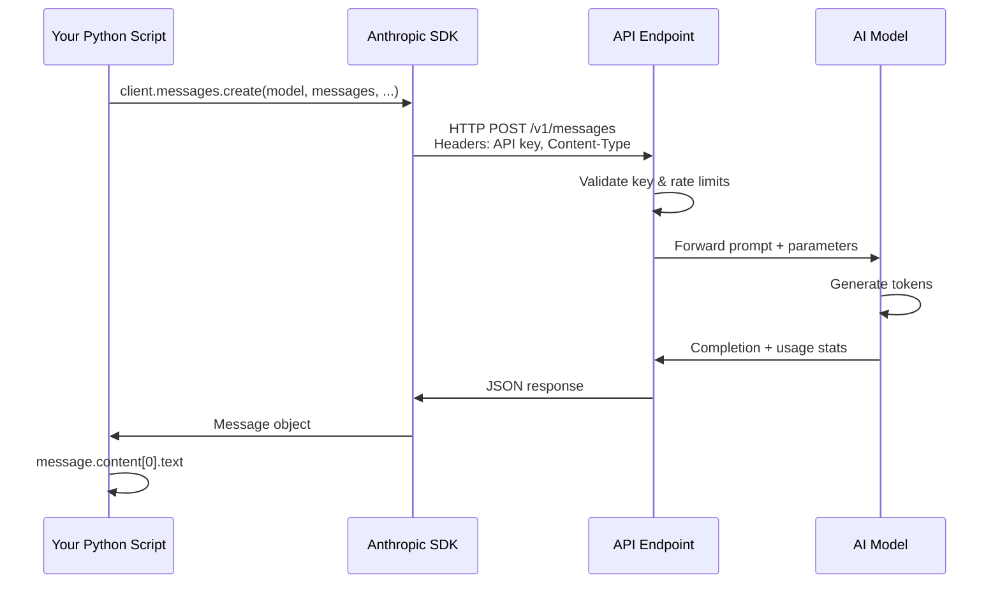

# How AI APIs Work

Every major AI model — Claude, GPT, Gemini, Llama — is accessible through an API. Understanding how these APIs work is the single most important skill in applied AI engineering. This article takes you from zero to making real API calls, managing costs, and building your first AI-powered script.

## APIs: A Quick Refresher

:::definition[API (Application Programming Interface)]
A structured way for one program to talk to another. You send a **request** with specific data, and you get back a **response**. AI APIs let your code talk to models running on powerful remote servers.
:::

You have already worked with APIs if you have fetched data from a URL or used a library that talks to a web service. AI APIs follow the same pattern: your code sends an HTTP request, a server processes it, and you get a response back.

But AI APIs have some important differences from traditional APIs that you need to understand before writing your first line of code.

## What Makes AI APIs Different

Traditional APIs are predictable. You ask for a user's profile, you get the same profile every time. AI APIs are fundamentally different in several ways:

**Non-deterministic by default.** The same input can produce different outputs. Ask Claude the same question twice and you may get two different (but both correct) answers. You can control this with a parameter called `temperature`.

**Stateless.** The API has no memory between calls. Every request is independent. If you want a conversation, *you* have to send the entire conversation history with every request. This surprises most beginners.

**Token-based pricing.** You pay per token (roughly 3/4 of a word) for both input and output. Every character in your prompt and every character in the response costs money. This makes efficiency a real engineering concern, not just a nice-to-have.

**Model selection matters.** Unlike a traditional API where there is one endpoint, AI providers offer multiple models at different price/performance points. Choosing the right model for your task is a core skill.

:::callout[info]
A common misconception: AI APIs are not "talking to ChatGPT." ChatGPT is a product built *on top of* the OpenAI API. When you use the API directly, you get raw model access without the product wrapper — more control, more flexibility, more responsibility.
:::

## Anatomy of an AI API Call

Every AI API call has the same fundamental structure, regardless of provider. Here is what goes into a request and what comes back.

:::diagram

:::

Here is the full request/response lifecycle in more detail:

:::diagram

:::

### The Request

| Component | What It Does | Example |
|-----------|-------------|---------|
| **Endpoint** | The URL you send the request to | `https://api.anthropic.com/v1/messages` |
| **Headers** | Authentication and metadata | API key, content type, API version |
| **Model** | Which AI model to use | `claude-sonnet-4-20250514`, `gpt-4o` |
| **Messages** | The conversation (system + user + assistant) | Your prompt and any conversation history |
| **Parameters** | Controls for model behavior | `temperature`, `max_tokens` |

### The Response

The response comes back as JSON containing:
- The model's generated text (the "completion")
- Token usage (how many tokens the input and output consumed)
- Metadata (model used, stop reason, request ID)

Let's break down each component in detail.

## Messages: The Core of Every Request

The messages array is where you tell the model what to do. It uses a role-based structure:

:::definition[System Prompt]
A special instruction that sets the model's behavior, personality, and constraints. It is processed before the conversation and shapes every response. Think of it as the model's "job description."
:::

:::definition[Messages Array]
An ordered list of `user` and `assistant` messages that represent the conversation. The model sees this entire array as context and generates the next `assistant` response.
:::

```python title="Single-turn message"
messages = [
    {"role": "user", "content": "What is the capital of France?"}
]
```

For multi-turn conversations, you include the full history:

```python title="Multi-turn conversation"
messages = [
    {"role": "user", "content": "What is the capital of France?"},
    {"role": "assistant", "content": "The capital of France is Paris."},
    {"role": "user", "content": "What is its population?"}
]
```

The model sees the entire array and understands that "its" refers to Paris. But remember — the API itself did not remember the first exchange. *You* sent it back in.

## Key Parameters

### `model`

Specifies which model handles your request. Each provider offers a range:

| Provider | Smaller/Faster/Cheaper | Larger/Smarter/Pricier |
|----------|----------------------|----------------------|
| Anthropic | `claude-haiku-4-20250514` | `claude-sonnet-4-20250514` |
| OpenAI | `gpt-4o-mini` | `gpt-4o` |

:::callout[tip]
Start with the cheaper model. Only upgrade if the task genuinely requires more intelligence. Many tasks — summarization, extraction, classification — work great with smaller models at a fraction of the cost.
:::

### `temperature`

Controls randomness in the output. Ranges from `0` to `1` (some providers allow up to `2`).

- **`0`** — Nearly deterministic. Best for factual tasks, code generation, data extraction.
- **`0.3–0.7`** — Balanced. Good for most general tasks.
- **`1.0`** — Maximum creativity. Good for brainstorming, creative writing.

### `max_tokens`

The maximum number of tokens the model will generate in its response. This is a hard cap — the model stops generating once it hits this limit, even mid-sentence. Set this based on how long you expect the response to be.

### `system`

The system prompt. In the Anthropic API, this is a top-level parameter. In the OpenAI API, it is a message with `role: "system"` in the messages array.

## Setting Up API Keys

Before you can make API calls, you need API keys from each provider. Here is how to get them and — critically — how to handle them safely.

### Getting Your Keys

1. **Anthropic (Claude):** Go to [console.anthropic.com](https://console.anthropic.com), create an account, and generate an API key in the API Keys section.
2. **OpenAI (GPT):** Go to [platform.openai.com](https://platform.openai.com), create an account, and generate an API key in the API Keys section.

Both providers offer free credits for new accounts. You do not need a paid plan to follow along with this article.

### Storing Keys Securely

:::callout[warning]
**Never hardcode API keys in your source code.** If you push a file with an API key to GitHub, automated bots will find it within minutes and abuse your account. This is not hypothetical — it happens constantly.
:::

The standard approach is **environment variables** stored in a `.env` file:

**Step 1:** Create a `.env` file in your project root:

```bash title=".env"
ANTHROPIC_API_KEY=sk-ant-your-key-here
OPENAI_API_KEY=sk-your-key-here
```

**Step 2:** Add `.env` to your `.gitignore` immediately:

```bash
echo ".env" >> .gitignore
```

**Step 3:** Install `python-dotenv` and load the variables in your code:

```bash
pip install python-dotenv
```

```python title="load_keys.py"
import os
from dotenv import load_dotenv

load_dotenv()

anthropic_key = os.getenv("ANTHROPIC_API_KEY")
openai_key = os.getenv("OPENAI_API_KEY")
```

:::callout[tip]
Create a `.env.example` file with placeholder values and commit *that* to your repo. This tells collaborators which environment variables they need without exposing real keys.
```bash title=".env.example"
ANTHROPIC_API_KEY=your-key-here
OPENAI_API_KEY=your-key-here
```
:::

## Your First API Call

Time to make it real. Install both SDKs:

```bash
pip install anthropic openai python-dotenv
```

:::tabs

```tab[Claude (Anthropic)]
import anthropic
import os
from dotenv import load_dotenv

load_dotenv()

client = anthropic.Anthropic()  # Reads ANTHROPIC_API_KEY from environment

message = client.messages.create(
    model="claude-sonnet-4-20250514",
    max_tokens=1024,
    system="You are a helpful assistant that gives concise answers.",
    messages=[
        {"role": "user", "content": "Explain what an API is in two sentences."}
    ]
)

print(message.content[0].text)
```

```tab[OpenAI (GPT)]
from openai import OpenAI
import os
from dotenv import load_dotenv

load_dotenv()

client = OpenAI()  # Reads OPENAI_API_KEY from environment

response = client.chat.completions.create(
    model="gpt-4o-mini",
    max_tokens=1024,
    messages=[
        {"role": "system", "content": "You are a helpful assistant that gives concise answers."},
        {"role": "user", "content": "Explain what an API is in two sentences."}
    ]
)

print(response.choices[0].message.content)
```

:::

Run either script and you should see a clean, concise explanation printed to your terminal. Congratulations — you just made your first AI API call.

## Understanding the Response Object

The response you get back contains more than just the text. Let's examine it.

:::tabs

```tab[Claude Response]
import json

message = client.messages.create(
    model="claude-sonnet-4-20250514",
    max_tokens=1024,
    messages=[
        {"role": "user", "content": "What is Python?"}
    ]
)

# The generated text
print(message.content[0].text)

# Token usage
print(f"Input tokens:  {message.usage.input_tokens}")
print(f"Output tokens: {message.usage.output_tokens}")

# Metadata
print(f"Model:        {message.model}")
print(f"Stop reason:  {message.stop_reason}")  # "end_turn" or "max_tokens"
```

```tab[OpenAI Response]
response = client.chat.completions.create(
    model="gpt-4o-mini",
    max_tokens=1024,
    messages=[
        {"role": "user", "content": "What is Python?"}
    ]
)

# The generated text
print(response.choices[0].message.content)

# Token usage
print(f"Input tokens:  {response.usage.prompt_tokens}")
print(f"Output tokens: {response.usage.completion_tokens}")
print(f"Total tokens:  {response.usage.total_tokens}")

# Metadata
print(f"Model:         {response.model}")
print(f"Finish reason: {response.choices[0].finish_reason}")  # "stop" or "length"
```

:::

:::callout[info]
The `stop_reason` (Anthropic) or `finish_reason` (OpenAI) tells you *why* the model stopped generating. `"end_turn"` / `"stop"` means it finished naturally. `"max_tokens"` / `"length"` means it hit your token limit and was cut off. Always check this — a truncated response is a silent bug.
:::

## Token Counting and Cost Awareness

:::definition[Token]
The fundamental unit of text processing for language models. Roughly 3/4 of an English word, or about 4 characters. The word "hamburger" is 3 tokens. A 1,000-word essay is approximately 1,300 tokens.
:::

Tokens matter because you pay for them. Here is a rough pricing table (as of early 2026):

| Model | Input (per 1M tokens) | Output (per 1M tokens) |
|-------|----------------------|----------------------|
| Claude Haiku | ~$0.80 | ~$4.00 |
| Claude Sonnet | ~$3.00 | ~$15.00 |
| GPT-4o-mini | ~$0.15 | ~$0.60 |
| GPT-4o | ~$2.50 | ~$10.00 |

:::diagram

:::

:::callout[tip]
For learning and prototyping, your costs will be pennies. A typical API call with a short prompt and a paragraph-length response uses around 500 total tokens — well under a cent. You would need to make thousands of calls to spend even $1.
:::

### Counting Tokens Before Sending

You can estimate token counts before making an API call:

```python
# Anthropic provides a token counting method
token_count = client.count_tokens(
    model="claude-sonnet-4-20250514",
    messages=[{"role": "user", "content": "Your prompt here"}]
)
print(f"This prompt will use approximately {token_count} input tokens")
```

For quick mental math: take your word count and multiply by 1.3. That gives you a reasonable token estimate.

## Rate Limits

API providers limit how many requests you can make in a given time window. This prevents abuse and ensures fair access.

When you hit a rate limit, you get an HTTP `429` error. The correct way to handle this is **exponential backoff** — wait a bit, try again, wait longer if it fails again:

```python title="retry_with_backoff.py"
import time
import anthropic

client = anthropic.Anthropic()

def call_with_retry(messages, max_retries=3):
    for attempt in range(max_retries):
        try:
            response = client.messages.create(
                model="claude-sonnet-4-20250514",
                max_tokens=1024,
                messages=messages
            )
            return response
        except anthropic.RateLimitError:
            wait_time = 2 ** attempt  # 1s, 2s, 4s
            print(f"Rate limited. Waiting {wait_time}s before retry...")
            time.sleep(wait_time)
    raise Exception("Max retries exceeded")
```

:::details[Want to go deeper? Streaming responses]
By default, API calls wait until the entire response is generated before returning. For long responses, this can take several seconds with no visible progress. **Streaming** sends tokens back as they are generated, so the user sees text appear word by word — just like ChatGPT.

```python title="streaming_example.py"
# Anthropic streaming
with client.messages.stream(
    model="claude-sonnet-4-20250514",
    max_tokens=1024,
    messages=[{"role": "user", "content": "Explain how APIs work."}]
) as stream:
    for text in stream.text_stream:
        print(text, end="", flush=True)
```

Streaming is important for user-facing applications where perceived responsiveness matters. You will use it extensively when you build chatbots and web apps in later articles.
:::

:::callout[info]
Rate limits are rarely an issue during development. You will only encounter them if you are making many calls in rapid succession (like processing a large batch of data). The SDKs for both Anthropic and OpenAI have built-in retry logic that handles this automatically in most cases.
:::

## Putting It All Together

Here is a complete, well-structured script that demonstrates everything you have learned:

```python title="ai_query.py"
"""
ai_query.py — Send a question to Claude and get an answer.
Demonstrates: API setup, environment variables, error handling, token tracking.
"""

import anthropic
import os
import sys
from dotenv import load_dotenv

load_dotenv()


def ask_claude(question: str, temperature: float = 0.3) -> str:
    """Send a question to Claude and return the response text."""
    client = anthropic.Anthropic()

    try:
        message = client.messages.create(
            model="claude-sonnet-4-20250514",
            max_tokens=1024,
            temperature=temperature,
            system="You are a knowledgeable assistant. Give clear, accurate, concise answers.",
            messages=[
                {"role": "user", "content": question}
            ]
        )

        # Log token usage
        print(f"[Tokens: {message.usage.input_tokens} in, {message.usage.output_tokens} out]",
              file=sys.stderr)

        return message.content[0].text

    except anthropic.AuthenticationError:
        return "Error: Invalid API key. Check your ANTHROPIC_API_KEY environment variable."
    except anthropic.RateLimitError:
        return "Error: Rate limited. Wait a moment and try again."
    except anthropic.APIError as e:
        return f"Error: API returned an error: {e}"


def main():
    if len(sys.argv) < 2:
        print("Usage: python ai_query.py \"Your question here\" [temperature]")
        print("  temperature: 0.0–1.0 (default: 0.3)")
        sys.exit(1)

    question = sys.argv[1]
    temperature = float(sys.argv[2]) if len(sys.argv) > 2 else 0.3

    answer = ask_claude(question, temperature)
    print(answer)


if __name__ == "__main__":
    main()
```

Test it:

```bash
python ai_query.py "What are the three laws of thermodynamics? Explain each in one sentence."
```

```bash
python ai_query.py "Write me a haiku about debugging" 1.0
```

The first call uses a low temperature for factual accuracy. The second cranks it up for creativity. Notice the token usage printed to stderr — building cost awareness into your tools from day one is a habit that will serve you well.

:::build-challenge
### Build Challenge: AI Question Answerer

Build a Python CLI tool called `ask.py` that:

1. Takes a question as a command-line argument
2. Sends it to Claude's API
3. Prints the response to stdout
4. Accepts an optional `--temperature` flag (default `0.3`)
5. Prints token usage and estimated cost to stderr
6. Handles errors gracefully (missing API key, rate limits, network failures)

**Stretch goals:**
- Add a `--model` flag to switch between Claude Haiku and Sonnet
- Add a `--provider` flag to switch between Anthropic and OpenAI
- Add a `--json` flag that outputs the response as structured JSON (including the answer, token counts, model used, and cost)
- Store a running total of tokens used in a local file so you can track your spending over time

**Example usage:**
```bash
python ask.py "How does photosynthesis work?"
python ask.py "Write a limerick about APIs" --temperature 0.9
python ask.py "Summarize the Python GIL" --model haiku --json
```
:::
