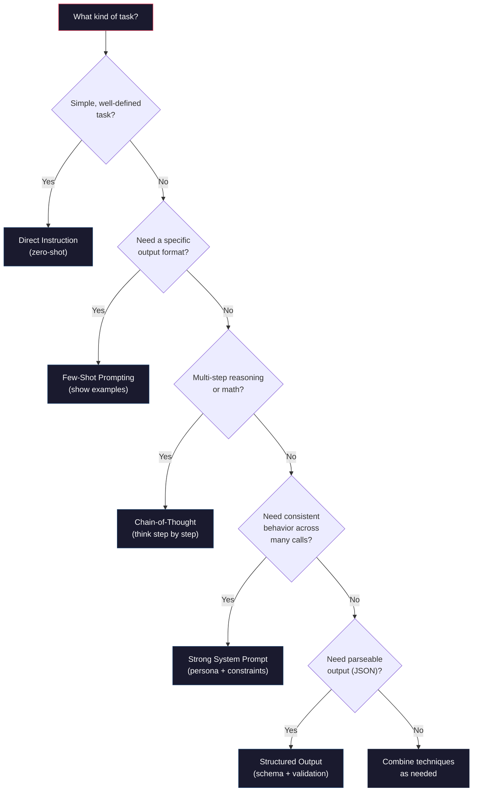

# Prompt Engineering

Prompt engineering is not a collection of magic tricks. It is the discipline of writing clear, structured instructions that produce reliable and repeatable results from language models. This article treats it as a real engineering skill — with patterns, failure modes, testing strategies, and measurable outcomes.

You already know how to make API calls. Now you learn how to make them *good*.

## Which Technique Should I Use?

Before diving into individual techniques, here is a decision flowchart. Refer back to this as you learn each pattern:

:::diagram

:::

In practice, you will often combine multiple techniques — a strong system prompt with few-shot examples and structured output, for instance. The sections below teach each technique individually so you understand when and why to use it.

## System Prompts: Setting the Rules

The system prompt is the most powerful lever you have. It runs before the conversation begins, and the model treats it as foundational instructions. Everything the model does is filtered through the system prompt.

:::definition[System Prompt]
A persistent instruction that defines the model's behavior, persona, constraints, and output format. The model reads the system prompt before every response it generates. A well-written system prompt is the difference between a useful AI tool and a frustrating one.
:::

Here is a weak system prompt:

```
You are a helpful assistant.
```

And here is a strong one:

```
You are a senior Python code reviewer. Your job is to review code snippets
for bugs, performance issues, and style problems.

Rules:
- Always explain WHY something is a problem, not just what to change
- Rate severity as: critical, warning, or nitpick
- If the code is good, say so — don't invent problems
- Format your response as a numbered list of findings
- Keep explanations concise (2-3 sentences per finding)
```

The strong version works because it specifies:
1. **Role** — who the model is (a senior code reviewer)
2. **Task** — what it does (reviews code for specific issues)
3. **Constraints** — what it should not do (don't invent problems)
4. **Format** — how to structure the output (numbered list, severity labels)
5. **Style** — how to communicate (concise, explain the why)

:::callout[tip]
Write system prompts like you are writing a job description for a human contractor who is smart but has zero context about your project. Be explicit about what you want and what you do not want.
:::

:::callout[warning]
**Vague prompts produce vague results.** Compare these two approaches:

| Weak Prompt | Strong Prompt |
|---|---|
| "Review this code" | "Review this Python code for SQL injection vulnerabilities. List each finding with the line number, severity (critical/warning/info), and a fix." |
| "Summarize this" | "Summarize this article in exactly 3 bullet points, each under 20 words, focusing on actionable takeaways for a junior developer." |
| "Write a function" | "Write a Python function that takes a list of dicts with 'name' and 'score' keys, returns the top 3 by score, and handles the case where the list has fewer than 3 items." |

The strong prompts specify **role**, **task**, **format**, and **edge cases**. The model can only be as precise as your instructions.
:::

### System Prompt Patterns

**The Persona Pattern** — Give the model a specific identity:

```python title="persona_pattern.py"
system = """You are a database architect with 15 years of experience.
You specialize in PostgreSQL and think carefully about indexing,
normalization, and query performance. When asked about database design,
you always consider scale — what works for 1,000 rows vs 1,000,000 rows."""
```

**The Constraint Pattern** — Define boundaries:

```python title="constraint_pattern.py"
system = """You are a customer support agent for a SaaS product.

You MUST:
- Only answer questions about the product
- Escalate billing issues to human support
- Never make promises about future features

You MUST NOT:
- Discuss competitors
- Share internal pricing logic
- Provide legal or financial advice"""
```

**The Output Format Pattern** — Control response structure:

```python title="output_format_pattern.py"
system = """You are a data extraction assistant. When given text,
extract all mentioned entities and return them as JSON.

Always use this exact format:
{
  "people": ["name1", "name2"],
  "organizations": ["org1", "org2"],
  "locations": ["loc1", "loc2"],
  "dates": ["date1", "date2"]
}

If a category has no matches, use an empty array. Never add commentary outside the JSON."""
```

## User/Assistant Message Patterns

The messages array is not just for conversation. You can use it strategically to shape model behavior.

### The Direct Instruction

The simplest pattern. One user message, one task:

```python
messages = [
    {"role": "user", "content": "Summarize this article in 3 bullet points:\n\n{article_text}"}
]
```

### The Prefilled Assistant

You can start the assistant's response to steer its format:

:::tabs

```tab[Claude (Anthropic)]
# Anthropic supports prefilling the assistant response
messages = [
    {"role": "user", "content": "Extract the email addresses from this text:\n\nContact us at info@example.com or sales@example.com for more info."},
    {"role": "assistant", "content": "["}  # Forces the model to start with a JSON array
]
```

```tab[OpenAI (GPT)]
# OpenAI does not support prefilled assistant messages the same way.
# Instead, be explicit in the system prompt about output format.
messages = [
    {"role": "system", "content": "Always respond with a JSON array of strings. No other text."},
    {"role": "user", "content": "Extract the email addresses from this text:\n\nContact us at info@example.com or sales@example.com for more info."}
]
```

:::

### Multi-Turn Context Setting

Use prior turns to establish context without overloading a single message:

```python
messages = [
    {"role": "user", "content": "I'm building a Flask app that manages a todo list with a PostgreSQL database."},
    {"role": "assistant", "content": "Got it. I understand the stack — Flask for the web framework, PostgreSQL for persistence. What would you like help with?"},
    {"role": "user", "content": "Write the SQLAlchemy model for the Todo table."}
]
```

This gives the model strong context about your project before the actual request.

## Few-Shot Prompting

Few-shot prompting means giving the model examples of the input-output pattern you want before asking it to handle new input. It is one of the most reliable techniques for getting consistent results.

:::definition[Few-Shot Prompting]
Providing one or more examples of the desired input-output behavior in the prompt. The model identifies the pattern and applies it to new inputs. "Few-shot" means a small number of examples (typically 2-5). "Zero-shot" means no examples.
:::

### The Structure

```python title="few_shot_classification.py"
system = "You classify customer feedback as positive, negative, or neutral."

messages = [
    # Example 1
    {"role": "user", "content": "Feedback: 'The app crashes every time I try to export.'"},
    {"role": "assistant", "content": "Classification: negative\nReason: Reports a consistent bug causing functionality failure."},

    # Example 2
    {"role": "user", "content": "Feedback: 'Love the new dark mode! Great update.'"},
    {"role": "assistant", "content": "Classification: positive\nReason: Expresses enthusiasm about a specific feature."},

    # Example 3
    {"role": "user", "content": "Feedback: 'The app is fine, nothing special.'"},
    {"role": "assistant", "content": "Classification: neutral\nReason: Neither positive nor negative sentiment expressed."},

    # The real request
    {"role": "user", "content": "Feedback: 'Support took 3 days to respond but they did solve my problem.'"}
]
```

The model sees the pattern — classify, then explain — and applies it to the new input. The more consistent your examples are, the more consistent the output will be.

:::callout[tip]
Include edge cases in your few-shot examples. If you only show clear-cut examples, the model will struggle with ambiguous inputs. The customer feedback example above works well because Example 3 (neutral) and the real request (mixed) are not obvious.
:::

### When to Use Few-Shot

| Scenario | Zero-Shot | Few-Shot |
|----------|-----------|----------|
| Simple, well-defined tasks | Works fine | Overkill |
| Custom output formats | Hit-or-miss | Highly reliable |
| Classification with specific categories | Often good | Much better |
| Complex, multi-step reasoning | Inconsistent | More consistent |
| Domain-specific language | Often wrong | Much better |

## Chain-of-Thought Reasoning

For complex tasks, asking the model to think step-by-step dramatically improves accuracy. This is called chain-of-thought prompting.

:::definition[Chain-of-Thought (CoT)]
A prompting technique where you instruct the model to show its reasoning before giving a final answer. This reduces errors on multi-step problems because the model can "check its work" as it goes.
:::

### Basic Chain-of-Thought

```python
messages = [
    {"role": "user", "content": """A store sells notebooks for $4 each. They offer a 25% discount
on orders of 10 or more. Tax is 8%. How much does an order of 12 notebooks cost?

Think through this step by step before giving the final answer."""}
]
```

Without CoT, models frequently make arithmetic errors on problems like this. With CoT, accuracy jumps significantly because the model breaks the problem into steps and can catch mistakes.

### Structured Chain-of-Thought

For more complex tasks, give explicit structure to the reasoning:

```python
system = """You are a debugging assistant. When given a code snippet and an error,
diagnose the problem using this process:

1. UNDERSTAND: Restate what the code is trying to do
2. IDENTIFY: Locate the specific line(s) causing the error
3. EXPLAIN: Explain why the error occurs
4. FIX: Provide the corrected code
5. PREVENT: Suggest how to avoid this type of bug in the future

Always follow all 5 steps in order."""
```

This forces the model through a rigorous process rather than jumping straight to an answer — which is where mistakes happen.

:::callout[info]
Chain-of-thought is especially valuable for tasks involving math, logic, code analysis, and multi-step planning. For simple tasks like "translate this sentence," CoT adds unnecessary overhead without improving results.
:::

## Structured Output: Getting JSON Reliably

Getting models to return clean, parseable JSON is one of the most common needs in applied AI. There are two main approaches.

### Approach 1: API-Level Enforcement

OpenAI offers a `response_format` parameter that forces valid JSON:

```python
response = client.chat.completions.create(
    model="gpt-4o-mini",
    response_format={"type": "json_object"},
    messages=[
        {"role": "system", "content": "Extract entities from text. Return JSON with keys: people, places, dates."},
        {"role": "user", "content": "Barack Obama visited Paris on June 5th, 2024."}
    ]
)

import json
data = json.loads(response.choices[0].message.content)
print(data)
# {"people": ["Barack Obama"], "places": ["Paris"], "dates": ["June 5th, 2024"]}
```

### Approach 2: Prompt-Based (Works with Any Model)

When API-level enforcement is not available, you can achieve reliable JSON through careful prompting:

```python
system = """You extract structured data from text. You ONLY output valid JSON.
No markdown, no explanation, no code fences — just the raw JSON object.

Schema:
{
  "people": [string],
  "places": [string],
  "dates": [string]
}"""

message = client.messages.create(
    model="claude-sonnet-4-20250514",
    max_tokens=1024,
    system=system,
    messages=[
        {"role": "user", "content": "Barack Obama visited Paris on June 5th, 2024."}
    ]
)

import json
data = json.loads(message.content[0].text)
```

:::callout[tip]
For the prompt-based approach, three things dramatically improve JSON reliability:
1. Show the exact schema in the system prompt
2. Say "ONLY output valid JSON" and "No markdown" explicitly
3. Use a low temperature (`0` or `0.1`) to reduce creative formatting
:::

### Validating Structured Output

Never trust model output blindly. Always validate:

```python
import json

def parse_model_json(raw_text: str) -> dict | None:
    """Safely parse JSON from model output."""
    # Strip markdown code fences if the model added them
    cleaned = raw_text.strip()
    if cleaned.startswith("```"):
        cleaned = cleaned.split("\n", 1)[1]  # Remove first line
        cleaned = cleaned.rsplit("```", 1)[0]  # Remove last fence

    try:
        return json.loads(cleaned)
    except json.JSONDecodeError as e:
        print(f"Failed to parse JSON: {e}")
        return None
```

## Prompt Templates and Variables

Real applications do not use hardcoded prompts. They use templates with variables:

```python title="prompt_template.py"
def analyze_code(code: str, language: str, focus: str = "bugs") -> str:
    """Analyze code using a templated prompt."""
    system = f"""You are a {language} code analyst specializing in finding {focus}.
Analyze the provided code and return your findings as a JSON array.
Each finding should have: "line", "issue", "severity", "suggestion"."""

    message = client.messages.create(
        model="claude-sonnet-4-20250514",
        max_tokens=2048,
        temperature=0,
        system=system,
        messages=[
            {"role": "user", "content": f"Analyze this {language} code:\n\n```{language}\n{code}\n```"}
        ]
    )
    return message.content[0].text


# Usage
result = analyze_code(
    code="def add(a, b):\n    return a + b",
    language="Python",
    focus="performance issues"
)
```

:::callout[warning]
Be careful with f-strings in prompts. If the variable contains text that looks like instructions (like user input), it could "hijack" the prompt. This is called **prompt injection** and it is a real security concern you will learn more about later. For now, keep untrusted input in the `user` message, not the `system` prompt.
:::

## Common Failure Modes

Every applied AI engineer encounters these. Knowing how to diagnose and fix them is what separates real engineers from tutorial followers.

### Hallucination

**Symptom:** The model states false information confidently.

**Fixes:**
- Add "If you don't know, say so" to the system prompt
- Use RAG to ground responses in real data (covered in a later article)
- Ask for sources and then verify them
- Lower temperature to reduce creative fabrication

### Verbosity

**Symptom:** You asked for a one-sentence answer and got five paragraphs.

**Fixes:**
- Be explicit: "Respond in exactly one sentence"
- Add length constraints to the system prompt: "Keep responses under 50 words"
- Use the `max_tokens` parameter as a hard cap
- Include a concise example in a few-shot setup

### Format Breaking

**Symptom:** You asked for JSON and got JSON wrapped in markdown code fences, or worse, JSON with explanatory text around it.

**Fixes:**
- Use API-level `response_format` where available
- Say "ONLY output JSON. No other text." in the system prompt
- Use assistant prefilling to start the response with `{`
- Parse defensively (strip code fences, handle extra text)

### Refusal

**Symptom:** The model refuses a legitimate request because it misidentifies it as harmful.

**Fixes:**
- Add context about *why* you need this: "I'm building a security training tool"
- Rephrase the request to be clearly constructive
- Use a system prompt that establishes a professional context
- Try a different model — refusal thresholds vary

### Inconsistency

**Symptom:** The same prompt produces wildly different outputs each time.

**Fixes:**
- Set `temperature=0` for deterministic tasks
- Use few-shot examples to anchor the output format
- Make instructions more specific and less ambiguous
- Test with multiple runs and compare

:::details[Advanced techniques: Self-consistency, meta-prompting, and prompt chaining]
Once you are comfortable with the core techniques, these advanced patterns unlock more reliable results:

**Self-consistency** — Run the same prompt multiple times (with temperature > 0) and take the majority answer. If 4 out of 5 runs say "classification: negative," you can be more confident than a single run. This is especially useful for classification and reasoning tasks.

**Meta-prompting** — Use an LLM to write or improve your prompts. Give the model your current prompt and some failure cases, and ask it to suggest improvements. This is surprisingly effective for discovering blind spots in your instructions.

**Prompt chaining** — Break a complex task into multiple sequential API calls, where the output of one becomes the input of the next. For example: (1) extract key facts from a document, (2) use those facts to generate a summary, (3) use the summary to draft an email. Each step is simpler and more reliable than trying to do everything in one prompt.

**Constitutional AI / Self-critique** — Ask the model to generate an answer, then ask it to critique its own answer and revise. This two-pass approach often catches errors the first pass missed.
:::

## Testing Prompts Systematically

Amateur prompt engineers test by running a prompt once, reading the output, and tweaking. Professional prompt engineers build test suites.

### The Evaluation Framework

```python title="prompt_eval.py"
"""
prompt_eval.py — A minimal prompt evaluation framework.
"""

import anthropic
from dataclasses import dataclass

client = anthropic.Anthropic()


@dataclass
class TestCase:
    input_text: str
    expected_contains: list[str]  # Strings that SHOULD appear in output
    expected_not_contains: list[str] = None  # Strings that should NOT appear


def evaluate_prompt(system: str, test_cases: list[TestCase], model: str = "claude-sonnet-4-20250514") -> dict:
    """Run a prompt against test cases and report results."""
    results = {"passed": 0, "failed": 0, "details": []}

    for i, test in enumerate(test_cases):
        message = client.messages.create(
            model=model,
            max_tokens=1024,
            temperature=0,
            system=system,
            messages=[{"role": "user", "content": test.input_text}]
        )
        output = message.content[0].text

        # Check expected content
        passed = True
        issues = []

        for expected in test.expected_contains:
            if expected.lower() not in output.lower():
                passed = False
                issues.append(f"Missing expected: '{expected}'")

        if test.expected_not_contains:
            for forbidden in test.expected_not_contains:
                if forbidden.lower() in output.lower():
                    passed = False
                    issues.append(f"Contains forbidden: '{forbidden}'")

        results["passed" if passed else "failed"] += 1
        results["details"].append({
            "test": i + 1,
            "input": test.input_text[:80],
            "passed": passed,
            "issues": issues,
            "output_preview": output[:200]
        })

    return results


# Example usage
test_cases = [
    TestCase(
        input_text="Feedback: 'The product is amazing, best purchase ever!'",
        expected_contains=["positive"],
        expected_not_contains=["negative", "neutral"]
    ),
    TestCase(
        input_text="Feedback: 'Shipping was slow but the item itself is fine.'",
        expected_contains=["mixed", "neutral"],  # Either is acceptable
    ),
    TestCase(
        input_text="Feedback: 'Broke after one day. Total waste of money.'",
        expected_contains=["negative"],
        expected_not_contains=["positive"]
    ),
]

system = "Classify customer feedback as positive, negative, neutral, or mixed. Start your response with 'Classification: [label]'."

results = evaluate_prompt(system, test_cases)
print(f"Passed: {results['passed']}/{results['passed'] + results['failed']}")
for detail in results["details"]:
    status = "PASS" if detail["passed"] else "FAIL"
    print(f"  [{status}] Test {detail['test']}: {detail['input']}")
    if detail["issues"]:
        for issue in detail["issues"]:
            print(f"         {issue}")
```

:::callout[tip]
Run your test suite every time you change a prompt. Models are sensitive to small wording changes, and a tweak that fixes one test case might break another. Treat prompt changes like code changes — test before deploying.
:::

:::build-challenge
### Build Challenge: Prompt Playground

Build a Python CLI tool called `prompt_playground.py` that lets you test and compare prompts systematically:

1. **Takes a user message** as a required argument
2. **Accepts multiple system prompts** via a `--systems` flag (provide them as a JSON file where each key is a name and each value is the system prompt text)
3. **Runs the same user message** against each system prompt
4. **Displays results side by side** in the terminal, showing:
   - The system prompt name
   - The response text
   - Token count and estimated cost
   - Response time
5. **Supports `--temperature`** and `--model`** flags for controlling parameters
6. **Saves results** to a JSON file for later comparison

**Example systems.json:**
```json
{
    "concise": "You give extremely concise answers. Maximum one sentence.",
    "detailed": "You give thorough, detailed explanations with examples.",
    "socratic": "You answer every question with a clarifying question to help the user think deeper."
}
```

**Example usage:**
```bash
python prompt_playground.py "Explain recursion" --systems systems.json --temperature 0.3
python prompt_playground.py "Review this code: def f(x): return f(x-1)" --systems systems.json --model haiku
```

**Stretch goals:**
- Add a `--runs N` flag that runs each system prompt N times and shows consistency metrics (how similar are the outputs across runs?)
- Add a `--eval` flag that takes evaluation criteria and uses a second LLM call to judge which system prompt produced the best response
- Color-code the output for easy visual comparison (use the `rich` library)
:::
