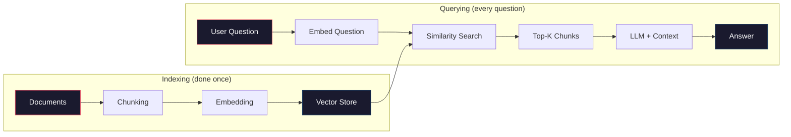
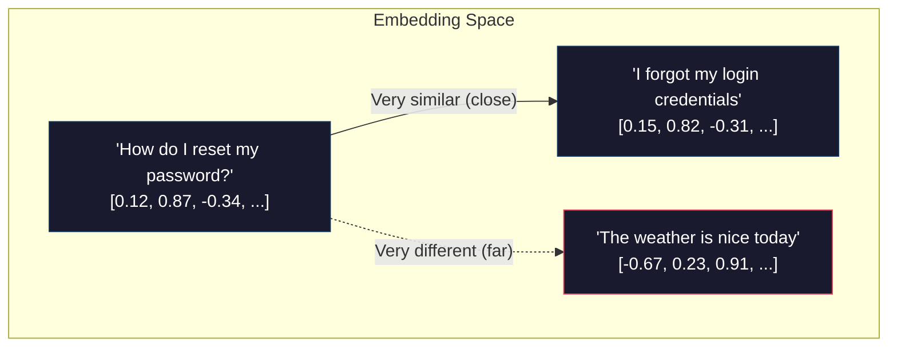

# RAG Fundamentals

Retrieval-Augmented Generation is one of the most in-demand skills in applied AI. It solves a fundamental problem: language models do not know your data. They cannot answer questions about your company's documentation, your personal notes, or last week's meeting transcript — unless you give them that information at query time. RAG is the system that does exactly that.

This article builds a complete RAG pipeline from scratch. By the end, you will have a working "chat with your documents" application.

## Why RAG Exists

Language models have three limitations that RAG addresses directly:

**1. They don't know your data.** Claude was trained on public internet data. It has never seen your internal wiki, your product documentation, or the PDF you downloaded yesterday. If you ask it a question about your data, it will either refuse or hallucinate.

**2. Context windows have limits.** Even models with 200K token context windows cannot hold an entire knowledge base. A single textbook might be 500K tokens. A company's documentation could be millions. You cannot just paste everything in.

**3. Hallucination.** When a model does not have relevant information, it sometimes generates plausible-sounding but false answers. RAG mitigates this by providing real source material for the model to reference.

:::definition[RAG (Retrieval-Augmented Generation)]
A technique where you **retrieve** relevant documents from a knowledge base, then pass them as context to a language model that **generates** an answer grounded in those documents. The model answers based on your data, not just its training data.
:::

The core idea is simple: instead of hoping the model knows the answer, you *find* the relevant information first and hand it to the model along with the question.

## The RAG Pipeline

Every RAG system follows the same architecture, regardless of complexity:

:::diagram

:::

There are two phases:

1. **Indexing** (done once): Load your documents, split them into chunks, convert each chunk to an embedding, and store everything in a vector database.
2. **Querying** (every question): Convert the user's question to an embedding, find the most similar chunks in the vector database, and pass those chunks to the LLM as context.

Let's build each step.

## Step 1: Document Loading

Before you can search your documents, you need to load them into your program. Here is a simple loader that handles plain text and PDF files:

```bash
pip install anthropic chromadb pypdf python-dotenv
```

```python title="document_loader.py"
"""
document_loader.py — Load documents from files.
"""

from pathlib import Path


def load_text_file(file_path: str) -> str:
    """Load a plain text file."""
    return Path(file_path).read_text(encoding="utf-8")


def load_pdf(file_path: str) -> str:
    """Load text from a PDF file."""
    from pypdf import PdfReader

    reader = PdfReader(file_path)
    text = ""
    for page in reader.pages:
        page_text = page.extract_text()
        if page_text:
            text += page_text + "\n"
    return text


def load_document(file_path: str) -> str:
    """Load a document, auto-detecting the file type."""
    path = Path(file_path)

    if path.suffix == ".pdf":
        return load_pdf(file_path)
    elif path.suffix in (".txt", ".md", ".rst"):
        return load_text_file(file_path)
    else:
        raise ValueError(f"Unsupported file type: {path.suffix}")


def load_directory(dir_path: str, extensions: list[str] = None) -> dict[str, str]:
    """Load all supported documents from a directory.

    Returns a dict mapping filename to content.
    """
    if extensions is None:
        extensions = [".txt", ".md", ".pdf"]

    documents = {}
    for path in Path(dir_path).iterdir():
        if path.suffix in extensions and path.is_file():
            try:
                documents[path.name] = load_document(str(path))
                print(f"Loaded: {path.name} ({len(documents[path.name]):,} characters)")
            except Exception as e:
                print(f"Failed to load {path.name}: {e}")

    return documents
```

## Step 2: Chunking

You cannot embed an entire document as a single vector — it would be too large and the meaning would be too diluted. Instead, you split documents into smaller **chunks** that each capture a focused piece of information.

:::definition[Chunking]
The process of splitting a document into smaller, semantically meaningful segments. Each chunk becomes a unit that can be independently embedded and retrieved. Chunk size is one of the most important parameters in a RAG system.
:::

### Why Chunk Size Matters

Chunks that are **too small** (50 words) lose context. A sentence like "This approach outperformed the baseline by 15%" is meaningless without knowing what "this approach" refers to.

Chunks that are **too large** (5,000 words) dilute the signal. When you search for information about "authentication," a chunk containing an entire chapter about web security will match — but the relevant information is buried in noise.

The sweet spot for most use cases is **200-500 words per chunk** (roughly 300-700 tokens).

### Chunking Strategies

**Fixed-size chunking** — The simplest approach. Split text every N characters with overlap:

```python title="fixed_size_chunking.py"
def chunk_fixed_size(text: str, chunk_size: int = 1000, overlap: int = 200) -> list[str]:
    """Split text into fixed-size chunks with overlap.

    Args:
        text: The full document text
        chunk_size: Target size for each chunk in characters
        overlap: Number of overlapping characters between chunks
    """
    chunks = []
    start = 0

    while start < len(text):
        end = start + chunk_size

        # Try to break at a sentence boundary
        if end < len(text):
            # Look for the last period, question mark, or newline before the cutoff
            for sep in ["\n\n", ".\n", ". ", "? ", "! "]:
                last_sep = text[start:end].rfind(sep)
                if last_sep != -1:
                    end = start + last_sep + len(sep)
                    break

        chunk = text[start:end].strip()
        if chunk:
            chunks.append(chunk)

        start = end - overlap

    return chunks
```

:::callout[info]
The **overlap** parameter is important. Without overlap, information that spans a chunk boundary gets split and potentially lost. A 200-character overlap means the end of chunk N and the beginning of chunk N+1 share 200 characters of context.
:::

**Recursive chunking** — A smarter approach that respects document structure. Split on the largest separator first (headings, double newlines), then recursively split chunks that are still too large:

```python title="recursive_chunking.py"
def chunk_recursive(text: str, chunk_size: int = 1000, overlap: int = 200) -> list[str]:
    """Split text recursively, respecting document structure.

    Tries to split on headings first, then paragraphs, then sentences.
    """
    separators = ["\n## ", "\n### ", "\n\n", "\n", ". "]

    def split_text(text: str, sep_index: int = 0) -> list[str]:
        if len(text) <= chunk_size:
            return [text.strip()] if text.strip() else []

        if sep_index >= len(separators):
            # Fallback to fixed-size split
            return chunk_fixed_size(text, chunk_size, overlap)

        sep = separators[sep_index]
        parts = text.split(sep)

        chunks = []
        current_chunk = ""

        for part in parts:
            candidate = current_chunk + sep + part if current_chunk else part

            if len(candidate) <= chunk_size:
                current_chunk = candidate
            else:
                if current_chunk:
                    chunks.extend(split_text(current_chunk, sep_index + 1))
                current_chunk = part

        if current_chunk:
            chunks.extend(split_text(current_chunk, sep_index + 1))

        return chunks

    return split_text(text)
```

:::callout[tip]
Start with fixed-size chunking at 1000 characters with 200 overlap. This works well for most documents. Switch to recursive chunking when you are working with structured documents (markdown, technical documentation) where headings provide natural boundaries.
:::

## Step 3: Embeddings

This is where the magic happens. Embeddings convert text into arrays of numbers (vectors) where **similar meanings produce similar vectors**. This is what allows you to search by meaning rather than keywords.

:::definition[Embedding]
A numerical representation of text as a vector (array of numbers) in high-dimensional space. Texts with similar meaning have vectors that are close together. The sentence "How do I reset my password?" and "I forgot my login credentials" would have very similar embeddings, even though they share almost no words.
:::

### How Embeddings Work (Intuitively)

Imagine a 3D space where:
- The X-axis represents "technical vs casual"
- The Y-axis represents "positive vs negative sentiment"
- The Z-axis represents "question vs statement"

The sentence "This code is brilliant!" might land at (0.8, 0.9, -0.3) — technical, positive, statement. The sentence "Is this code any good?" might land at (0.7, 0.1, 0.9) — technical, neutral, question.

Real embeddings use 256 to 3072 dimensions instead of 3, capturing far more nuance. But the principle is the same: **meaning becomes geometry**.

:::diagram

:::

### Creating Embeddings

You can get embeddings from several providers. Here we use the Anthropic-compatible Voyage AI embeddings and the OpenAI embeddings API:

:::tabs

```tab[Voyage AI (recommended with Claude)]
# pip install voyageai
import voyageai

voyage_client = voyageai.Client()  # Reads VOYAGE_API_KEY from environment

# Embed a single text
result = voyage_client.embed(
    texts=["How do I reset my password?"],
    model="voyage-3"
)
embedding = result.embeddings[0]  # A list of floats
print(f"Embedding dimension: {len(embedding)}")  # 1024
```

```tab[OpenAI Embeddings]
from openai import OpenAI

openai_client = OpenAI()

result = openai_client.embeddings.create(
    model="text-embedding-3-small",
    input=["How do I reset my password?"]
)
embedding = result.data[0].embedding  # A list of floats
print(f"Embedding dimension: {len(embedding)}")  # 1536
```

:::

:::callout[tip]
For this tutorial and getting started, ChromaDB has a built-in embedding function that uses a small local model — no API key needed. This is perfect for learning. You can swap in a production embedding model later.
:::

:::details[How similarity search actually works under the hood]
When you search for similar vectors, the database computes a **distance metric** between your query vector and every stored vector. The most common metrics are:

**Cosine similarity** measures the angle between two vectors. Two vectors pointing in the same direction have a cosine similarity of 1 (identical meaning). Two vectors pointing in opposite directions have a similarity of -1. Cosine similarity ignores magnitude — it only cares about direction, which makes it ideal for comparing texts of different lengths.

**Euclidean distance** measures the straight-line distance between two points in the vector space. Shorter distance means more similar. This is the geometric distance you learned in math class, extended to hundreds of dimensions.

In practice, with thousands or millions of vectors, checking every single one would be too slow. Vector databases use approximate nearest neighbor (ANN) algorithms like HNSW (Hierarchical Navigable Small World) that trade a tiny amount of accuracy for massive speed improvements. ChromaDB uses HNSW by default.

The math:
```
cosine_similarity(A, B) = (A . B) / (|A| * |B|)
```
Where `A . B` is the dot product and `|A|` is the magnitude (length) of vector A.
:::

## Step 4: Vector Storage with ChromaDB

A vector database stores your embeddings and lets you search them by similarity. ChromaDB is the easiest to start with — it runs locally, requires no setup, and handles embedding automatically.

:::definition[Vector Database]
A database optimized for storing and searching high-dimensional vectors. Instead of searching by exact match (like SQL), you search by similarity — "find the 5 vectors most similar to this query vector." ChromaDB, Pinecone, and Weaviate are popular options.
:::

### Setting Up ChromaDB

```python title="chroma_setup.py"
import chromadb

# Create a persistent client (data survives restarts)
chroma_client = chromadb.PersistentClient(path="./chroma_db")

# Create (or get) a collection — like a table in a regular database
collection = chroma_client.get_or_create_collection(
    name="my_documents",
    metadata={"hnsw:space": "cosine"}  # Use cosine similarity
)
```

### Adding Documents

```python title="index_documents.py"
def index_documents(collection, chunks: list[str], source: str):
    """Add document chunks to the vector store.

    ChromaDB handles embedding automatically using its default model.
    """
    ids = [f"{source}_chunk_{i}" for i in range(len(chunks))]

    collection.add(
        documents=chunks,
        ids=ids,
        metadatas=[{"source": source, "chunk_index": i} for i in range(len(chunks))]
    )

    print(f"Indexed {len(chunks)} chunks from '{source}'")
```

### Querying

```python title="search_vectors.py"
def search(collection, query: str, n_results: int = 5) -> list[dict]:
    """Search the vector store for chunks relevant to the query."""
    results = collection.query(
        query_texts=[query],
        n_results=n_results
    )

    # Format results for easy use
    formatted = []
    for i in range(len(results["documents"][0])):
        formatted.append({
            "text": results["documents"][0][i],
            "source": results["metadatas"][0][i]["source"],
            "distance": results["distances"][0][i],  # Lower = more similar
        })

    return formatted
```

:::callout[info]
ChromaDB uses **cosine distance** by default, where 0 means identical and 2 means completely opposite. In practice, relevant results typically have distances below 0.5, and highly relevant results are below 0.3. But these thresholds vary by embedding model and domain.
:::

## Step 5: The Generation Step

Now you combine retrieval with generation. Take the user's question, find relevant chunks, and pass them to Claude as context:

```python title="rag_generation.py"
import anthropic
from dotenv import load_dotenv

load_dotenv()

client = anthropic.Anthropic()

RAG_SYSTEM_PROMPT = """You are a helpful assistant that answers questions based on
the provided context documents. Follow these rules:

1. ONLY use information from the provided context to answer
2. If the context doesn't contain enough information to answer, say so clearly
3. Cite which document/section your answer comes from
4. Never make up information that isn't in the context
5. If the user asks something unrelated to the documents, politely redirect them"""


def rag_query(collection, question: str) -> str:
    """Answer a question using RAG."""

    # Step 1: Retrieve relevant chunks
    results = search(collection, question, n_results=5)

    if not results:
        return "No relevant documents found. Please make sure documents have been indexed."

    # Step 2: Format context for the LLM
    context_parts = []
    for i, result in enumerate(results):
        context_parts.append(
            f"[Source: {result['source']} | Relevance: {1 - result['distance']:.2f}]\n"
            f"{result['text']}"
        )
    context = "\n\n---\n\n".join(context_parts)

    # Step 3: Generate answer
    response = client.messages.create(
        model="claude-sonnet-4-20250514",
        max_tokens=2048,
        system=RAG_SYSTEM_PROMPT,
        messages=[
            {
                "role": "user",
                "content": f"Context documents:\n\n{context}\n\n---\n\nQuestion: {question}"
            }
        ]
    )

    return response.content[0].text
```

## Putting It All Together

Here is the complete RAG pipeline in one script:

```python title="rag_pipeline.py"
"""
rag_pipeline.py — A complete RAG system: load, chunk, index, and query documents.
"""

import anthropic
import chromadb
from pathlib import Path
from dotenv import load_dotenv

load_dotenv()

# --- Configuration ---
CHROMA_PATH = "./chroma_db"
COLLECTION_NAME = "documents"
CHUNK_SIZE = 1000
CHUNK_OVERLAP = 200

# --- Initialize clients ---
llm_client = anthropic.Anthropic()
chroma_client = chromadb.PersistentClient(path=CHROMA_PATH)
collection = chroma_client.get_or_create_collection(
    name=COLLECTION_NAME,
    metadata={"hnsw:space": "cosine"}
)


# --- Document Loading ---
def load_document(file_path: str) -> str:
    path = Path(file_path)
    if path.suffix == ".pdf":
        from pypdf import PdfReader
        reader = PdfReader(file_path)
        return "\n".join(page.extract_text() or "" for page in reader.pages)
    else:
        return path.read_text(encoding="utf-8")


# --- Chunking ---
def chunk_text(text: str, size: int = CHUNK_SIZE, overlap: int = CHUNK_OVERLAP) -> list[str]:
    chunks = []
    start = 0
    while start < len(text):
        end = start + size
        if end < len(text):
            for sep in ["\n\n", ". ", "\n"]:
                idx = text[start:end].rfind(sep)
                if idx != -1:
                    end = start + idx + len(sep)
                    break
        chunk = text[start:end].strip()
        if chunk:
            chunks.append(chunk)
        start = end - overlap
    return chunks


# --- Indexing ---
def index_file(file_path: str):
    """Load, chunk, and index a single file."""
    name = Path(file_path).name
    text = load_document(file_path)
    chunks = chunk_text(text)

    # Check if already indexed
    existing = collection.get(where={"source": name})
    if existing["ids"]:
        print(f"'{name}' already indexed ({len(existing['ids'])} chunks). Skipping.")
        return

    collection.add(
        documents=chunks,
        ids=[f"{name}_chunk_{i}" for i in range(len(chunks))],
        metadatas=[{"source": name, "chunk_index": i} for i in range(len(chunks))]
    )
    print(f"Indexed '{name}': {len(chunks)} chunks from {len(text):,} characters")


def index_directory(dir_path: str):
    """Index all supported files in a directory."""
    extensions = {".txt", ".md", ".pdf", ".rst"}
    for path in sorted(Path(dir_path).iterdir()):
        if path.suffix in extensions and path.is_file():
            index_file(str(path))


# --- Retrieval ---
def retrieve(query: str, n_results: int = 5) -> list[dict]:
    """Find the most relevant chunks for a query."""
    results = collection.query(query_texts=[query], n_results=n_results)
    formatted = []
    for i in range(len(results["documents"][0])):
        formatted.append({
            "text": results["documents"][0][i],
            "source": results["metadatas"][0][i]["source"],
            "distance": results["distances"][0][i],
        })
    return formatted


# --- Generation ---
SYSTEM_PROMPT = """You answer questions using ONLY the provided context documents.
Rules:
- If the context doesn't contain the answer, say "I don't have enough information to answer that based on the provided documents."
- Cite your sources by mentioning which document the information comes from.
- Be accurate and concise. Never fabricate information."""


def ask(question: str) -> str:
    """Answer a question using the RAG pipeline."""
    results = retrieve(question)

    if not results:
        return "No documents have been indexed yet. Use index_file() or index_directory() first."

    context = "\n\n---\n\n".join(
        f"[Source: {r['source']}]\n{r['text']}" for r in results
    )

    response = llm_client.messages.create(
        model="claude-sonnet-4-20250514",
        max_tokens=2048,
        system=SYSTEM_PROMPT,
        messages=[{
            "role": "user",
            "content": f"Context:\n\n{context}\n\n---\n\nQuestion: {question}"
        }]
    )
    return response.content[0].text


# --- Interactive Mode ---
def chat():
    """Run an interactive RAG chatbot."""
    print(f"RAG Chatbot ready. {collection.count()} chunks indexed.")
    print("Type 'quit' to exit.\n")

    while True:
        try:
            question = input("You: ").strip()
        except (KeyboardInterrupt, EOFError):
            break

        if not question:
            continue
        if question.lower() == "quit":
            break

        # Show retrieved sources
        results = retrieve(question, n_results=3)
        print(f"\n[Retrieved {len(results)} chunks from: {', '.join(set(r['source'] for r in results))}]")

        answer = ask(question)
        print(f"\nAssistant: {answer}\n")


if __name__ == "__main__":
    import sys

    if len(sys.argv) > 1:
        # Index files/directories passed as arguments
        for path in sys.argv[1:]:
            p = Path(path)
            if p.is_dir():
                index_directory(str(p))
            elif p.is_file():
                index_file(str(p))
            else:
                print(f"Not found: {path}")

    chat()
```

### Usage

```bash
# Index a directory of documents, then start chatting
python rag_pipeline.py ./my_documents/

# Or index individual files
python rag_pipeline.py report.pdf notes.txt readme.md
```

## Quality Considerations

Building a RAG pipeline is straightforward. Building one that gives *good* answers is the real engineering challenge. Here are the trade-offs you need to understand.

### Chunk Size Trade-Offs

| Chunk Size | Retrieval Precision | Context Quality | Token Cost |
|-----------|-------------------|-----------------|------------|
| Small (200 chars) | High — very specific matches | Low — lacks surrounding context | Low |
| Medium (1000 chars) | Balanced | Balanced | Moderate |
| Large (3000 chars) | Low — diluted matches | High — lots of context per chunk | High |

:::callout[tip]
There is no universally correct chunk size. The right size depends on your documents and your questions. FAQ-style documents work well with small chunks. Technical documentation works better with larger chunks that preserve context. Always test with real questions against your real data.
:::

### Retrieval Accuracy

The biggest source of bad RAG answers is bad retrieval. If the wrong chunks are retrieved, the model generates an answer from irrelevant content — which looks like a confident, well-sourced hallucination.

Common retrieval failures:
- **Vocabulary mismatch:** The user asks about "authentication" but the document uses "login verification." Embeddings usually handle this well, but domain-specific jargon can cause misses.
- **Too few results:** Retrieving only 1-2 chunks might miss important context. Start with 5 and adjust.
- **Too many results:** Retrieving 20 chunks floods the context with noise. The model struggles to find the relevant parts.

### Garbage In, Garbage Out

RAG quality starts with document quality. Common issues:
- **Bad PDF extraction:** Tables, images, and multi-column layouts often produce garbled text. Always inspect your extracted text before indexing.
- **Duplicate content:** If the same information appears in 10 documents, 8 of your 10 retrieved chunks might be near-duplicates, wasting context.
- **Outdated content:** If you index old and new versions of the same document, the model might cite outdated information.

:::callout[warning]
Always manually inspect a sample of your chunks after processing. Read 10-20 chunks and ask yourself: "If I only had this text, could I answer a reasonable question about this topic?" If chunks are garbled, truncated, or missing context, fix your chunking strategy before moving forward.
:::

:::details[Advanced: Improving Retrieval Quality]
Once your basic pipeline works, here are techniques to improve retrieval:

**Hybrid search** — Combine embedding similarity with keyword search (BM25). This catches cases where exact keyword matches matter but embeddings miss them.

**Reranking** — Retrieve more candidates (top 20) then use a reranking model to re-score and select the best 5. Cohere Rerank and cross-encoder models are popular options.

**Query expansion** — Use an LLM to generate multiple reformulations of the user's question, then search for all of them. This helps with vocabulary mismatch.

**Metadata filtering** — Add metadata (date, document type, author) to chunks and let users filter. "What did the Q4 report say?" should only search Q4 documents.

**Chunk enrichment** — Add the document title and section heading to each chunk so the embedding captures the broader context, not just the chunk text.
:::

## Where to Go From Here

You now have a working RAG pipeline. The next steps depend on your goals:

- **Agents and Tool Use** (next article) — Give your AI the ability to *decide* when to search your documents vs. using other tools
- **Evaluation and Observability** — Systematically measure RAG quality with automated test suites
- **Production deployment** — Move from ChromaDB to a hosted vector database like Pinecone for scale

:::details[Advanced: Evaluating RAG quality systematically]
Measuring RAG quality requires evaluating two independent components:

**Retrieval quality** — Are you finding the right chunks? Measure this with:
- **Precision@K**: Of the K chunks retrieved, how many are actually relevant?
- **Recall@K**: Of all the relevant chunks in your database, how many did you retrieve?
- Create a test set of 20-50 question/answer pairs with known source documents, then check if your retrieval finds those documents.

**Generation quality** — Given the right context, does the model produce a correct answer? Measure this with:
- **Faithfulness**: Does the answer stick to the provided context, or does it hallucinate?
- **Relevance**: Does the answer actually address the question?
- **Completeness**: Does the answer cover all the relevant information from the retrieved chunks?

Tools like RAGAS and LangSmith provide automated evaluation frameworks. But you can start simple: manually review 20 question-answer pairs and grade them. This gives you a baseline that automated metrics can later track.
:::

:::build-challenge
### Build Challenge: Chat With Your Documents

Build a complete "Chat with your documents" application:

1. **Document ingestion** — Accept a directory path as input and index all `.txt`, `.md`, and `.pdf` files
2. **Interactive chat** — Let the user ask questions and get answers grounded in the documents
3. **Source citations** — Every answer must show which document(s) it drew from
4. **Relevance display** — Show the similarity scores of retrieved chunks so the user can judge confidence

**Requirements:**
- Use ChromaDB for vector storage with persistent storage (data survives restarts)
- Handle the case where no relevant documents are found (tell the user honestly)
- Include a `--reindex` flag that clears and rebuilds the index
- Print retrieval diagnostics: which chunks were retrieved, from which documents, with what scores

**Test it with real documents.** Choose one of these:
- A textbook chapter (PDF)
- Your university's FAQ page (copy text into .txt files)
- A project's documentation folder
- A collection of your own notes

**Stretch goals:**
- Add a Gradio web interface with a file upload widget for adding new documents
- Implement the sliding window memory strategy so the chatbot remembers conversation context across questions
- Add a `--stats` command that shows how many documents are indexed, total chunks, and the most common sources
- Experiment with different chunk sizes (500, 1000, 2000) on the same documents and compare answer quality — document your findings

**Example usage:**
```bash
# First run: index documents
python rag_chat.py ./study_materials/

# Subsequent runs: just chat (data is persisted)
python rag_chat.py

# Rebuild the index
python rag_chat.py ./study_materials/ --reindex
```
:::
