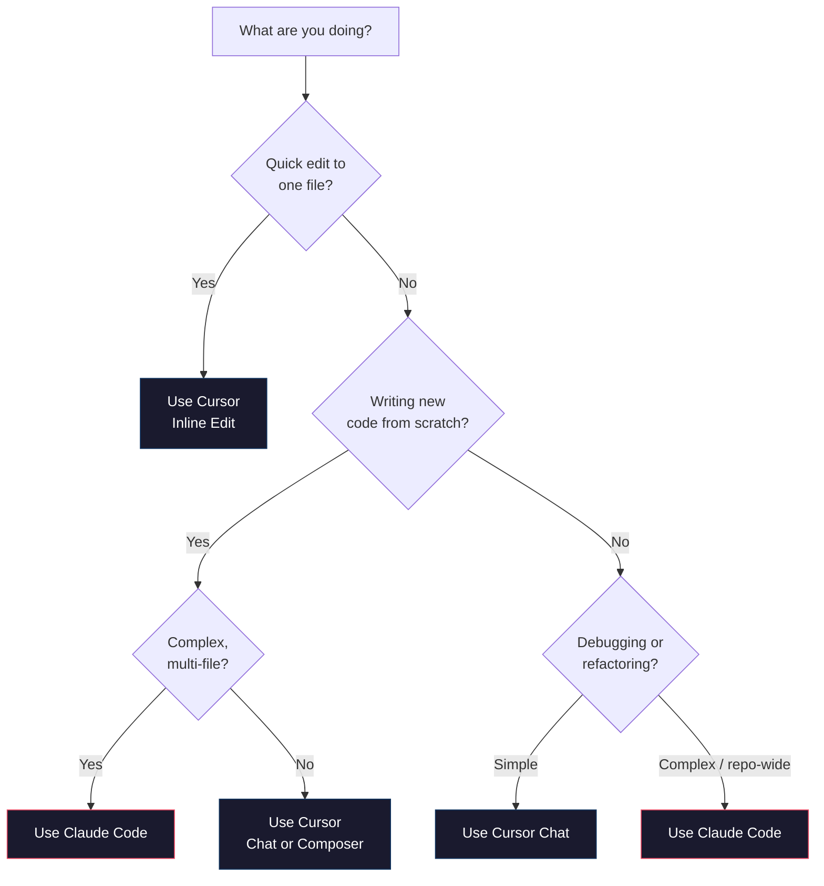

# Claude Code

Cursor lives in a GUI editor. Claude Code lives in your terminal. It is Anthropic's CLI-based AI coding agent — a tool that reads your codebase, edits files, runs commands, and works through multi-step tasks directly from the command line. No editor required.

This is not a chatbot you paste code into. Claude Code is an *agent* that operates on your actual project files. It can read your entire repository, understand how pieces connect, make coordinated changes across multiple files, run your tests, and fix whatever breaks. You describe what you want, and it does the work.

## How It Differs from Cursor

Cursor and Claude Code solve the same fundamental problem — AI-assisted development — but they approach it differently.

:::tabs

```tab[Cursor]
**Environment:** GUI editor (VS Code fork)
**Interaction:** Chat panel, inline edit, composer
**Workflow:** You select code, ask questions, review diffs
**Strengths:** Visual diff review, inline edits, tab completion
**Best for:** Writing new code, quick edits, exploring a codebase visually
```

```tab[Claude Code]
**Environment:** Terminal (CLI)
**Interaction:** Natural language conversation in the terminal
**Workflow:** You describe a task, Claude Code executes it end-to-end
**Strengths:** Multi-file changes, running commands, large refactors, automation
**Best for:** Repo-wide changes, CLI-heavy workflows, complex multi-step tasks
```

:::

The mental model: **Cursor is a copilot** — it assists while you drive. **Claude Code is an agent** — you give it a task and it drives, checking in with you at key points.

Neither is universally better. They complement each other. Many developers use Cursor for day-to-day editing and Claude Code for larger tasks like refactoring a module, setting up a project, or debugging complex issues.

## Installation and Setup

Claude Code is an npm package that runs on Node.js.

### Prerequisites

- **Node.js 18+** — Check with `node --version`. Install from [nodejs.org](https://nodejs.org) if needed.
- **An Anthropic API key** — Get one from [console.anthropic.com](https://console.anthropic.com). Claude Code uses your API key directly (you pay per token, no subscription).

### Install

```bash
npm install -g @anthropic-ai/claude-code
```

Verify the installation:

```bash
claude --version
```

### First-Time Setup

The first time you run `claude` in a project directory, it will ask for your API key (or you can set it as an environment variable):

```bash
# Option 1: Set the environment variable
export ANTHROPIC_API_KEY=sk-ant-...

# Option 2: Claude Code will prompt you on first run
```

:::callout[tip]
Add `export ANTHROPIC_API_KEY=sk-ant-...` to your shell profile (`~/.zshrc` or `~/.bashrc`) so it is always available. Never commit API keys to git.
:::

## The Basics

### Starting a Session

Navigate to your project directory and start Claude Code:

```bash
cd ~/projects/my-agent
claude
```

You will see a terminal interface where you can type natural language instructions. Claude Code immediately indexes your project — it reads your files, understands the structure, and uses this context for every interaction.

### Giving Instructions

Just type what you want in plain English:

```
> Add error handling to the web_search function in tools.py. It should catch
  connection timeouts and return a structured error JSON.
```

Claude Code will:
1. Read `tools.py` to understand the current code
2. Identify the `web_search` function
3. Edit the file to add error handling
4. Show you exactly what it changed

You can confirm or reject the changes before they are written to disk.

### Watching It Work

One of the most useful aspects of Claude Code is transparency. It shows you everything it does:

```
> Add a new endpoint to the API that returns system health

Reading app.py...
Reading routes/health.py... (file not found, will create)
Reading requirements.txt...

Creating routes/health.py:
  + import psutil
  + from fastapi import APIRouter
  + ...

Editing app.py:
  + from routes.health import router as health_router
  + app.include_router(health_router)

Editing requirements.txt:
  + psutil>=5.9.0

Would you like me to apply these changes? (y/n)
```

You see every file read, every edit proposed, and you approve before anything is written.

## When to Use Claude Code vs. Cursor

:::diagram

:::

**Use Claude Code when:**
- You need to make coordinated changes across many files
- The task involves running terminal commands (installing packages, running tests, git operations)
- You are doing a large refactor or migration
- You want to describe a task at a high level and let the AI figure out the implementation
- You are working primarily in the terminal already

**Use Cursor when:**
- You are writing code line by line and want completions
- You want to see visual diffs before applying changes
- You are exploring a codebase and want to jump around visually
- The change is small and localized to one file

## Key Features

### File Reading and Editing

Claude Code can read any file in your project and edit files with surgical precision. It understands the full context of your codebase, not just the file you are looking at.

```
> What does the Agent class do? Walk me through its main methods.
```

Claude Code reads the relevant files and gives you an explanation grounded in your actual code — not generic documentation.

```
> The run_python tool doesn't handle the case where the user's code imports a
  module that isn't installed. Add a check that catches ImportError and suggests
  pip install.
```

It reads the current implementation, understands the context, makes the edit, and shows you exactly what changed.

### Command Execution

Claude Code can run terminal commands — installing packages, running tests, starting servers, git operations. This is where it becomes an agent, not just an editor.

```
> Run the test suite and fix any failures
```

Claude Code will:
1. Run `pytest` (or whatever your test runner is)
2. Read the output
3. Identify failing tests
4. Read the relevant source code
5. Fix the issues
6. Run the tests again to verify

This loop — run, diagnose, fix, verify — is exactly how an experienced developer works. Claude Code automates it.

:::callout[warning]
Claude Code runs commands on your actual machine. It will ask for permission before running commands that modify your system (installing packages, deleting files). Always read what it proposes to run before approving, especially early on when you are learning how it works.
:::

### Project Context via CLAUDE.md

`CLAUDE.md` is to Claude Code what `.cursorrules` is to Cursor — a project-level configuration file that gives the AI persistent context about your project.

Create a `CLAUDE.md` file in your project root:

```markdown
# Project: Personal Assistant Agent

## Overview
A personal assistant AI agent with tools for file I/O, code execution,
web search, and task management. Built with the Anthropic Python SDK.

## Tech Stack
- Python 3.11+
- anthropic SDK for Claude API
- gradio for web interface
- pytest for testing

## Project Structure
- agent.py — Main agent class with the agentic loop
- tools.py — Tool definitions and implementations
- main.py — Terminal interface
- test_agent.py — Test suite
- evals/ — Evaluation datasets and runners

## Development Commands
- Run the agent: `python main.py`
- Run tests: `pytest -v`
- Run evals: `python eval_runner.py`

## Coding Conventions
- All functions have type hints and docstrings
- Tool functions return JSON strings, never raise exceptions
- Use pathlib for file paths
- Tests follow naming: test_<function>_<scenario>
```

Claude Code reads this file automatically at the start of every session. It is the fastest way to get Claude Code up to speed on your project.

:::callout[tip]
Keep `CLAUDE.md` updated as your project evolves. A stale `CLAUDE.md` is worse than none — it gives Claude Code incorrect assumptions. Add the key commands, the project structure, and any non-obvious conventions. You do not need to document everything, just what an experienced developer would need to be productive in 5 minutes.
:::

### Slash Commands

Claude Code has built-in commands for common operations:

| Command | What It Does |
|---------|-------------|
| `/help` | Show available commands |
| `/clear` | Clear conversation history |
| `/compact` | Summarize and compress the conversation to save context |
| `/cost` | Show token usage and estimated cost for the session |
| `/init` | Generate a CLAUDE.md file by analyzing your project |

The `/init` command is particularly useful for new projects. It analyzes your codebase and generates a starting `CLAUDE.md` that you can then refine.

The `/compact` command is important for long sessions. As your conversation grows, each message includes more context, which costs more and slows responses. `/compact` summarizes the conversation so you keep the context without the token overhead.

## A Real Workflow: Adding a Feature

Let's walk through a realistic workflow. You want to add a caching layer to the web search tool in your agent project.

```
> I want to add caching to the web_search tool. When the same query is searched
  twice within an hour, return the cached result instead of making another API
  call. Use a simple JSON file for the cache.
```

Claude Code might:

1. **Read** `tools.py` to understand the current `web_search` implementation
2. **Read** `agent.py` to see how tools are called
3. **Create** a cache module or add caching logic to `tools.py`
4. **Edit** the `web_search` function to check the cache first
5. **Show** you the proposed changes

After you approve:

```
> Now add a test for the caching behavior — test that a second call with the
  same query returns the cached result without incrementing the API call counter.
```

Claude Code reads the existing tests, writes a new test that follows the same patterns, and can even run the test to verify it passes.

```
> Run the tests to make sure nothing is broken.
```

It runs `pytest`, reads the output, and reports back. If anything fails, it can diagnose and fix the issue without you needing to read the test output yourself.

## Setting Up CLAUDE.md for Your Project

Here is a template that works well as a starting point:

```markdown
# Project: [Name]

## What This Is
[One paragraph description]

## Commands
- Start: `[command]`
- Test: `[command]`
- Lint: `[command]`
- Build: `[command]`

## Architecture
[Key files and what they do]

## Conventions
[Non-obvious rules — the things a new developer would get wrong]

## Current Status
[What is working, what is in progress, known issues]
```

:::details[Advanced: Multiple CLAUDE.md Files]
You can place `CLAUDE.md` files in subdirectories for module-specific context. Claude Code reads the root `CLAUDE.md` and any `CLAUDE.md` in the directory it is working in.

This is useful for monorepos or projects with distinct modules:

```
project/
  CLAUDE.md              # Project overview, top-level commands
  frontend/
    CLAUDE.md            # Frontend conventions, React patterns
  backend/
    CLAUDE.md            # Backend conventions, API patterns
  ml/
    CLAUDE.md            # ML pipeline conventions, data formats
```

Each module's `CLAUDE.md` adds context only when Claude Code is working in that directory.
:::

## Cost Awareness

Claude Code uses your API key directly, so you pay per token. A typical session costs $0.50-$5.00 depending on how much context is involved and how many steps the task requires.

**Tips for managing costs:**
- Use `/cost` to check your spending during a session
- Use `/compact` to reduce context size for long sessions
- For simple questions, use Cursor Chat instead (if you have a Cursor subscription, it is included)
- Be specific in your instructions — vague requests lead to more back-and-forth, which means more tokens

:::callout[info]
Claude Code uses Claude Sonnet by default, which offers a good balance of capability and cost. For complex architectural decisions or tricky debugging, you can switch to Opus. For simple file edits, Sonnet is more than sufficient.
:::

## Where to Go From Here

You now have two powerful AI coding tools in your toolkit: Cursor for visual, editor-based AI assistance, and Claude Code for terminal-native, agentic workflows. The best developers use both, picking the right tool for each task.

As you build more projects, you will develop an intuition for when to reach for each tool. Start by using Claude Code for one real task this week — adding a feature, fixing a bug, or setting up a new project.

:::build-challenge
### Build Challenge: Claude Code vs. Cursor Comparison

Use Claude Code to add a feature to one of your previous projects, then compare the experience to doing a similar task in Cursor.

**Part 1: Set up Claude Code**
1. Install Claude Code (`npm install -g @anthropic-ai/claude-code`)
2. Navigate to one of your previous projects (chatbot, RAG, or agent)
3. Run `/init` to generate a `CLAUDE.md` file
4. Review and refine the generated `CLAUDE.md`

**Part 2: Add a feature with Claude Code**

Choose a feature to add. Examples:
- Add a `/history` command to your chatbot that shows the last 10 conversations
- Add a `list_collections` tool to your RAG pipeline that shows all indexed document collections
- Add cost tracking to your agent that warns when a session exceeds $1.00

Give Claude Code the instruction and let it work. Note:
- How many steps did it take?
- Did it need clarification?
- Did it make mistakes? How did it recover?
- How long did the whole process take?

**Part 3: Add a similar feature with Cursor**

Choose a different (but similarly scoped) feature and build it using Cursor. Use Chat, Inline Edit, and Composer as appropriate.

**Part 4: Compare**

Write a short comparison (in a markdown file or just notes):
- Which tool was faster for this type of task?
- Which gave you more control over the result?
- Where did each tool struggle?
- Which would you use for a 5-minute fix? A 2-hour feature? A full-day refactor?

**Stretch goals:**
- Try giving both tools the exact same task and compare the implementations
- Set up Claude Code with a detailed `CLAUDE.md` and see if the quality of output improves
- Use Claude Code to write the tests for code you wrote in Cursor (or vice versa)
:::
