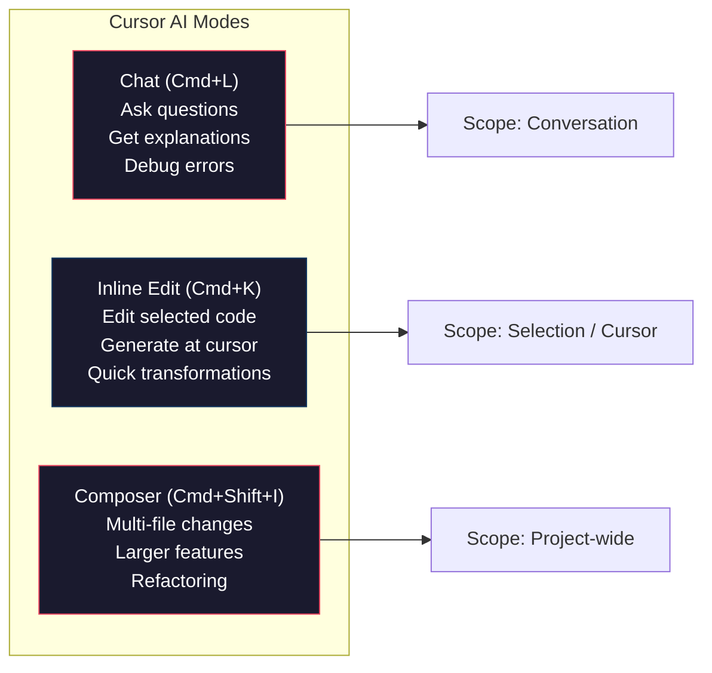

# Cursor Deep Dive

You have Cursor installed and you have had your first conversations with AI. Now it is time to learn the tool properly. Cursor has multiple ways to interact with AI — each designed for different situations. Knowing which to use and when is the difference between fighting the tool and flowing with it.

This article covers every major Cursor feature in depth, with the keyboard shortcuts and workflows you need to be productive immediately.

## The Three Modes of AI Interaction

Cursor gives you three distinct ways to work with AI. Each has a different scope and purpose.

:::diagram

:::

| Mode | Shortcut | Best For | Scope |
|------|----------|----------|-------|
| **Chat** | `Cmd+L` | Questions, debugging, exploration | Any — you control context |
| **Inline Edit** | `Cmd+K` | Quick edits, generating code at cursor | Current selection or cursor position |
| **Composer** | `Cmd+Shift+I` | Multi-file changes, features, refactoring | Multiple files at once |

:::callout[tip]
A useful mental model: **Chat** is for thinking and learning. **Inline Edit** is for quick surgical changes. **Composer** is for building and refactoring across files. Start with Chat when you are unsure what to do, switch to Inline Edit or Composer when you know what you want.
:::

## Chat Panel (Cmd+L)

The Chat panel is your primary interface for talking to AI about your code. Open it with `Cmd+L` (Mac) or `Ctrl+L` (Windows/Linux).

### Context Selection with @-Mentions

The most powerful feature of Chat is **@-mentions**. By default, Chat has no context about your project — it just sees what you type. @-mentions let you give it exactly the context it needs.

| @-Mention | What It Does | When to Use |
|-----------|-------------|-------------|
| `@file` | Includes the entire contents of a file | When you want AI to understand a specific file |
| `@folder` | Includes all files in a directory | When you need broader context about a module |
| `@codebase` | Searches your entire codebase for relevant context | When you do not know which file is relevant |
| `@docs` | Searches documentation you have indexed | When you need library/framework knowledge |
| `@web` | Searches the internet for current information | When you need up-to-date info beyond training data |
| `@git` | Includes git diff or commit history | When debugging a regression or reviewing changes |

**Example conversations:**

```
You: @file:agent.py Why does the agentic loop sometimes get stuck? I see it hitting
     max_iterations on simple tasks.

You: @codebase How is authentication handled in this project?

You: @folder:src/api What are all the API endpoints and what do they do?

You: @docs:FastAPI How do I add middleware for request logging?

You: @web What is the latest version of the Anthropic Python SDK?
```

:::callout[info]
`@codebase` is particularly powerful for large projects. It uses embeddings to search your entire repository and pull in the most relevant files — even ones you forgot existed. It is the closest thing to the AI "knowing" your project. Use it when you ask questions like "how does X work?" or "where is Y implemented?"
:::

### Long Conversations vs. Focused Queries

Chat maintains a conversation history. Every message you send includes all previous messages as context. This is useful for multi-turn debugging but has a cost: long conversations use more tokens, responses get slower, and the AI can lose focus.

**Rules of thumb:**

- **Start a new chat** (`Cmd+L` again) when you switch topics. Do not ask about authentication in the same chat where you were debugging a CSS issue.
- **Keep debugging chats focused.** Paste the error, provide the relevant file, get the fix. Do not let it wander.
- **Use long chats for exploration.** When you are learning a new codebase or designing architecture, a longer back-and-forth is appropriate.

### Debugging Workflow

This is one of the most common Chat workflows. Here is the pattern:

1. You hit an error in your terminal
2. Copy the full traceback
3. Open Chat (`Cmd+L`)
4. Paste the error and reference the file: `@file:agent.py I'm getting this error: [paste traceback]`
5. Apply the suggested fix
6. If it does not work, share the new error in the same chat

The AI sees the original error, its suggested fix, and the new error — so it can refine its approach. This iterative debugging loop is where Chat shines.

## Inline Edit (Cmd+K)

Inline Edit lets you modify code directly in the editor. Select some code (or just place your cursor), press `Cmd+K`, type what you want, and the AI edits in place.

### When to Use Inline Edit

- **Transform selected code:** Select a function, press `Cmd+K`, type "add error handling" or "convert to async"
- **Generate code at cursor:** Place your cursor where you want new code, press `Cmd+K`, type "write a function that validates email addresses"
- **Quick fixes:** Select a variable name, press `Cmd+K`, type "rename to something more descriptive"

### Examples

**Adding type hints:**
1. Select a function
2. `Cmd+K` → "add type hints to all parameters and return value"

**Writing a docstring:**
1. Place cursor inside a function, above the first line of code
2. `Cmd+K` → "write a docstring for this function"

**Refactoring:**
1. Select a block of code
2. `Cmd+K` → "extract this into a separate function called process_results"

**Converting data formats:**
1. Select a JSON object
2. `Cmd+K` → "convert to a Python dataclass"

:::callout[tip]
Inline Edit works best with *specific, scoped instructions*. "Make this better" is too vague. "Add input validation and return an error dict if the email is invalid" is specific enough for the AI to produce exactly what you want.
:::

### Accepting or Rejecting Changes

After Inline Edit generates code, you see a diff view:
- **Accept** the changes: `Cmd+Y` or click "Accept"
- **Reject** the changes: `Cmd+N` or click "Reject"
- **Edit the instruction** and try again: just modify your prompt in the Cmd+K bar

Always review the diff before accepting. The AI is fast but not always right.

## Composer (Cmd+Shift+I)

Composer is for changes that span multiple files. Adding a feature, refactoring a module, creating a new endpoint with its route, handler, and tests — these are Composer tasks.

### How Composer Works

1. Open Composer: `Cmd+Shift+I`
2. Describe what you want in natural language
3. Optionally add context files with @-mentions
4. Composer proposes changes across multiple files
5. Review each file's changes and accept or reject individually

### When to Use Composer

:::tabs

```tab[Good Composer Tasks]
- "Add a /health endpoint to the API that returns system status"
- "Create a new data model for blog posts with title, content, author, and created_at fields, plus the migration"
- "Refactor the authentication module to use JWT tokens instead of session cookies"
- "Add comprehensive error handling to all API endpoints"

These all involve changes across 2+ files and benefit from the AI seeing the whole picture at once.
```

```tab[Bad Composer Tasks]
- "Fix the typo on line 42" — Use Inline Edit
- "What does this function do?" — Use Chat
- "Add a comment to this line" — Use Inline Edit
- "Explain the project architecture" — Use Chat

These are either too small (Inline Edit is faster) or not about code changes (Chat is more appropriate).
```

:::

### A Real Composer Workflow

Say you want to add logging to your agent project. Here is how you would use Composer:

```
Open Composer (Cmd+Shift+I):

"Add structured logging to the personal assistant agent. Use Python's logging module
with JSON formatting. Add logging to:
1. Every API call (model, tokens, latency)
2. Every tool execution (tool name, inputs, result summary)
3. Every error

@file:agent.py @file:tools.py

Create the logging configuration in a new file called logging_config.py."
```

Composer will propose changes to `agent.py`, `tools.py`, and create `logging_config.py`. You review each file's diff independently.

## Tab Completion

Tab completion is Cursor's predictive code suggestions. As you type, the AI predicts what you are about to write and shows a grayed-out suggestion. Press `Tab` to accept.

Tab completion is different from Chat and Inline Edit — it is passive. You do not ask for anything. The AI watches what you type and offers completions.

**Where Tab shines:**
- Writing repetitive patterns (if you wrote one test function, it suggests the next)
- Completing function signatures, import statements, and boilerplate
- Finishing lines you started typing
- Writing code that follows established patterns in your file

**Tips:**
- Tab completion learns from your current file. If you have a consistent style, it picks up on it.
- You can accept partial suggestions: press `Cmd+Right Arrow` to accept one word at a time instead of the entire suggestion.
- If the suggestion is wrong, just keep typing. It will update.

## Cursor Rules

Cursor Rules are project-level instructions that give the AI persistent context about your coding standards, project structure, and preferences. They live in a `.cursorrules` file in your project root.

### Setting Up .cursorrules

Create a `.cursorrules` file at the root of your project:

```
# Project: Personal Assistant Agent
# Language: Python 3.11+

## Code Style
- Use type hints on ALL function parameters and return types
- Write docstrings for every function (Google style)
- Use pathlib.Path instead of os.path for file operations
- Prefer dataclasses over plain dicts for structured data
- Use f-strings for string formatting, never .format() or %

## Error Handling
- Always return structured JSON from tool functions, never raise exceptions
- Log errors before returning them
- Include the original error message in error responses

## Project Structure
- Tool definitions go in tools.py
- Tool implementations go in the same file as their definitions
- The main agent class lives in agent.py
- Tests go in test_*.py files
- Eval datasets go in evals/

## Testing
- Every tool function needs at least 2 test cases
- Test both success and failure paths
- Use descriptive test names: test_read_file_returns_content, test_read_file_not_found

## Dependencies
- anthropic (Claude API)
- python-dotenv (environment variables)
- chromadb (vector storage, if using RAG)
- gradio (web interfaces)
```

:::callout[info]
Every Chat, Inline Edit, and Composer interaction in your project will now include these rules as context. The AI will follow your coding standards automatically. This is like having a code review template built into your editor.
:::

### What to Put in Cursor Rules

| Category | Example Rules |
|----------|--------------|
| **Language/style** | Python version, formatting preferences, import ordering |
| **Architecture** | Where different types of code live, naming conventions |
| **Libraries** | Which libraries to use (and which to avoid) |
| **Error handling** | How to handle and report errors |
| **Testing** | Testing framework, coverage requirements, naming conventions |
| **Project-specific** | Domain terms, business rules, API conventions |

:::callout[warning]
Keep your `.cursorrules` file focused and concise. A 2,000-word rules file eats into your context window on every interaction. Aim for 20-40 clear rules that cover the most common situations. If a rule only applies to one file, put it as a comment in that file instead.
:::

## Settings That Matter

Open Cursor Settings (`Cmd+,` then search for "cursor" or use the Cursor-specific settings panel).

### Model Selection

Cursor lets you choose which model powers each feature:
- **Chat:** Claude Sonnet or GPT-4o are good defaults. Use Claude Opus for complex reasoning tasks.
- **Inline Edit:** Sonnet or GPT-4o. Speed matters here since you are waiting in the editor.
- **Tab completion:** Uses a fast, small model by default. Leave this alone unless you have a reason to change it.

### Privacy Mode

If you are working on proprietary code, enable Privacy Mode. This ensures your code is not stored or used for training by the model provider. Check your organization's policies.

### Other Useful Settings

- **Auto-apply suggestions:** Off by default. Leave it off — you want to review changes before they are applied.
- **Codebase indexing:** Turn this on. It powers the `@codebase` feature. First indexing takes a few minutes for large projects.
- **Context window:** Shows how much context the AI has. If you are getting poor responses on complex questions, you may be exceeding the context window.

## Advanced Workflows

### Workflow 1: Debugging with AI

```
1. Error appears in terminal
2. Cmd+L (open Chat)
3. Paste the full error traceback
4. Add @file mention for the relevant source file
5. Read the explanation and proposed fix
6. Cmd+K in the editor to apply the fix inline
7. Run again — if new error, share it in the same Chat
```

### Workflow 2: Refactoring

```
1. Identify code that needs refactoring
2. Select the code in the editor
3. Cmd+L to open Chat with the selection as context
4. Ask: "How should I refactor this? What are the issues?"
5. Read the AI's analysis
6. Cmd+Shift+I (Composer) to implement the refactoring
7. Review each file's changes in the diff view
```

### Workflow 3: Code Review

```
1. Open a file you want reviewed
2. Cmd+L (Chat)
3. Type: "@file:my_module.py Review this code. Look for bugs,
   performance issues, security concerns, and style problems."
4. Read the review
5. Use Cmd+K (Inline Edit) to apply individual fixes
```

### Workflow 4: Learning a New Codebase

```
1. Cmd+L (Chat)
2. "@codebase Give me a high-level overview of this project.
   What does it do, what are the main modules, and how do they
   connect?"
3. Follow up with specific questions about modules you need to understand
4. "@folder:src/auth How does authentication work in this project?"
```

:::details[Keyboard Shortcuts Reference]

**Core shortcuts:**
| Action | Mac | Windows/Linux |
|--------|-----|---------------|
| Open Chat | `Cmd+L` | `Ctrl+L` |
| Inline Edit | `Cmd+K` | `Ctrl+K` |
| Open Composer | `Cmd+Shift+I` | `Ctrl+Shift+I` |
| Accept Inline Edit | `Cmd+Y` | `Ctrl+Y` |
| Reject Inline Edit | `Cmd+N` | `Ctrl+N` |
| Accept Tab completion | `Tab` | `Tab` |
| Accept word-by-word | `Cmd+Right` | `Ctrl+Right` |
| New Chat | `Cmd+L` (when Chat open) | `Ctrl+L` |
| Toggle Chat panel | `Cmd+L` | `Ctrl+L` |

**Editor shortcuts (standard VS Code):**
| Action | Mac | Windows/Linux |
|--------|-----|---------------|
| Command Palette | `Cmd+Shift+P` | `Ctrl+Shift+P` |
| Quick Open file | `Cmd+P` | `Ctrl+P` |
| Find in file | `Cmd+F` | `Ctrl+F` |
| Find in project | `Cmd+Shift+F` | `Ctrl+Shift+F` |
| Open terminal | `` Cmd+` `` | `` Ctrl+` `` |
| Split editor | `Cmd+\` | `Ctrl+\` |
:::

## Where to Go From Here

You now know Cursor well enough to use it as your primary development tool. The next article introduces Claude Code — a fundamentally different approach to AI-assisted development that runs in the terminal.

:::build-challenge
### Build Challenge: AI-Powered Project Setup

Use Cursor to build a small project entirely through AI conversations, and create a `.cursorrules` file that guides the process.

**Part 1: Create the rules file**
1. Create a `.cursorrules` file for a Python project
2. Include rules for: code style, error handling, testing conventions, project structure, and preferred libraries
3. Make the rules specific enough to be useful (not just "write good code")

**Part 2: Build a project with AI**

Build a small but complete project using only Cursor's AI features — Chat, Inline Edit, and Composer. Choose one:

- **CLI Todo App:** A terminal todo app with add/complete/remove/list commands, persistent storage in JSON, and colored output
- **API Client:** A Python wrapper for a public API (GitHub, weather, news) with error handling, rate limiting, and caching
- **Data Analyzer:** A script that reads a CSV file, generates summary statistics, and creates simple charts with matplotlib

**Requirements:**
- Use Chat to plan the project structure before writing code
- Use Composer to create the initial file structure
- Use Inline Edit for quick fixes and improvements
- Use Tab completion while writing code
- Write at least 5 tests using Chat to generate the test file
- Document your experience: which Cursor feature was most useful for each part?

**Stretch goals:**
- Try building the same project in vanilla VS Code (no AI) and compare the time
- Use `@docs` to integrate documentation for a library you have never used before
- Share your `.cursorrules` file with a classmate and see if the AI produces consistent code across both setups
:::
